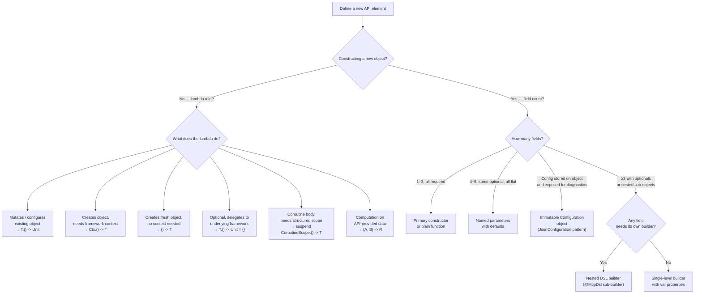
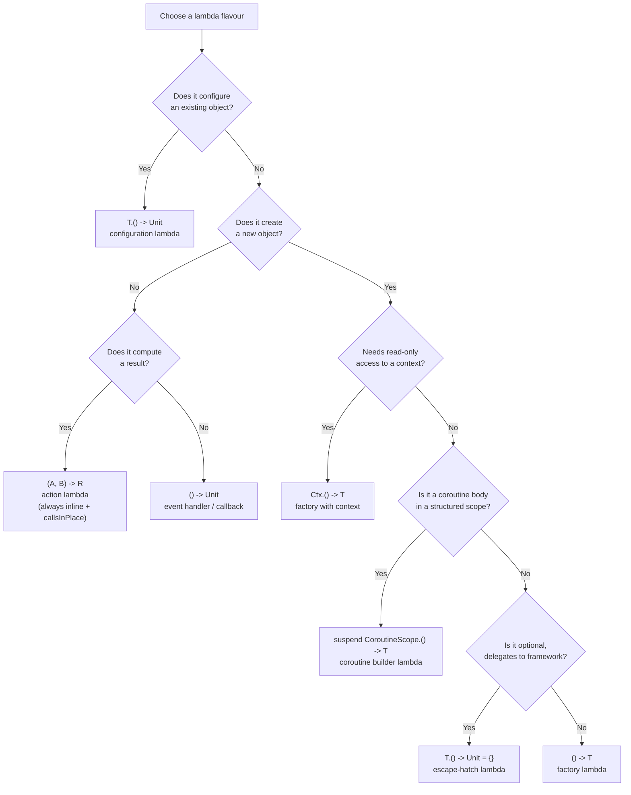
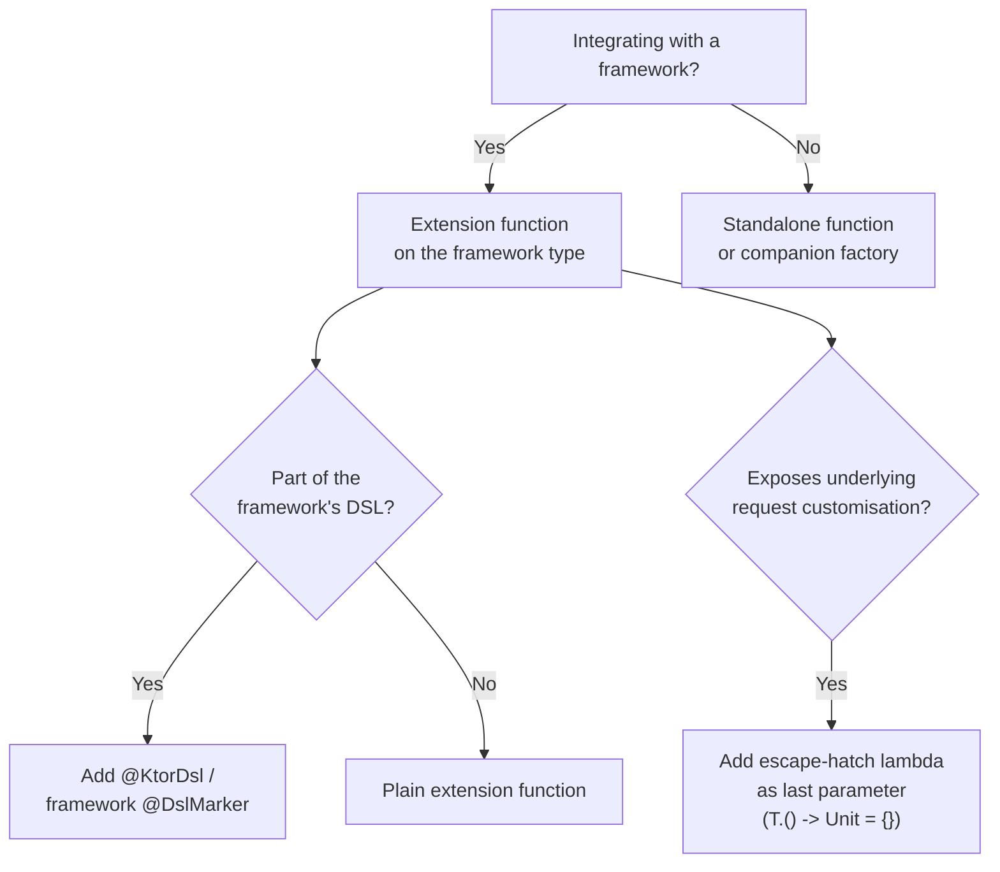

# Kotlin API Review Guides

Use this reference when reviewing an API design and you need compact decision aids, flowcharts, or a checklist of common anti-patterns.

## Included sections

- 17. Decision Flowcharts
- 18. Anti-patterns

## 17. Decision Flowcharts

### Choosing parameter style



### Choosing a lambda flavour



### Framework integration



---

## 18. Anti-patterns

### 18.1 Builder without `@DslMarker`

```kotlin
// ❌ Missing @McpDsl — outer scope bleeds in
class RequestBuilder {
    fun meta(block: RequestMetaBuilder.() -> Unit) { ... }
}

class RequestMetaBuilder {
    fun put(key: String, value: String) { ... }
    // Caller can accidentally call RequestBuilder methods here
}
```

```kotlin
// ✅ @McpDsl prevents implicit outer-scope access
@McpDsl class RequestMetaBuilder { ... }
```

<details><summary>Reasoning</summary>

See §3 `@DslMarker` rule — the reasoning there covers this anti-pattern directly. The concrete failure mode: inside a `RequestMetaBuilder` block, calling an unqualified `meta(…)` resolves to `RequestBuilder.meta(…)` on the outer receiver, silently nesting builders incorrectly. `@McpDsl` on `RequestMetaBuilder` causes the compiler to reject this unqualified call, because `RequestBuilder` is also annotated `@McpDsl` and two same-marker receivers cannot be in implicit scope simultaneously.

</details>

### 18.2 Builder for single-field objects

```kotlin
// ❌ Overkill — one field, no nesting, no validation
class PingRequestBuilder {
    var id: String? = null
    fun build() = PingRequest(id)
}
```

```kotlin
// ✅ Plain constructor or companion factory
fun buildPingRequest(id: String? = null): PingRequest = PingRequest(id)
```

<details><summary>Reasoning</summary>

**Why: The reason is unknown**

A builder allocates an object (`PingRequestBuilder`), stores the one field on it, validates it (trivially), and constructs the result — three steps instead of one. At a single-field call site, `buildPingRequest { id = "x" }` is strictly worse than `buildPingRequest(id = "x")` or `PingRequest("x")`: more syntax, more indirection, no benefit. The DSL builder pattern earns its weight only when there are ≥ 3 independently settable properties or nested sub-builders (see §4). Below that threshold, it is ceremonial complexity.

</details>

### 18.3 Missing contract on inline entry function

```kotlin
// ❌ No contract — compiler cannot track val initialization inside block
inline fun buildFoo(block: FooBuilder.() -> Unit): Foo =
    FooBuilder().apply(block).build()
```

```kotlin
// ✅
inline fun buildFoo(block: FooBuilder.() -> Unit): Foo {
    contract { callsInPlace(block, InvocationKind.EXACTLY_ONCE) }
    return FooBuilder().apply(block).build()
}
```

<details><summary>Reasoning</summary>

`buildList` in `stdlib/src/kotlin/collections/Collections.kt` has `contract { callsInPlace(builderAction, InvocationKind.EXACTLY_ONCE) }`. Without it, the Kotlin compiler treats the lambda body as code that *may or may not run*, which means: `val name: String; buildFoo { name = "x" }` fails with "variable 'name' must be initialized" because the compiler cannot prove the assignment executes. This breaks a natural Kotlin idiom — capturing a result from inside a builder block into a `val`. The fix is one line of code; the cost of omitting it is forcing callers to use `lateinit var` or nullable types unnecessarily.

</details>

### 18.4 Lambda overload without a corresponding value overload

```kotlin
// ❌ Lambda-only — forces callers to use DSL even for pre-built values
fun arguments(block: JsonObjectBuilder.() -> Unit)
```

```kotlin
// ✅ Both — callers choose
fun arguments(arguments: JsonObject)
fun arguments(block: JsonObjectBuilder.() -> Unit) = arguments(buildJsonObject(block))
```

<details><summary>Reasoning</summary>

See §5 — the same reasoning applies. The concrete failure here: lambda-only forces `arguments { put("key", "value") }` even when the caller already has a `val args: JsonObject` from a previous computation or test fixture. This is ergonomically hostile in testing, where a pre-built object is passed to multiple assertions. `JsonObjectBuilder.put(key, JsonElement)` and `JsonObjectBuilder.putJsonObject(key, builderAction)` in `JsonElementBuilders.kt` demonstrate that both overloads coexist without conflict.

</details>

### 18.5 Public mutable builder constructor

```kotlin
// ❌ Anyone can call new FooBuilder() directly
class FooBuilder constructor() { ... }
```

```kotlin
// ✅ Only accessible via the inline entry function after inlining
class FooBuilder @PublishedApi internal constructor() { ... }
```

<details><summary>Reasoning</summary>

**Why: The reason is unknown**

A public constructor means callers can do `val b = FooBuilder(); b.name = "x"; b.name = "y"; b.build()` — constructing a builder directly, mutating it arbitrarily, and calling `build()` multiple times. This breaks the intended single-use contract and bypasses any validation in the entry function. `@PublishedApi internal constructor` makes the constructor effectively invisible to external callers while remaining accessible inside the `inline buildFoo { }` function after inlining. The stdlib's `HexFormat.Builder` and kotlinx.serialization's `JsonObjectBuilder` both follow this pattern.

</details>

### 18.6 Using a configuration lambda when a factory lambda is needed

```kotlin
// ❌ Wrong flavour — block is stored and called per connection, not once at construction
fun Route.mcpWebSocket(block: Server.() -> Unit)
// Server doesn't exist yet at route-registration time;
// calling block() here constructs nothing

// ✅ Factory lambda — creates a new Server each time a connection arrives
fun Route.mcpWebSocket(block: () -> Server)
```

Rule: if the lambda needs to produce a new object on each invocation, use `() -> T`.
If the object already exists and the lambda configures it, use `T.() -> Unit`.

<details><summary>Reasoning</summary>

**Why: The reason is unknown**

The concrete failure: `fun Route.mcpWebSocket(block: Server.() -> Unit)` requires a `Server` instance to exist at route-registration time, but no connection has arrived yet — there is nothing to call `block` on. The block would have to be stored and called later, but `Server.() -> Unit` has no way to produce a `Server` — it can only mutate one. The `() -> Server` signature makes the intent unambiguous: "call this to get a new `Server` per connection." Passing `Server.() -> Unit` here is a type-level category error: configuration lambda vs. factory lambda.

</details>

### 18.7 Wrapping an escape hatch in your own abstraction

```kotlin
// ❌ Forces callers to learn a custom abstraction instead of the framework's API
fun HttpClient.mcpSse(urlString: String?, config: McpRequestConfig): SseClientTransport

// ✅ Delegate directly to the framework's own builder
fun HttpClient.mcpSse(
    urlString: String? = null,
    requestBuilder: HttpRequestBuilder.() -> Unit = {},
): SseClientTransport
```

<details><summary>Reasoning</summary>

**Why: The reason is unknown**

`McpRequestConfig` forces callers to learn a custom intermediate type and its property mapping to Ktor concepts. The escape-hatch lambda (`HttpRequestBuilder.() -> Unit = {}`) delegates directly to Ktor's own builder — callers apply knowledge they already have. Every custom wrapper type is a new vocabulary item that must be documented, maintained, and kept in sync with the underlying framework. The escape hatch is zero-maintenance by design: it grows with Ktor automatically.

</details>

### 18.8 Do deprecate superseded flat-parameter constructors

When you migrate flat parameters to a `Configuration` class, always mark the old constructor
`@Deprecated` with `replaceWith`. Without it, callers have no migration path and the two forms
silently coexist, causing confusion about which is canonical.

<details><summary>Reasoning</summary>

`JsonConfiguration` in kotlinx.serialization demonstrates the cost of not following this rule: the `classDiscriminatorMode` setter was made `@Deprecated(level = ERROR)` with message "JsonConfiguration is not meant to be mutable… The `Json(from = …) {}` copy builder should be used instead." Without `replaceWith`, the IDE cannot offer a one-click fix — the caller must manually discover and apply the replacement. When two forms coexist without deprecation, documentation becomes the only guide, and over time code bases accumulate a mix of old and new style with no clear winner.

</details>

### 18.9 Missing `@KtorDsl` on Ktor extension functions

```kotlin
// ❌ Callable anywhere — IDE gives no warning if used outside routing { }
fun Route.mcp(path: String, block: ServerSSESession.() -> Server)
```

```kotlin
// ✅ Scoped to Ktor DSL context
@KtorDsl
fun Route.mcp(path: String, block: ServerSSESession.() -> Server)
```

<details><summary>Reasoning</summary>

**Why: The reason is unknown**

Without `@KtorDsl`, the Kotlin compiler allows `Route.mcp(…)` to be called from any context — including outside `routing { }` — where no routing tree is being built. The call compiles but produces no effect (or a runtime error), because the route registration has nowhere to attach. `@KtorDsl` is a `@DslMarker` annotation; applying it limits the function to contexts where a `Route` or `Application` DSL receiver is in scope. See §8 and §3 `@DslMarker` for the underlying mechanism.

</details>

### 18.10 Missing `@Suppress("FunctionName")` on type-named factory functions

```kotlin
// ❌ Lint warning: function name should start with a lowercase letter
public fun CoroutineScope(context: CoroutineContext): CoroutineScope = ...
public fun MutableStateFlow(value: T): MutableStateFlow<T> = ...
```

```kotlin
// ✅ Suppress the spurious FunctionName warning explicitly
@Suppress("FunctionName")
public fun CoroutineScope(context: CoroutineContext): CoroutineScope = ...
```

Without the suppression, every call site appears to have an incorrectly named function,
and lint tools report false positives. The annotation makes the intentional naming explicit.

<details><summary>Reasoning</summary>

See §9 `@Suppress("FunctionName")` rule — the concrete evidence is in `CoroutineScope.kt` at lines 121 and 297, and `StateFlow.kt` for `MutableStateFlow`. The failure mode: CI lint and IntelliJ inspections flag every type-named factory as a `FunctionName` violation, generating noise that trains reviewers to ignore lint output. When real naming problems appear (e.g., an accidentally capitalised utility function), they are buried in the false-positive flood. The `@Suppress` annotation documents the intentional exception at the point of definition.

</details>

---
