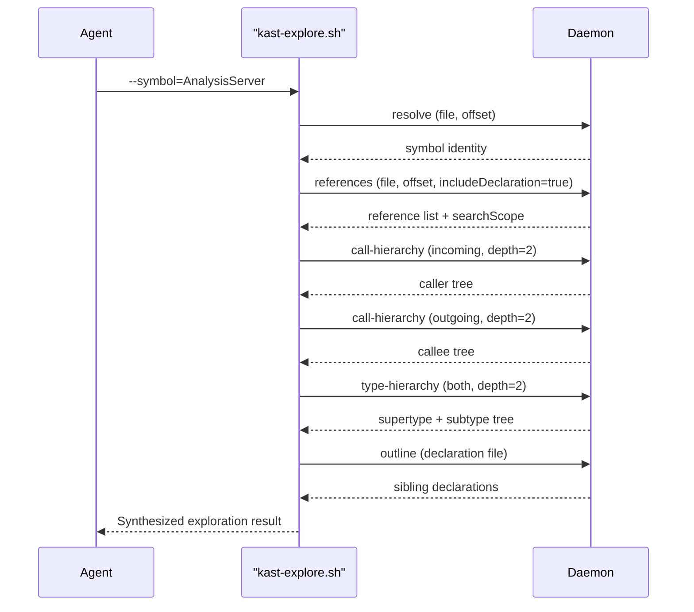
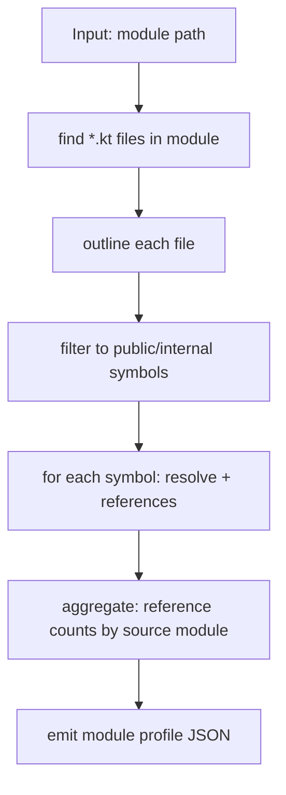
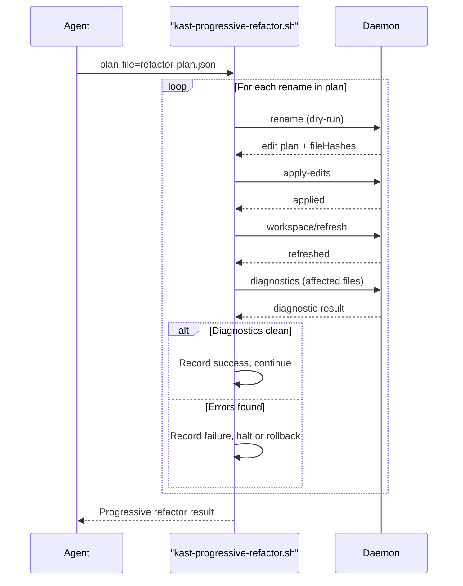

You have strong primitives. The gap is in the **composition layer** — the scripts that chain them into the higher-level flows you're describing. Here's what you can do today, what's missing, and where the daemon API itself has a gap.

## Your Existing Primitives

Every operation below is already available over JSON-RPC:

| Primitive | What it gives you | Key metadata |
|---|---|---|
| `resolve` | Symbol identity at a position | `fqName`, `kind`, `visibility`, `supertypes`, `containingDeclaration` |
| `references` | All usages across workspace | `searchScope.exhaustive`, `searchScope.visibility`, per-reference `preview` |
| `call-hierarchy` (incoming) | Who calls this function | Bounded tree with `stats` + per-node `truncation` |
| `call-hierarchy` (outgoing) | What does this function call | Same bounded tree, outgoing direction |
| `type-hierarchy` | Supertypes + subtypes tree | Available on standalone backend only |
| `outline` | All declarations in a file | Nested tree: classes → members → nested classes |
| `workspace-symbol` | Find declarations by name | Substring or regex, filterable by `kind` |
| `rename` → `apply-edits` → `diagnostics` | Compiler-backed refactoring | Hash-based conflict detection, post-edit diagnostic validation |
| `semantic-insertion-point` | Where to insert new code | Offsets for class body start/end, file top/bottom, after imports |
| `imports/optimize` | Clean up imports after edits | Edit plan for unused/missing imports | [4-cite-0](#4-cite-0) 

## What's Missing: Three New Compound Scripts

### 1. `kast-explore.sh` — Deep Symbol Navigation ("Codebase Navigation Sub-Agent")

This is the "data flow mapping" flow. Given a symbol, build a complete picture of its role in the codebase.



**What it produces:**
```json
{
  "ok": true,
  "symbol": { "fqName": "...", "kind": "CLASS", "visibility": "PUBLIC", "supertypes": [...] },
  "references": { "count": 12, "by_file": { "A.kt": 3, "B.kt": 9 }, "search_scope": {...} },
  "incoming_callers": { "root": {...}, "stats": {...} },
  "outgoing_callees": { "root": {...}, "stats": {...} },
  "type_hierarchy": { "supertypes": [...], "subtypes": [...] },
  "file_context": { "file": "AnalysisServer.kt", "sibling_declarations": [...] },
  "completeness": {
    "references_exhaustive": true,
    "callers_truncated": false,
    "callees_truncated": false,
    "type_hierarchy_truncated": false
  }
}
```

This is a strict superset of what `kast-impact.sh` does today. `kast-impact.sh` does resolve + references + optional incoming callers. [4-cite-1](#4-cite-1)

The new script adds: **outgoing callees**, **type hierarchy**, **file outline for context**, and a **completeness summary** that tells the LLM exactly which parts of the result are bounded.

**What you can build this from today:** All five daemon calls already exist. The script is pure composition — no new daemon endpoints needed. The only caveat is that `type-hierarchy` is not available on the IntelliJ plugin backend (it throws `CapabilityNotSupportedException`), so the script should gracefully skip it when the capability is absent. [4-cite-2](#4-cite-2)

### 2. `kast-module-profile.sh` — Module API Surface Mapping ("General Form")

This is the "understand a module's reference shape" flow. Given a module path (e.g., `analysis-api`), enumerate its public API and compute the reference shape for each symbol.



**What it produces:**
```json
{
  "ok": true,
  "module_path": "analysis-api/src/main/kotlin",
  "symbols": [
    {
      "fqName": "io.github.amichne.kast.api.AnalysisBackend",
      "kind": "INTERFACE",
      "visibility": "PUBLIC",
      "reference_count": 47,
      "referenced_from_files": ["AnalysisDispatcher.kt", "CliService.kt", ...],
      "referenced_from_modules": { "analysis-server": 12, "kast-cli": 8, "backend-standalone": 15, ... }
    },
    ...
  ],
  "stats": { "total_symbols": 42, "total_references": 312, "files_scanned": 18 }
}
```

**The gap here:** There is no daemon endpoint to list workspace files or enumerate modules. The `workspace-symbol` command can find symbols by name, but it can't enumerate "all public symbols in module X." [4-cite-3](#4-cite-3)

You have two options:
- **Client-side file enumeration:** The script uses `find` to list `.kt` files under a module path, then calls `outline` on each file. This works today — no daemon changes needed. The `kast-common.sh` already does client-side file scanning via `rglob("*.kt")` for candidate collection. [4-cite-4](#4-cite-4)
- **New daemon endpoint (future):** A `workspace/files` or `workspace/modules` endpoint that returns the file list and module structure the daemon already knows about internally (via `StandaloneAnalysisSession.allKtFiles()` and `sourceModuleSpecs`). [4-cite-5](#4-cite-5)

### 3. `kast-progressive-refactor.sh` — Compiler-Backed Progressive Rename ("Observed Form → General Form")

This is the "drive true refactors at a module level" flow. Given a list of rename operations, execute them sequentially with diagnostic gates between each step.



**What it produces:**
```json
{
  "ok": false,
  "completed": 3,
  "total": 5,
  "steps": [
    { "symbol": "OldName1", "new_name": "NewName1", "ok": true, "edit_count": 4, "diagnostics": { "clean": true } },
    { "symbol": "OldName2", "new_name": "NewName2", "ok": true, "edit_count": 7, "diagnostics": { "clean": true } },
    { "symbol": "OldName3", "new_name": "NewName3", "ok": true, "edit_count": 2, "diagnostics": { "clean": true } },
    { "symbol": "OldName4", "new_name": "NewName4", "ok": false, "stage": "diagnostics", "error_count": 2 }
  ],
  "halted_at_step": 4,
  "halt_reason": "ERROR-severity diagnostics after rename"
}
```

**What you can build this from today:** `kast-rename.sh` already does the full single-rename loop (resolve → plan → apply → diagnostics). The progressive script wraps N invocations with a `workspace/refresh` between each to ensure the daemon sees the updated files. The key addition is the **halt-on-error gate** and the **cumulative result** that tells the LLM exactly where the refactoring stopped and why. [4-cite-6](#4-cite-6)

The `workspace/refresh` endpoint already exists and is critical here — after each `apply-edits`, the daemon needs to re-index the changed files before the next rename can resolve correctly. [4-cite-7](#4-cite-7)

## The One Real API Gap

The daemon has no way to answer "what files/modules exist in this workspace?" The session internally tracks this via `allKtFiles()` and `sourceModuleSpecs`, but it's not exposed over JSON-RPC. [4-cite-8](#4-cite-8)

For the module-profile flow, you need to enumerate files. Today you can work around this with client-side `find` (which is what `kast-common.sh` already does). But a proper `workspace/files` endpoint would let the agent ask the daemon directly, which is more reliable because the daemon knows the actual resolved source roots and module boundaries — including Gradle-discovered source sets, test fixtures, and custom source sets. [4-cite-9](#4-cite-9)

A minimal endpoint would return:
```json
{
  "modules": [
    { "name": ":app[main]", "sourceRoots": [...], "files": [...] },
    { "name": ":app[test]", "sourceRoots": [...], "files": [...] },
    { "name": ":lib[main]", "sourceRoots": [...], "files": [...] }
  ]
}
```

This maps directly to what `StandaloneAnalysisSession` already computes — `sourceModuleSpecs` has the module names and source roots, and `allKtFiles()` has the file list.

## How These Compose Into Your Two Use Cases

### Codebase Navigation Sub-Agent

The LLM uses `kast-explore.sh` as its primary tool. The flow:

1. User says "understand how `AnalysisDispatcher` works"
2. Agent calls `kast-explore.sh --symbol=AnalysisDispatcher`
3. Gets back: symbol identity, all references, incoming callers, outgoing callees, type hierarchy, file context
4. Agent synthesizes: "AnalysisDispatcher is a class in analysis-server that routes JSON-RPC methods to AnalysisBackend. It's called from UnixDomainSocketRpcServer, StdioRpcServer, and TcpRpcServer. It calls all 15 AnalysisBackend methods. It has no subtypes."
5. If the agent needs to go deeper on a specific caller, it calls `kast-explore.sh` again on that caller

This is the "IntelliJ data flow mapping" equivalent — the agent builds a mental model by recursively exploring the graph.

### Module-Level Refactoring

The LLM uses `kast-module-profile.sh` + `kast-progressive-refactor.sh`:

1. Agent calls `kast-module-profile.sh --module-path=analysis-api/src/main/kotlin` → gets the "observed form" (current API surface + reference shape)
2. Agent compares against the "general form" (the desired pattern — e.g., "all query types should follow `XyzQuery` naming, all result types should follow `XyzResult` naming")
3. Agent identifies deviations (e.g., `ImportOptimizeQuery` should be `OptimizeImportsQuery`)
4. Agent builds a rename plan JSON and calls `kast-progressive-refactor.sh --plan-file=plan.json`
5. Each rename is applied with compiler validation between steps
6. If a rename breaks something, the flow halts and the agent gets a structured error to reason about

## Priority Order

1. **`kast-explore.sh`** — highest value, pure composition of existing primitives, no daemon changes needed. This is the "deep navigation" tool that makes the LLM genuinely useful for understanding code.

2. **`kast-progressive-refactor.sh`** — second highest, also pure composition. This is the "drive true refactors" tool. The main subtlety is the `workspace/refresh` between steps.

3. **`kast-module-profile.sh`** — requires either client-side file enumeration (works today) or a new `workspace/files` daemon endpoint (better long-term). This is the "general form vs observed form" tool.

4. **`workspace/files` daemon endpoint** — the one actual API addition. Low complexity (the data already exists in `StandaloneAnalysisSession`), high leverage for module-level operations.

## What You Can't Do Yet

- **Cross-workspace analysis** — Kast is one daemon per workspace. If a refactor spans multiple repositories, you need multiple daemons.
- **Import-aware rename** — The standalone backend has a comment noting "A future import-aware rename pass can append import edits here once qualified-reference tracking is added." Today, renames don't update import statements that use the old name. [4-cite-10](#4-cite-10)
- **Arbitrary code edits with semantic validation** — You can rename and apply text edits, but you can't ask the daemon "generate the code for a new method that implements interface X." The daemon validates; it doesn't generate.
- **Type hierarchy on IntelliJ backend** — Currently throws `CapabilityNotSupportedException`. The explore flow needs to gracefully degrade. [4-cite-2](#4-cite-2)
