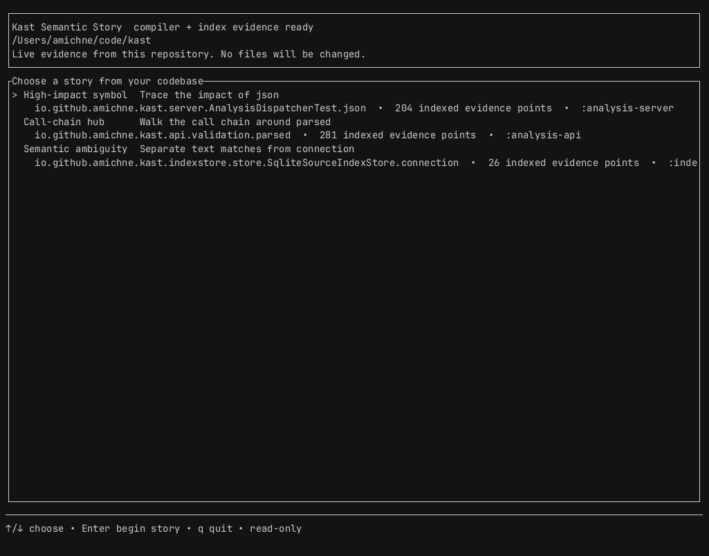

<a href="https://deepwiki.com/amichne/kast"></a> [](https://github.com/amichne/kast/actions/workflows/ci.yml)

# Kast


`kast` gives Copilot, terminal workflows, CI jobs, and hosted agents
compiler-backed Kotlin answers. Use it when text search can show where a name
appears, but you need to know which declaration it resolves to, which callers
are real, or whether a planned edit is safe to apply.

## Install

For a macOS developer machine, quit IntelliJ IDEA or Android Studio, then run
the developer installer:

```console
/bin/bash -c "$(curl -fsSL https://raw.githubusercontent.com/amichne/kast/main/install.sh)"
```

The installer establishes the fail-closed Homebrew CLI receipt, derives its
exact release tag, and delegates the matching plugin's initial installation to
JetBrains' `installPlugins` command. That command does not replace an existing
plugin. If no standard IDE launcher is found, the installer prints the exact
GitHub Release ZIP for **Install Plugin from Disk**. Add
`https://github.com/amichne/kast/releases/latest/download/updatePlugins.xml`
as a custom plugin repository for native updates, then open the exact project
so the plugin writes compatibility metadata. `install.sh verify` rejects an
unsupported CLI/plugin pair after that metadata refresh.
In normal use, open your project in IntelliJ IDEA or Android Studio after the
installer completes.

Use the Linux headless bundle when a CI runner, hosted agent, server image, or
air-gapped host needs its own binary and backend runtime:

```console
export KAST_UBUNTU_DEBIAN_VERSION="v1.2.3"
./scripts/install-ubuntu-debian.sh install
./scripts/install-ubuntu-debian.sh verify
```

The [macOS install guide](https://kast.michne.com/install/macos/) covers the
root installer and IDE handoff. The [headless Linux guide](https://kast.michne.com/install/headless-linux/)
covers server and hosted-agent installs.

## Develop From A Checkout

Kast contributors can build and activate the exact current checkout without
publishing a release or changing Homebrew and JetBrains release authority.

```console
./gradlew refreshDevelopmentLocal
```

The command creates a source-bound headless authority under
`.kast/local-development/`, including the CLI, backend, skill, agent guidance,
configuration, and strict receipt. Follow [validate a local
checkout](https://kast.michne.com/distribute/local-development-refresh/) for
machine-readable verification, linked-worktree isolation, rollback, and
removal.

## Try it on your code

Once the workspace is prepared and its backend is ready, run the read-only
repository tour:



```console
kast demo
```

Kast ranks high-signal symbols from the source index, adds live compiler
identity, references, and diagnostics when the backend is available, then
hands each chapter back to an equivalent typed `kast agent` command. It does
not change source files. Semantic status colors distinguish compiler, index,
verified, and plan-only evidence at a glance; `NO_COLOR=1 kast demo` preserves
the same hierarchy in monochrome. Use `kast --output json demo` for a deterministic
captured snapshot, or add `--symbol <name>` to choose the story anchor.

The [repository demo guide](https://kast.michne.com/learn/repository-demo/) explains
the full, index-only, and backend-only evidence modes.

## Why Kast instead of text search?

Kast answers questions that `grep` and `rg` cannot answer reliably on their
own:

- **Resolve the exact symbol, not just the spelling.** Kast asks the Kotlin
  analysis engine which declaration a position refers to.
- **Trace usage with semantic context.** Reference and caller queries follow
  compiler-backed relationships instead of matching strings.
- **Plan edits before applying them.** Agent edit flows surface identity,
  scope, and conflict evidence before they touch files.
- **Report completeness and bounds.** Reference and hierarchy responses tell
  agents whether evidence was exhaustive, truncated, or limited.

## Runtime choices

Kast has two runtime modes behind the same command surface:

| Runtime mode | Best when | Install path |
| --- | --- | --- |
| **IDEA / Android Studio plugin backend** | A macOS developer machine uses IDEA or Android Studio for local Kotlin state | Homebrew CLI plus GitHub-hosted, JetBrains-installed plugin |
| **Headless CLI + backend** | A CI runner, server, or hosted Linux image needs its own runtime | Linux headless bundle |

Repository agent guidance can use either runtime because agents call the same
global `kast` binary and command surface. The Linux headless bundle is a
server/hosted-agent distribution, not the local macOS developer fallback.

On developer machines, the JetBrains plugin starts the Kast backend when the
project opens and can request a Gradle refresh by default. Agents use that backend behind the scenes
when they need compiler-backed evidence.

Temporary clones and Git worktrees have independent semantic state. Open the
exact checkout in the JetBrains IDE on macOS, or select an already installed
headless runtime on a supported host. `kast agent verify --workspace-root
"$PWD"` reports the selected backend, exact root, source modules, limitations,
and evidence quality; it never borrows another checkout's runtime.
Verification only reuses an already ready runtime: it never launches an IDE or
starts a headless backend. On macOS, applied mutations still require exact-root
plugin preparation even when `--backend=headless` is selected.

## Documentation

- Read the [documentation site](https://kast.michne.com/).
- Follow the [macOS install guide](https://kast.michne.com/install/macos/) or
  [headless Linux guide](https://kast.michne.com/install/headless-linux/).
- Run the [first semantic workflow](https://kast.michne.com/learn/first-semantic-workflow/)
  or explore your repository with the
  [read-only demo](https://kast.michne.com/learn/repository-demo/).
- Browse the [command reference](https://kast.michne.com/reference/commands/).
- Validate an unreleased checkout with the [local development refresh](https://kast.michne.com/distribute/local-development-refresh/).
- Use [inspect Kotlin](https://kast.michne.com/use/inspect-kotlin/) and
  [plan safe edits](https://kast.michne.com/use/plan-safe-edits/) for common
  CLI workflows.
