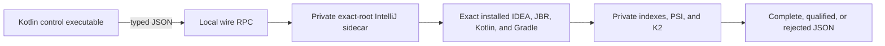

# Kast

Kast gives engineers and coding agents compiler-grounded evidence about one
exact Kotlin repository.

It resolves questions that text alone cannot settle while retaining the root,
generation, scope, bounds, and identity behind every result.

[Read the documentation](https://kast.michne.com/) ·
[Install Kast](https://kast.michne.com/start/) ·
[Browse the CLI reference](https://kast.michne.com/reference/cli/) ·
[See how Kast works](https://kast.michne.com/explanation/how-kast-works/)

## The compiler sees more than text

Aliases, overloads, generated declarations, and repeated names make text
matches ambiguous:

```kotlin
import billing.PricePolicy as BillingPricePolicy

class Checkout(private val policy: BillingPricePolicy) {
	fun total(order: Order): Money = policy.price(order)
}
```

A search can find `PricePolicy`, `policy`, and `price`. Kast can establish which
declaration the alias names and which overload receives `order`.

## Install

You need:

- macOS on Apple silicon;
- an on-disk Kotlin Gradle repository; and
- IntelliJ IDEA with a bundled Java 25 JBR.

The installer uses IDEA's JBR, so a separate `JAVA_HOME` is not required.
Semantic compatibility is enforced by JetBrains platform release line, not one
exact patch build.

Reference pair: IDEA build 262.9437.185 and Kotlin plugin build 262.9437.185-IJ.
Compatible patch builds are accepted when IDEA and Kotlin plugin both remain on
JetBrains platform release line 262.

Install the latest published release:

```shell
curl -fsSL https://raw.githubusercontent.com/amichne/kast/main/install.sh | bash
```

The installer resolves the release, downloads both matched payloads, verifies
their checksums, and installs the `kast` and `kast-codex` commands. Pass options
after `bash -s --`; for example:

```shell
curl -fsSL https://raw.githubusercontent.com/amichne/kast/main/install.sh | bash -s -- --idea-home "/Applications/IntelliJ IDEA.app"
```

### Installer flags

| Flag | Applies to | Purpose |
| --- | --- | --- |
| `--help`, `-h` | Install or uninstall | Print the installer contract. |
| `--version <major.minor.patch>` | Install | Install one release instead of the latest stable release. |
| `--purge-existing` | Install | Remove existing Kast-owned machine state after the requested release is downloaded and verified. |
| `--install-root <absolute-path>` | Install or uninstall | Select the versioned product root. |
| `--bin-dir <absolute-path>` | Install or uninstall | Select the directory for the public commands. |
| `--runtime-store <absolute-path>` | Install or uninstall | Select the downloaded semantic-runtime store. |
| `--runtime-directory <absolute-path>` | Install or uninstall | Select the runtime socket and process-state directory. |
| `--cache-root <absolute-path>` | Install or uninstall | Select the private IntelliJ cache root. |
| `--enable-launchd <0-or-1>` | Install | Choose direct process ownership (`0`) or launchd (`1`). |
| `--idea-home <absolute-app-or-contents-path>` | Install | Select an IntelliJ IDEA application bundle or its `Contents` directory. |
| `--repository <owner/name>` | Install | Download releases from another GitHub repository. |
| `--release-base-url <https-or-file-url>` | Install | Download an explicit version from a custom release root. |
| `--assets-directory <absolute-path>` | Install | Install an explicit version from four already-downloaded archive and checksum files. |
| `--installation-only` | Uninstall | Remove only the selected installation and its owned runtime state. |

`install` is optional. Use `uninstall` as the first argument to remove Kast. The
custom release and local-assets paths require an explicit `--version`.

If discovery finds zero or multiple eligible IDEA installations, pass
`--idea-home "/path/to/IntelliJ IDEA.app"`.

Read the [full host contract](https://kast.michne.com/start/) or review the
[installer source](install.sh) before running it.

One public `kast` command is backed by two matched release payloads:

| Release payload | Responsibility |
| --- | --- |
| `kast-control-*.tar.gz` | CLI parsing, lifecycle, schemas, broker, and typed wire transport; contains no IntelliJ semantic implementation. |
| `kast-semantic-runtime-*.zip` | Private headless indexer and compiler integration loaded with the supported local IDEA; contains no IDEA distribution. |

The control manifest binds the semantic payload's URL, size, and SHA-256 digest.
Neither archive is installed or selected independently.

Installer-owned defaults live in
`${XDG_CONFIG_HOME:-$HOME/.config}/kast/environment`:

- `KAST_RUNTIME_STORE`
- `KAST_RUNTIME_DIRECTORY`
- `KAST_CACHE_ROOT`
- `KAST_ENABLE_LAUNCHD`

Process environment values override saved defaults.

## Start from the repository root

Ask the semantic question directly. Kast admits the exact repository, starts or
joins its runtime, and acquires the evidence required by the operation:

```console
cd /path/to/kotlin-repository
kast
kast query run < request.json
```

Bare `kast` inspects product, runtime, cache, network-policy, and trace state
without starting the sidecar or synchronizing the workspace. `kast start` remains
an optional prewarm command; `kast stop` explicitly releases the process.

`kast start --idea-home PATH` resolves runtime discovery, and
`kast start --cache seed` can copy a validated, stopped IDEA cache.

Source changes are reconciled before semantic work. Unchanged evidence retains
its generation; changed evidence invalidates old selectors. Traversal acquires
topology lazily and reuses its published snapshot. Symbol, source, diagnostic,
and one-hop relation requests do not require a topology build.

The public lifecycle consists of bare `kast`, optional `kast start`, and explicit
`kast stop`. Synchronization and topology construction remain internal
capabilities. Kast ships no IDEA home and installs nothing into the user's IDE.

Read [lifecycle and enterprise configuration](docs/lifecycle-convergence.md) for
freshness limits, trust precedence, and installed acceptance commands.

## Ask a repository question

`kast --schema` is the machine-readable contract for the ten public semantic operations.
The generated [CLI reference](https://kast.michne.com/reference/cli/) is its
readable counterpart.

| Question | Command path |
| --- | --- |
| What is Kast ready to inspect? | Bare `kast` for passive inspection |
| How do I use changed source? | Issue the semantic request again; rediscover stale selectors |
| What declarations and relationships match? | `kast query run < request.json`; the `symbols` source establishes exact identities inside Kast. |
| What source content and structure exist here? | `kast source read < request.json` |
| How is this code connected? | `kast relation read < request.json` for one hop, or `kast traversal run < request.json` for bounded depth |
| What diagnostics exist in this scope? | `kast diagnostic check < request.json` |
| How can I add a declaration safely? | `change plan`, `change apply`, and `change recover` each read one canonical request document. |

Kast owns the normal refinement path:

1. Discovery returns bounded candidates.
2. The `symbols` query source, or an explicit `inspect` step, establishes exact compiler identity.
3. Source, relation, traversal, diagnostic, or change operations reuse that
   evidence without guessing identity from text.

## Use Kast through Codex

The control distribution includes `kast-codex`, which hosts the Kast integration
and launches the installed Codex client through its supported `--remote`
transport. Integration state lives under `$CODEX_HOME/kast-integration`, or
`~/.codex/kast-integration` when `CODEX_HOME` is unset.

Before a new thread starts, the broker qualifies the exact installed Kast
projection and adds its authorized hosted tool catalog plus concise selection
policy to the Codex session. Semantic commands establish workspace readiness and
derived evidence internally; users and agents do not start, synchronize, or
build Kast as a prerequisite.

The hosted catalog exposes only read operations by default. An explicitly
authorized launch may set `KAST_CODEX_TOOL_EXPOSURE=mutation-enabled` to include
the plan, apply, and recovery tools for that broker lifetime. The other accepted
value is `read-only`; absence also means read-only, and unknown values are
rejected. See [broker provenance](docs/broker-provenance.md) for ownership,
presentation, and the acceptance boundary.

## One request, at a high level


```mermaid
flowchart LR
	CLI["Kotlin control executable"] -->|typed JSON| RPC["Local wire RPC"]
	RPC --> IDE["Private exact-root IntelliJ sidecar"]
	IDE --> LOCAL["Exact installed IDEA, JBR, Kotlin, and Gradle"]
	LOCAL --> K2["Private indexes, PSI, and K2"]
	K2 --> RESULT["Complete, qualified, or rejected JSON"]
```

In Codex, successful reads occupy one compact native tool row that expands in
place, and completed changes carry native file-diff presentation data. To opt in
to those mutation tools for one broker lifetime:

```bash
KAST_CODEX_TOOL_EXPOSURE=mutation-enabled kast-codex
```

The control executable parses the CLI command into a typed request document and
sends one bounded frame over an exact-root Unix-domain socket. The private
sidecar extension admits the operation before IntelliJ semantic APIs can run.
PSI and K2 objects stay inside that process. The request and response cross the
wire as host-neutral documents.

[How Kast works](https://kast.michne.com/explanation/how-kast-works/) traces a
concrete `kast symbol inspect` request through the Kotlin implementation.

## Inspect topology and traversal latency

Run bare `kast` to find the authoritative trace location without
starting the sidecar. It reports:

- enabled state and OTLP JSON Lines format;
- the private `directoryPath` with mode `0700`; and
- the `traceFilePath` with mode `0600`.

Traces cover topology and traversal phases with bounded outcome and count
attributes. They exclude paths, selectors, source, exception messages, and
stacks. Apply the host's retention policy to persistent trace files.

## Know what the result proves

Transport success does not imply semantic success. Every operation returns one
closed outcome:

| Outcome | Meaning |
| --- | --- |
| Complete | The result met the admitted scope, bounds, and completeness policy. |
| Qualified | The returned evidence remains usable within a named limitation. |
| Rejected | Kast established no successful payload and returned a typed reason. |

Read outcomes by authority:

- Complete is required for synchronization, topology publication, exact symbol
  work, planning, application, and verification.
- Qualified evidence is allowed only for operations with an explicit limitation.
- Unknown, stale, unsupported, or inadmissible input is rejected.
- An undurable write withdraws change authority until recovery proves a clean
  state.

[Trust the evidence](https://kast.michne.com/concepts/evidence-boundaries/)
explains how root, operation, generation, scope, bounds, and qualification
constrain each claim.

## Develop Kast

Development requires Java 25 or newer and Python 3.12 or newer. The checked-in
`.python-version` is the Python version authority used by local version managers
and every Python-consuming GitHub workflow.

Build the current checkout and its small private sidecar archive with Gradle:

```shell
./gradlew build
./gradlew assembleSidecarRelease
./gradlew installLocal
kast --version
```

`installLocal` installs the control launcher and matched private sidecar under
`~/.local/share/kast/local`. It publishes one relocatable command at
`~/.local/bin/kast` and never writes a JetBrains plugin directory.

To dogfood one locally packaged, matched product through that same verified
installer boundary, assign an unreleased semantic version and select the local
release directory explicitly:

```shell
release_version="${KAST_RELEASE_VERSION:?set KAST_RELEASE_VERSION to an unreleased semantic version}"
./gradlew -Pversion="$release_version" assembleSidecarRelease
bash install.sh install --purge-existing \
  --version "$release_version" \
  --release-base-url "file://$PWD/build/release"
```

The installer still checks both SHA-256 records, archive paths, product
metadata, and matched sidecar identity before it removes an older installation.
An explicit version is required for a custom HTTPS mirror or absolute `file://`
release base.

Published releases also include CLI schema and module-knowledge JSON with
SHA-256 records. Module knowledge preserves:

- the release version and Git revision;
- accepted architecture evidence and module policy;
- the admitted dependency graph; and
- repository guidance with content digests.

These assets can be downloaded without installing Kast.

Validate and preview the Mintlify documentation with:

```shell
cd docs/public
mint validate
mint dev
```

## License

Kast is available under the [MIT License](LICENSE).
