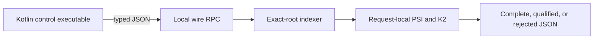

# Kast

Kast gives engineers and coding agents compiler-grounded evidence about one
exact Kotlin repository. It answers questions that source text alone cannot
settle, and it keeps the repository root, semantic generation, scope, limits,
and outcome attached to each answer.

[Read the documentation](https://kast.michne.com/) ·
[Install Kast](https://kast.michne.com/start/) ·
[Browse the CLI reference](https://kast.michne.com/reference/cli/) ·
[See how Kast works](https://kast.michne.com/explanation/how-kast-works/)

## The compiler sees more than text

Aliases, overloads, generated declarations, and repeated names make text
matches ambiguous:

```kotlin
import billing.PricePolicy as BillingPricePolicy

class Checkout(private val policy: BillingPricePolicy) {
	fun total(order: Order): Money = policy.price(order)
}
```

A search can find `PricePolicy`, `policy`, and `price`. Kast can establish which
declaration the alias names, which overload receives `order`, and which
compiler-visible relationships connect that call to the rest of the repository.

## Start from the repository root

Kast supports macOS on Apple silicon, Java 21, and a Kotlin Gradle repository.
It uses matched runtime libraries from IntelliJ IDEA 2026.2, build 262, or
Android Studio 2026.1.2, build 261. The JetBrains application can remain closed.

Download and inspect the installer before you run it:

```shell
installer_file="$(mktemp)"
curl --fail --location --silent --show-error \
	https://raw.githubusercontent.com/amichne/kast/main/install.sh \
	--output "$installer_file"

less "$installer_file"
bash "$installer_file"
```

Start or reuse the isolated semantic runtime for one canonical root:

```console
cd /path/to/kotlin-repository
kast start
kast workspace inspect
```

`kast start` returns only after workspace evidence is ready, or it returns a
typed blocker. It does not open, focus, or coordinate a foreground IDE project.

## Ask a repository question

Use the narrowest operation that answers the decision. The generated
[CLI reference](https://kast.michne.com/reference/cli/) contains every current
command shape, and `kast --schema` returns the same contract as JSON.

| Question | Command path |
| --- | --- |
| What is Kast ready to inspect? | `kast workspace inspect` |
| What declaration is this? | `kast symbol discover ...`, then `kast symbol resolve ...` and `kast symbol describe ...` |
| How is this code connected? | `kast relation read ...`, or `kast topology build` followed by `kast traversal run ...` |
| Is this file semantically valid? | `kast diagnostic check ...` |
| How can I change it safely? | `kast change plan ...`, `kast change apply ...`, `kast change verify ...`, and `kast change recover ...` |

Discovery returns bounded candidates. Resolution refines one candidate into an
exact, generation-bound selector. Multi-hop traversal requires an explicit,
eligible topology snapshot and never starts hidden compiler work.

## One request, at a high level


```mermaid
flowchart LR
	CLI["Kotlin control executable"] -->|typed JSON| RPC["Local wire RPC"]
	RPC --> INDEXER["Exact-root indexer"]
	INDEXER --> K2["Request-local PSI and K2"]
	K2 --> RESULT["Complete, qualified, or rejected JSON"]
```

The control executable parses the CLI command into a typed request document and
sends one bounded frame over an exact-root Unix-domain socket. The isolated
runtime admits the operation before a compiler or write adapter can run. PSI
and K2 objects stay inside that adapter. The request and response cross the wire
as host-neutral documents.

[How Kast works](https://kast.michne.com/explanation/how-kast-works/) traces a
concrete `kast symbol describe` request through the Kotlin implementation.

## Know what the result proves

Transport success does not imply semantic success. Every operation returns one
closed outcome:

| Outcome | Meaning |
| --- | --- |
| Complete | The result met the admitted scope, bounds, and completeness policy. |
| Qualified | The returned evidence remains usable within a named limitation. |
| Rejected | Kast established no successful payload and returned a typed reason. |

Exact symbol resolution, symbol description, and every change phase require a
complete result. Unknown, stale, unsupported, or inadmissible input fails
closed.

[Trust the evidence](https://kast.michne.com/concepts/evidence-boundaries/)
explains how root, operation, generation, scope, bounds, and qualification
constrain each claim.

## Develop Kast

Build and install the current checkout with Gradle:

```shell
./gradlew build
./gradlew installLocal
kast --version
```

Build the public documentation with:

```shell
python3 docs/build_public_site.py
```

## License

Kast is available under the [MIT License](LICENSE).
