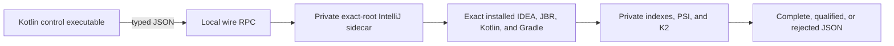

# Kast

Kast gives engineers and coding agents compiler-grounded evidence about one
exact Kotlin repository. It answers questions that source text alone cannot
settle, and it keeps the repository root, semantic generation, scope, limits,
and outcome attached to each answer.

[Read the documentation](https://kast.michne.com/) ·
[Install Kast](https://kast.michne.com/start/) ·
[Browse the CLI reference](https://kast.michne.com/reference/cli/) ·
[See how Kast works](https://kast.michne.com/explanation/how-kast-works/)

## The compiler sees more than text

Aliases, overloads, generated declarations, and repeated names make text
matches ambiguous:

```kotlin
import billing.PricePolicy as BillingPricePolicy

class Checkout(private val policy: BillingPricePolicy) {
	fun total(order: Order): Money = policy.price(order)
}
```

A search can find `PricePolicy`, `policy`, and `price`. Kast can establish which
declaration the alias names and which overload receives `order`.

## Start from the repository root

Kast supports macOS on Apple silicon, Java 25 or newer, IntelliJ IDEA build
262.9437.185 with Kotlin plugin build 262.9437.185-IJ, and an on-disk Kotlin
Gradle repository. It launches that exact local IDEA installation and its JBR
as a headless sidecar with private config, system, plugin, and log directories.

Install the latest stable control command and its matched private sidecar:

```shell
curl -fsSL https://raw.githubusercontent.com/amichne/kast/main/install.sh | bash
```

Read the [installer source](install.sh) before running the command if your
environment requires script review.

Inspect the installed runtime contract, then start the sidecar for the exact
repository:

```console
cd /path/to/kotlin-repository
kast product inspect
kast start
kast workspace inspect
```

`kast product inspect` reports the control, sidecar, supported IDEA/Kotlin pair,
and any Kast-owned cache for the current root without starting a runtime.

`kast start` discovers the exactly supported local IDEA home, starts one private
headless Project, imports its on-disk Gradle model, waits for smart mode, and
then publishes the exact-root endpoint. Use `--idea-home PATH` when discovery is
ambiguous. Kast installs nothing into the user's IDE and ships no IDEA home.

Ordinary startup never reads the user's IDEA system directory. To accelerate a
first private import from compatible indexes, shut down IDEA cleanly and run
`kast start --seed-from-idea`. Interactive use discloses the allowlisted cache
categories and estimated bytes; non-interactive use must also pass
`--accept-global-index-copy`. The copy is validated and atomically published
inside Kast's cache, and the source IDEA cache is never mounted or modified.

IntelliJ-declared local source roots remain part of that model even when an
empty directory does not currently exist. Kast preserves the root identity
without inventing source content, while malformed, non-local, or
outside-workspace roots still fail closed.

## Ask a repository question

The installed sidecar publishes ten public semantic operations. The generated
[CLI reference](https://kast.michne.com/reference/cli/) distinguishes those
public routes from relation and diagnostic services that remain internal to
sidecar workflows, and `kast --schema` returns the complete contract as JSON.
Its `serverProjection` is the installed executable's authority for
server-visible tool names, descriptions, input and output JSON Schemas, loading
policy, and field-to-CLI bindings. It advertises every public sidecar operation
and excludes the internal-only relation and diagnostic services. A broker can
therefore follow the selected installed path without carrying a Kast-version
lookup table.

| Question | Command path |
| --- | --- |
| What is Kast ready to inspect? | `kast workspace inspect` |
| What declaration is this? | `kast symbol discover ...`, then `kast symbol resolve ...` and `kast symbol describe ...` |
| How is this code connected? | `kast topology build`, then `kast traversal run ...` |
| How can I add a declaration safely? | `kast change plan ...`, `kast change apply ...`, `kast change verify ...`, and `kast change recover ...` |

Discovery returns bounded candidates. Resolution refines one candidate into an
exact, generation-bound selector. Description returns detached compiler
evidence for that selector. A successful apply publishes the newer workspace
generation in the same endpoint, so prior selectors become stale immediately
and verification can continue without restarting the sidecar. The successor also
activates read routes at that exact generation, so freshly resolved selectors
can consume the verified topology without reconstructing the endpoint.

Restarting the sidecar conservatively advances the semantic generation, so
selectors from the previous process remain stale. `kast topology build`
then verifies the current candidate set and can rebind an unchanged durable
snapshot to that new generation without repeating semantic extraction.

## One request, at a high level


```mermaid
flowchart LR
	CLI["Kotlin control executable"] -->|typed JSON| RPC["Local wire RPC"]
	RPC --> IDE["Private exact-root IntelliJ sidecar"]
	IDE --> LOCAL["Exact installed IDEA, JBR, Kotlin, and Gradle"]
	LOCAL --> K2["Private indexes, PSI, and K2"]
	K2 --> RESULT["Complete, qualified, or rejected JSON"]
```

The control executable parses the CLI command into a typed request document and
sends one bounded frame over an exact-root Unix-domain socket. The private
sidecar extension admits the operation before IntelliJ semantic APIs can run.
PSI and K2 objects stay inside that process. The request and response cross the
wire as host-neutral documents.

[How Kast works](https://kast.michne.com/explanation/how-kast-works/) traces a
concrete `kast symbol describe` request through the Kotlin implementation.

## Know what the result proves

Transport success does not imply semantic success. Every operation returns one
closed outcome:

| Outcome | Meaning |
| --- | --- |
| Complete | The result met the admitted scope, bounds, and completeness policy. |
| Qualified | The returned evidence remains usable within a named limitation. |
| Rejected | Kast established no successful payload and returned a typed reason. |

Exact symbol resolution, symbol description, topology publication, and every
change phase require a complete result. Unknown, stale, unsupported, or
inadmissible input fails closed. If a write cannot be durably recorded, Kast
withdraws planning, application, and verification authority until recovery
establishes a clean state.

[Trust the evidence](https://kast.michne.com/concepts/evidence-boundaries/)
explains how root, operation, generation, scope, bounds, and qualification
constrain each claim.

## Develop Kast

Build the current checkout and its small private sidecar archive with Gradle:

```shell
./gradlew build
./gradlew assembleSidecarRelease
./gradlew installLocal
kast --version
```

`installLocal` installs the control launcher and matched private sidecar from
the checkout. Neither path writes a JetBrains plugin directory or installs an
IDE distribution.

To dogfood one locally packaged, matched product through that same verified
installer boundary, assign an unreleased semantic version and select the local
release directory explicitly:

```shell
release_version=0.29.1
./gradlew -Pversion="$release_version" assembleSidecarRelease
bash install.sh install --purge-existing \
  --version "$release_version" \
  --release-base-url "file://$PWD/build/release"
```

The installer still checks both SHA-256 records, archive paths, product
metadata, and matched sidecar identity before it removes an older installation.
An explicit version is required for a custom HTTPS mirror or absolute `file://`
release base.

Validate and preview the Mintlify documentation with:

```shell
cd docs/public
mint validate
mint dev
```

## License

Kast is available under the [MIT License](LICENSE).
