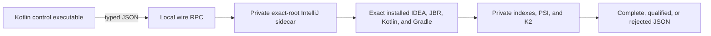

# Kast

Kast gives engineers and coding agents compiler-grounded evidence about one
exact Kotlin repository. It answers questions that source text alone cannot
settle. Every operation returns a closed status and preserves the
proof-specific root, generation, scope, limits, and identities needed to judge
its evidence.

[Read the documentation](https://kast.michne.com/) ·
[Install Kast](https://kast.michne.com/start/) ·
[Browse the CLI reference](https://kast.michne.com/reference/cli/) ·
[See how Kast works](https://kast.michne.com/explanation/how-kast-works/)

## The compiler sees more than text

Aliases, overloads, generated declarations, and repeated names make text
matches ambiguous:

```kotlin
import billing.PricePolicy as BillingPricePolicy

class Checkout(private val policy: BillingPricePolicy) {
	fun total(order: Order): Money = policy.price(order)
}
```

A search can find `PricePolicy`, `policy`, and `price`. Kast can establish which
declaration the alias names and which overload receives `order`.

## Start from the repository root

Kast supports macOS on Apple silicon, Java 25 or newer, IntelliJ IDEA build
262.9437.185 with Kotlin plugin build 262.9437.185-IJ, and an on-disk Kotlin
Gradle repository. It launches that exact local IDEA installation and its JBR
as a headless sidecar with private config, system, plugin, and log directories.

Install the latest stable control command and its matched private sidecar:

```shell
curl -fsSL https://raw.githubusercontent.com/amichne/kast/main/install.sh | bash
```

Read the [installer source](install.sh) before running the command if your
environment requires script review.

Inspect the installed runtime contract, then start the sidecar for the exact
repository:

```console
cd /path/to/kotlin-repository
kast product inspect
kast start
```

`kast product inspect` reports the control, sidecar, supported IDEA/Kotlin pair,
any Kast-owned cache, and the enabled per-socket telemetry destination for the
current root without starting a runtime. Use it to find the exact trace folder
and file before collecting performance evidence.

`kast start` discovers the exactly supported local IDEA home, starts one private
headless Project, imports its on-disk Gradle model, waits for smart mode, and
then publishes the exact-root endpoint. Use `--idea-home PATH` when discovery is
ambiguous. Kast installs nothing into the user's IDE and ships no IDEA home.

Sidecar processes launch directly by default. Set `KAST_ENABLE_LAUNCHD=1` to
opt into launchd-backed process ownership; leave it unset or set it to `0` for
direct launch. Any other value is rejected instead of being guessed.

Kast also keeps one local Kotlin/Ktor Codex tool broker alive whenever semantic
runtime demand brings Kast up. The broker reads tool definitions from the exact
installed `kast --schema`, generates and compiles the exact installed Codex App
Server schemas, and exposes the control socket at
`$CODEX_HOME/app-server-control/app-server-control.sock`. Its launchd identity
includes both executable digests, so upgrading Kast or Codex replaces stale
service state instead of reusing an unproven protocol. `kast broker serve` is
the process entry point used by that managed service. The Kotlin port's imported
[broker provenance](docs/broker-provenance.md) is recorded in-repository.

Ordinary startup never reads the user's IDEA system directory. To accelerate a
first private import from compatible indexes, shut down IDEA cleanly and run
`kast start --cache seed`. Interactive use discloses the allowlisted cache
categories and estimated bytes; non-interactive use must also pass
`--accept-global-index-copy`. The copy is validated and atomically published
inside Kast's cache, and the source IDEA cache is never mounted or modified.

IntelliJ-declared local source roots remain part of that model even when an
empty directory does not currently exist. Kast preserves the root identity
without inventing source content, while malformed, non-local, or
outside-workspace roots still fail closed.

## Ask a repository question

The installed sidecar publishes eleven public semantic operations. The generated
[CLI reference](https://kast.michne.com/reference/cli/) describes those public
routes, and `kast --schema` returns the complete contract as JSON.
Its `serverProjection` is the installed executable's authority for
server-visible tool names, descriptions, input and output JSON Schemas, loading
policy, explicit approval policy, and field-to-CLI bindings. Common read paths
cover index and topology effects, symbol discovery and inspection, source and
relation reads, traversal, and diagnostics; the canonical
operation IDs and evidence documents remain unchanged beneath those façades.
Every `change_*` tool is marked `explicit` approval while read tools are marked
`none`. The projection advertises every public sidecar operation from executable
admission. A broker can therefore follow the selected installed sidecar without
carrying a Kast-version lookup table.

| Question | Command path |
| --- | --- |
| What is Kast ready to inspect? | `kast start`, observed passively with `kast status` |
| How do I refresh stale files and semantic evidence? | `kast index sync` |
| What declaration is this? | `kast symbol discover ...`, then `kast symbol inspect --candidate ...` |
| What source content and structure exist here? | `kast source read ...` |
| How is this code connected? | `kast relation read ...` for one hop, or `kast topology build` then `kast traversal run ...` for bounded depth |
| What diagnostics exist in this scope? | `kast diagnostic check ...` |
| How can I add a declaration safely? | `kast change plan ...`, verified `kast change apply ...`, and `kast change recover ...` |

Discovery returns bounded candidates. Inspection refines one candidate into an
exact, generation-bound selector and returns detached compiler evidence for it.
Source reads remain source evidence and never establish compiler identity.
Bounded traversal returns one exact
`canonicalRoot`/generation snapshot identity plus normalized `nodes`, `edges`,
and proof-identity tables; repeated full signatures stay behind the on-demand
`symbol_inspect` façade. A successful apply publishes the newer workspace
generation in the same endpoint, so prior selectors become stale immediately
and verification can continue without restarting the sidecar. The successor also
activates read routes at that exact generation, so freshly resolved selectors
can consume the verified topology without reconstructing the endpoint.

`kast index sync` is the explicit repair path for source files changed outside
IntelliJ. It refreshes only the admitted local source roots, waits for IntelliJ
indexing, and publishes current semantic evidence. A sidecar change schedules
the same synchronization asynchronously only after an `AppliedUnverified`
success. Rejected or recovery-required applies do not schedule it, and a
scheduling failure cannot rewrite the already-proven apply outcome.

Restarting the sidecar conservatively advances the semantic generation,
so selectors from the previous process remain stale. `kast topology build`
then verifies the current candidate set and can rebind an unchanged durable
snapshot to that new generation without repeating semantic extraction.

## One request, at a high level


```mermaid
flowchart LR
	CLI["Kotlin control executable"] -->|typed JSON| RPC["Local wire RPC"]
	RPC --> IDE["Private exact-root IntelliJ sidecar"]
	IDE --> LOCAL["Exact installed IDEA, JBR, Kotlin, and Gradle"]
	LOCAL --> K2["Private indexes, PSI, and K2"]
	K2 --> RESULT["Complete, qualified, or rejected JSON"]
```

The control executable parses the CLI command into a typed request document and
sends one bounded frame over an exact-root Unix-domain socket. The private
sidecar extension admits the operation before IntelliJ semantic APIs can run.
PSI and K2 objects stay inside that process. The request and response cross the
wire as host-neutral documents.

[How Kast works](https://kast.michne.com/explanation/how-kast-works/) traces a
concrete `kast symbol inspect` request through the Kotlin implementation.

## Inspect topology and traversal latency

Each ready socket namespace forwards OpenTelemetry traces asynchronously by
default. The private directory is `<socket-path>.state/otel` with mode `0700`,
and the sidecar appends OTLP JSON Lines to `traces.jsonl` with mode `0600`. Run
`kast product inspect` to
read the exact `directoryPath`, `traceFilePath`, format, and enabled state
instead of reconstructing those paths. The reported `enabled` state describes
the default configuration without starting the sidecar.

The first spans cover `kast.topology.build`, `kast.traversal.run`, and their
meaningful workspace, snapshot, extraction, publication, and expansion phases.
Attributes are allowlisted to closed outcome and failure classes plus
non-negative file or record counts. Repository paths, selectors, source text,
exception messages, and stack traces are not exported. Trace files persist
across ordinary sidecar restarts and are removed by the explicit destructive
cache-clean lifecycle; apply the host's retention policy as needed.

## Know what the result proves

Transport success does not imply semantic success. Every operation returns one
closed outcome:

| Outcome | Meaning |
| --- | --- |
| Complete | The result met the admitted scope, bounds, and completeness policy. |
| Qualified | The returned evidence remains usable within a named limitation. |
| Rejected | Kast established no successful payload and returned a typed reason. |

Index synchronization, topology publication, exact symbol resolution and
description, planning, application, and verification require a complete result
for success. Discovery, relation, traversal, diagnostics, and unresolved manual
recovery may return qualified evidence with an explicit limitation. Unknown,
stale, unsupported, or inadmissible input fails closed. If a write cannot be
durably recorded, Kast withdraws planning, application, and verification
authority until recovery establishes a clean state.

[Trust the evidence](https://kast.michne.com/concepts/evidence-boundaries/)
explains how root, operation, generation, scope, bounds, and qualification
constrain each claim.

## Develop Kast

Development requires Java 25 or newer and Python 3.12 or newer. The checked-in
`.python-version` is the Python version authority used by local version managers
and every Python-consuming GitHub workflow.

Build the current checkout and its small private sidecar archive with Gradle:

```shell
./gradlew build
./gradlew assembleSidecarRelease
./gradlew installLocal
kast --version
```

The sole local-install task is `installLocal`; it
installs the control launcher and matched private sidecar as one coherent
product under
`~/.local/share/kast/local` and publishes one relocatable command at
`~/.local/bin/kast`; the two payloads cannot be installed independently.
Neither path writes a JetBrains plugin directory or installs an IDE
distribution.

To dogfood one locally packaged, matched product through that same verified
installer boundary, assign an unreleased semantic version and select the local
release directory explicitly:

```shell
release_version="${KAST_RELEASE_VERSION:?set KAST_RELEASE_VERSION to an unreleased semantic version}"
./gradlew -Pversion="$release_version" assembleSidecarRelease
bash install.sh install --purge-existing \
  --version "$release_version" \
  --release-base-url "file://$PWD/build/release"
```

The installer still checks both SHA-256 records, archive paths, product
metadata, and matched sidecar identity before it removes an older installation.
An explicit version is required for a custom HTTPS mirror or absolute `file://`
release base.

Each published release also provides `kast-cli-schema-v<version>.json` and
`kast-module-knowledge-v<version>.json`, with a SHA-256 record for each. The
module-knowledge document binds the release version and full Git revision to an
accepted `verifyKastArchitecture` report, the canonical module policy (including
allowed inter-module dependencies), the direct dependencies actually admitted
by that build, the exact contents and digests of every
repository `AGENTS.md`, and the governing or descendant guide paths associated
with each module. These JSON assets can be downloaded directly from the GitHub
release without installing Kast.

Validate and preview the Mintlify documentation with:

```shell
cd docs/public
mint validate
mint dev
```

## License

Kast is available under the [MIT License](LICENSE).
