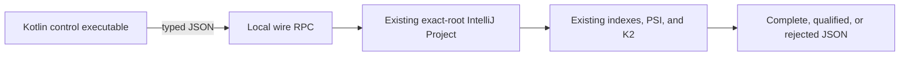

# Kast

Kast gives engineers and coding agents compiler-grounded evidence about one
exact Kotlin repository. It answers questions that source text alone cannot
settle, and it keeps the repository root, semantic generation, scope, limits,
and outcome attached to each answer.

[Read the documentation](https://kast.michne.com/) ·
[Install Kast](https://kast.michne.com/start/) ·
[Browse the CLI reference](https://kast.michne.com/reference/cli/) ·
[See how Kast works](https://kast.michne.com/explanation/how-kast-works/)

## The compiler sees more than text

Aliases, overloads, generated declarations, and repeated names make text
matches ambiguous:

```kotlin
import billing.PricePolicy as BillingPricePolicy

class Checkout(private val policy: BillingPricePolicy) {
	fun total(order: Order): Money = policy.price(order)
}
```

A search can find `PricePolicy`, `policy`, and `price`. Kast can establish which
declaration the alias names and which overload receives `order`.

## Start from the repository root

Kast supports macOS on Apple silicon, Java 21 or newer, IntelliJ IDEA build
262.9437.185 with Kotlin plugin build 262.9437.185-IJ, and a Kotlin Gradle
repository already open in that IDE. It reuses the IDE's existing Project,
VFS, indexes, PSI, and Kotlin semantic APIs.

Install the latest stable control command and its matched IDE plugin:

```shell
curl -fsSL https://raw.githubusercontent.com/amichne/kast/main/install.sh | bash
```

Read the [installer source](install.sh) before running the command if your
environment requires script review.

Open the repository in the supported IDE, then inspect its hosted endpoint:

```console
cd /path/to/kotlin-repository
kast product inspect
kast start
kast workspace inspect
```

`kast product inspect` reports the installed control identity and direct local
endpoint evidence even when compatibility admission fails. For a ready
endpoint it also reports the default trace format, directory, and epoch-specific
trace file. Use it to see the exact expected and observed identity before
repairing a mismatched installation or collecting performance evidence.

`kast start` admits only the compatible endpoint for this exact root, or returns
a typed blocker. It never opens a Project, imports Gradle, refreshes VFS, starts
an indexer process, or falls back to a private runtime.

IntelliJ-declared local source roots remain part of that model even when an
empty directory does not currently exist. Kast preserves the root identity
without inventing source content, while malformed, non-local, or
outside-workspace roots still fail closed.

## Ask a repository question

The installed endpoint publishes thirteen IDE-hosted operations. The generated
[CLI reference](https://kast.michne.com/reference/cli/) describes those public
routes, and `kast --schema` returns the complete contract as JSON.
Its `serverProjection` is the installed executable's authority for
server-visible tool names, descriptions, input and output JSON Schemas, loading
policy, explicit approval policy, and field-to-CLI bindings. Common read paths
are named `workspace_ensure_ready`, `symbol_lookup`, `symbol_inspect`,
`semantic_query`, `impact_analyze`, and `diagnostic_check`; the canonical
operation IDs and evidence documents remain unchanged beneath those façades.
Every `change_*` tool is marked `explicit` approval while read tools are marked
`none`. The projection advertises every public hosted operation from executable
admission. A broker can therefore follow the selected
installed path without carrying a Kast-version lookup table.

| Question | Command path |
| --- | --- |
| What is Kast ready to inspect? | `kast workspace inspect` |
| How do I refresh stale files and semantic evidence? | `kast index sync` |
| What declaration is this? | `kast symbol discover ...`, then `kast symbol resolve ...` and `kast symbol describe ...` |
| How is this code connected? | `kast relation read ...` for one hop, or `kast topology build` then `kast traversal run ...` for bounded depth |
| What diagnostics exist in this scope? | `kast diagnostic check ...` |
| How can I add a declaration safely? | `kast change plan ...`, `kast change apply ...`, `kast change verify ...`, and `kast change recover ...` |

Discovery returns bounded candidates. Resolution refines one candidate into an
exact, generation-bound selector. Description returns detached compiler
evidence for that selector. Bounded traversal returns one exact
`canonicalRoot`/generation snapshot identity plus normalized `nodes`, `edges`,
and proof-identity tables; repeated full signatures stay behind the on-demand
`symbol_inspect` façade. A successful apply publishes the newer workspace
generation in the same endpoint, so prior selectors become stale immediately
and verification can continue without restarting IntelliJ. The successor also
activates read routes at that exact generation, so freshly resolved selectors
can consume the verified topology without reconstructing the endpoint.

`kast index sync` is the explicit repair path for source files changed outside
IntelliJ. It refreshes only the admitted local source roots, waits for IntelliJ
indexing, and publishes current semantic evidence. A hosted change schedules
the same synchronization asynchronously only after an `AppliedUnverified`
success. Rejected or recovery-required applies do not schedule it, and a
scheduling failure cannot rewrite the already-proven apply outcome.

Reopening the IntelliJ Project conservatively advances the semantic generation,
so selectors from the previous process remain stale. `kast topology build`
then verifies the current candidate set and can rebind an unchanged durable
snapshot to that new generation without repeating semantic extraction.

## One request, at a high level


```mermaid
flowchart LR
	CLI["Kotlin control executable"] -->|typed JSON| RPC["Local wire RPC"]
	RPC --> IDE["Existing exact-root IntelliJ Project"]
	IDE --> K2["Existing indexes, PSI, and K2"]
	K2 --> RESULT["Complete, qualified, or rejected JSON"]
```

The control executable parses the CLI command into a typed request document and
sends one bounded frame over an exact-root Unix-domain socket. The hosted
plugin admits the operation before IntelliJ semantic APIs can run. PSI and K2
objects stay inside that adapter. The request and response cross the wire as
host-neutral documents.

[How Kast works](https://kast.michne.com/explanation/how-kast-works/) traces a
concrete `kast symbol describe` request through the Kotlin implementation.

## Inspect topology and traversal latency

Each ready socket namespace forwards OpenTelemetry traces asynchronously by
default. The private directory is `/tmp/.k<root-digest>.otel` with mode `0700`,
and each IDE runtime epoch appends OTLP JSON Lines to
`traces-<runtime-epoch>.jsonl` with mode `0600`. Run `kast product inspect` to
read the exact `directoryPath`, `traceFilePath`, format, and forwarding state
instead of reconstructing those paths.

The first spans cover `kast.topology.build`, `kast.traversal.run`, and their
meaningful workspace, snapshot, extraction, publication, and expansion phases.
Attributes are allowlisted to closed outcome and failure classes plus
non-negative file or record counts. Repository paths, selectors, source text,
exception messages, and stack traces are not exported. Trace files persist
outside the retired socket state directory; apply the host's retention policy
after the endpoint stops.

## Know what the result proves

Transport success does not imply semantic success. Every operation returns one
closed outcome:

| Outcome | Meaning |
| --- | --- |
| Complete | The result met the admitted scope, bounds, and completeness policy. |
| Qualified | The returned evidence remains usable within a named limitation. |
| Rejected | Kast established no successful payload and returned a typed reason. |

Exact symbol resolution, symbol description, topology publication, and every
change phase require a complete result. Unknown, stale, unsupported, or
inadmissible input fails closed. If a write cannot be durably recorded, Kast
withdraws planning, application, and verification authority until recovery
establishes a clean state.

[Trust the evidence](https://kast.michne.com/concepts/evidence-boundaries/)
explains how root, operation, generation, scope, bounds, and qualification
constrain each claim.

## Develop Kast

Build the current checkout, including the standalone IDE plugin archive, with
Gradle:

```shell
./gradlew build
./gradlew :ide-plugin:buildPlugin
./gradlew installLocal
kast --version
```

`installLocal` installs only the control launcher from the checkout. Use the
release installer when you need a matched, fully installed control-plus-plugin
product.

To dogfood one locally packaged, matched product through that same verified
installer boundary, assign an unreleased semantic version and select the local
release directory explicitly:

```shell
release_version="${KAST_RELEASE_VERSION:?set KAST_RELEASE_VERSION to an unreleased semantic version}"
./gradlew -Pversion="$release_version" assembleIdeHostedRelease
bash install.sh install --purge-existing \
  --version "$release_version" \
  --release-base-url "file://$PWD/build/release"
```

The installer still checks both SHA-256 records, archive paths, product
metadata, and matched plugin identity before it removes an older installation.
An explicit version is required for a custom HTTPS mirror or absolute `file://`
release base.

Validate and preview the Mintlify documentation with:

```shell
cd docs/public
mint validate
mint dev
```

## License

Kast is available under the [MIT License](LICENSE).
