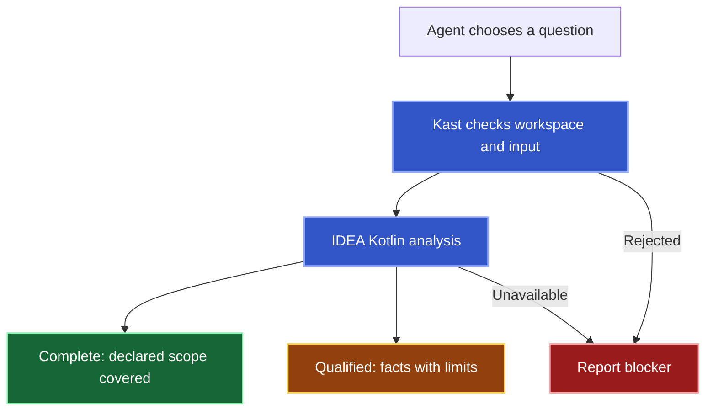
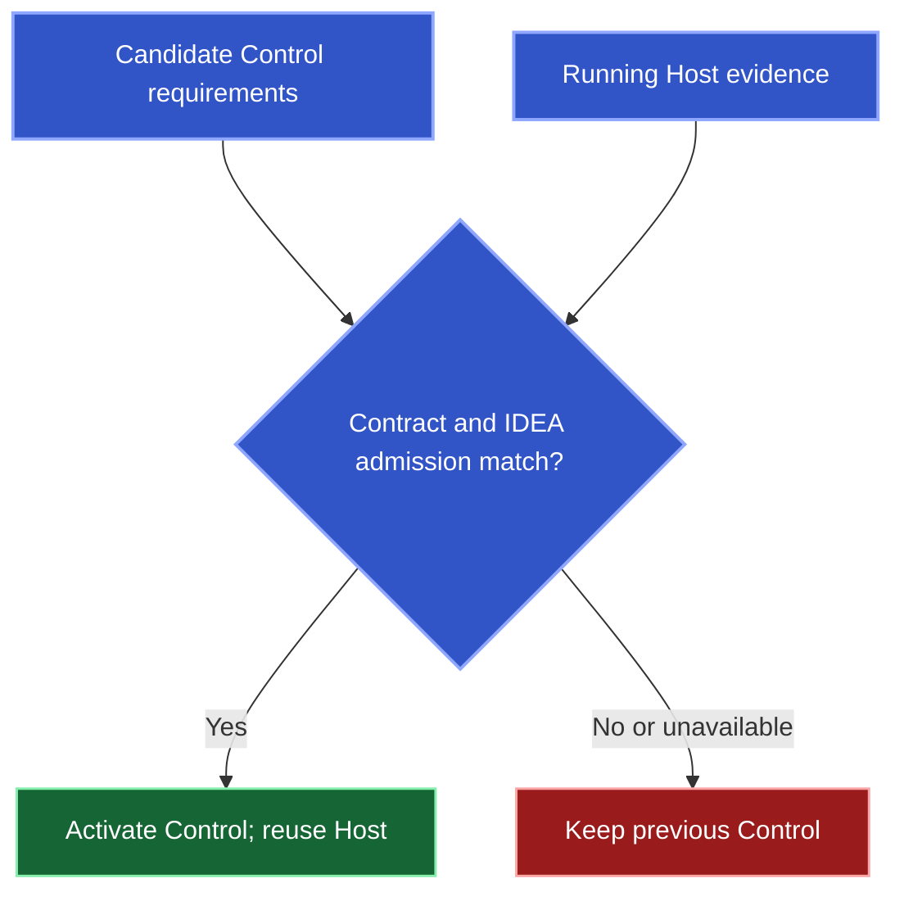

# Kast

Kast gives coding agents compiler-grounded Kotlin declarations, relationships,
diagnostics, and targeted source changes through IntelliJ IDEA.

**Kast is the deterministic structure around a probabilistic system.** The agent
chooses the question. Kast establishes identity and reports evidence limits.


```mermaid
flowchart TB
  accTitle: Program authority determines what an agent can conclude
  accDescr: Workspace checks precede IDEA analysis. Results distinguish complete coverage, qualified facts, and rejection.
  A["Agent chooses a question"] --> B["Kast checks workspace and input"]
  B --> I["IDEA Kotlin analysis"]
  B -->|Rejected| R["Report blocker"]
  I --> C["Complete: declared scope covered"]
  I --> Q["Qualified: facts with limits"]
  I -->|Unavailable| R
  classDef authority fill:#3154C7,color:#FFFFFF,stroke:#8FA7FF,stroke-width:2px;
  classDef evidence fill:#166534,color:#FFFFFF,stroke:#86EFAC,stroke-width:1.5px;
  classDef limited fill:#92400E,color:#FFFFFF,stroke:#FCD34D,stroke-width:1.5px;
  classDef rejected fill:#991B1B,color:#FFFFFF,stroke:#FCA5A5,stroke-width:1.5px;
  class B,I authority;
  class C evidence;
  class Q limited;
  class R rejected;
```

A confirmed caller does not establish every caller. Empty qualified results do
not prove absence. References require current workspace and source-state checks.

## Install

You need Apple silicon macOS, a Kotlin Gradle repository, and IntelliJ IDEA
`262.*` with its bundled Kotlin plugin and Java 25 JBR.

```shell
/bin/bash -c "$(curl -fsSL https://raw.githubusercontent.com/amichne/kast/main/install.sh)"
```

The default command selects stable releases. For the latest tested developer build:

```shell
/bin/bash -c "$(curl -fsSL https://raw.githubusercontent.com/amichne/kast/main/install.sh)" -- --developer-latest
```

Keep the `--` separator before installer options. Terminal downloads show progress.
Wait for the installation result. Ctrl-C stops installation. Append `--skip-codex-mcp`
to preserve an existing Codex MCP configuration.
Developer selection reads the published GitHub channel, independently of the local checkout or installed version.

Restart IDEA to load the plugin. Use `kast status` to inspect the installation.
The command is `$XDG_CONFIG_HOME/kast` when `XDG_CONFIG_HOME` is nonempty, otherwise
`$HOME/.local/bin/kast`. Upgrades preserve that location. If needed, add its directory to `PATH` using
the printed absolute path.

For Codex tools, the query skill, and examples:

```shell
kast plugin codex
```

Restart Codex and select the exact repository or worktree. After a Kast upgrade,
rerun `kast plugin codex`. Codex owns the plugin. Remove it with
`codex plugin remove kast@kast`.

Use [connection commands](https://kast.michne.com/agent-harnesses/) for Copilot,
Pi, or alternate Codex transports. Restart connected agents. For structured installer diagnostics, append `-- --verbose` to the
installation command.

For checksummed skill, plugin, and marketplace ZIPs, see
[agent tools](agent-tools/README.md).

## Ask a question

Start your agent from the intended repository or worktree, then ask:

> Use Kast to query declarations in this workspace. Show one compiler-backed
> symbol with its signature, source location, exact `ref`, and the result's
> coverage. If there is no proven match, report the limit or failure.

Queries prepare IDEA automatically. Reuse issued references unchanged. For stale
or unavailable state, query again. See [query examples](https://kast.michne.com/search/)
and [evidence boundaries](https://kast.michne.com/concepts/evidence-boundaries/).

## Upgrade and recover

Control owns the command, coordinator, adapters, and sessions. Host owns the IDEA
plugin and semantic runtime. Their release versions are independent.


```mermaid
flowchart TB
  accTitle: Contract equality permits independent Control upgrades
  accDescr: Matching contract and IDEA admission permit independent Control activation. Missing or incompatible Host evidence preserves previous Control.
  C["Candidate Control requirements"] --> M{"Contract and IDEA admission match?"}
  H["Running Host evidence"] --> M
  M -->|Yes| A["Activate Control; reuse Host"]
  M -->|No or unavailable| K["Keep previous Control"]
  classDef authority fill:#3154C7,color:#FFFFFF,stroke:#8FA7FF,stroke-width:2px;
  classDef evidence fill:#166534,color:#FFFFFF,stroke:#86EFAC,stroke-width:1.5px;
  classDef rejected fill:#991B1B,color:#FFFFFF,stroke:#FCA5A5,stroke-width:1.5px;
  class C,H,M authority;
  class A evidence;
  class K rejected;
```

Compatibility requires exact protocol, operation registry, wire schema, and
capability identities, plus IDEA/Kotlin release-line admission. Version equality
is not compatibility. `kast status` distinguishes installed Control, running Control, and observed Hosts.
Missing live evidence remains unavailable.

| Command | Effect |
| --- | --- |
| `kast upgrade --control-only` | Upgrade Control against a running compatible Host. Preserve IDEA and its plugin files. |
| `kast upgrade` | Upgrade both components on the selected channel. Interrupt active calls and sessions. |
| `kast stop` | Fence new calls and automatic restart, disable the coordinator, and wait up to 30 seconds for recorded calls. |
| `kast reinstall` | Verify shutdown, reinstall the recorded release, activate services, and restore registrations. |
| `kast uninstall` | Stop owned services and remove the receipted Host, Control, public executable, registrations, admitted configuration, and settled Kast state. |

Control-only upgrade checks Host before shutdown and after activation. Failure
restores and verifies previous Control or reports recovery required. Control
sessions can be interrupted. Load a compatible Host first.

For Host-only installation, use the public installer with
`--host-only --version <host-version>`, then restart IDEA. Control stays in place.

Hosted changes use the existing private local endpoint and native workspace
admission. Installation no longer creates approval keys. The keyless contract
requires matching Control and Host components; upgrade both and restart IDEA
before attaching a fresh agent session. An older Host remains incompatible until
it loads the matching plugin. See the [keyless migration](app-server/docs/compatibility.md#keyless-hosted-change-migration).

Uninstall retains a journal outside the installation until cleanup finishes, so a
retry can continue after Control has been removed. Unknown ownership, changed
configuration, active endpoints, or unsettled mutations retain the affected
artifacts and report a typed failure. A legacy Host without a recorded installation
target requires a verified paired installation before ordinary uninstall can
remove it.

Before stop or reinstall, close IDEA and affected agent connections. Running IDEA
returns `HOST_RESTART_REQUIRED`. Failed shutdown prevents replacement. Failed
activation preserves the fence and reports recovery. Sessions and writes are never
replayed. `kast stop --force` signals only processes whose recorded identity still matches.

**Destructive reset:** `kast uninstall --force` and `kast reinstall --force` erase
the selected Kast directory, including configuration, arbitrary files, and
registration history. Erased data has no rollback. Reset verifies process retirement
before deletion. Shared IDEA and Gradle processes remain under your control.

Force reinstall verifies replacement readiness and reports the new command at
`<kast-directory>/bin/kast`. Reconnect integrations, restart IDEA, and reload agents.
Preserve recovery paths and causes before retrying.

Lifecycle commands accept `--json`: one typed stdout result, stage observations on
stderr, and exit code 1 for unsuccessful outcomes. Unsupported fence capability
rejects before effects. See [management and recovery](https://kast.michne.com/workspaces/).

Kast uses `$HOME/.local/share/kast/installation`. For older `current` layouts, rerun
the published installer. Uncertain legacy removal requires `yes` per item.
Noninteractive upgrades keep and report those items.

Routine installation verifies the prior payload, retires its service, then checks
the state to retain. A stopped service's retained configuration does not prevent
installation. If retirement, state retention, or payload activation fails, Kast attempts to restart the prior service
and reports both the installation and recovery outcomes. Successful installation
resumes a valid shutdown left by `kast stop`. An existing tool session
rechecks a previous unavailable or incompatible Host or plugin when its next request
needs the workspace; restart IDEA after installing a Host update to load it.

Routine installation preserves admitted saved settings, including the App Server
endpoint, unless you explicitly select another. A fresh installation uses the standard Codex socket when available
and selects a private endpoint when that socket is occupied or cannot be inspected. Direct MCP and
the installed `kast-codex` launcher remain usable with a private endpoint.

## Develop

Use Java 25 or newer and Python from [`.python-version`](.python-version).
Native assembly uses Gradle-selected Java 25 with GraalVM Native Image.
Toolchain downloads require network access.

```shell
./gradlew build
./gradlew assembleRelease
# Independently package either component:
./gradlew assembleControlRelease -PcontrolVersion=0.50.0
./gradlew assembleHostRelease -PhostedPluginVersion=0.49.0
```

See [development](docs/development.md) for toolchains, installation, and testing,
or [OpenWiki](openwiki/quickstart.md) for source-bound architecture.

Report security issues through [private vulnerability reporting](https://github.com/amichne/kast/security/advisories/new).
Kast is under the [MIT License](LICENSE).
