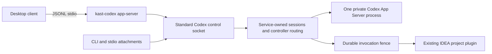

# Persistent Kast App Server

`:app-server` owns the persistent Codex broker, hosted tool catalog, and client
sessions. The installer keeps service control in the selected release at
`share/kast/libexec/kast-service`; it does not publish a `kast` command on `PATH`.
Semantic contracts and IntelliJ runtime implementations retain their own modules.

Provider qualification reads the bounded `share/kast/provider-catalog.json` artifact
and checks the complete hosted tool set against the canonical registry. Startup
rejects a missing or incompatible catalog and changes between qualification and
provider startup. Installed payload admission, IDEA compatibility, and Codex
schema qualification retain their existing owners.

## Enable and attach

Persistent installation enables the service and selects the canonical Codex App
Server endpoint. Register each repository or worktree explicitly before opening
it in a Codex client:

```sh
"${XDG_DATA_HOME:-$HOME/.local/share}/kast/current/share/kast/libexec/kast-service" register /absolute/path/to/repository
```

Registration is handled by the daemon management RPC. The private entry point
also accepts `enable`, `disable`, `stop`, `repair --destructive`, and
`enroll-trust`. A rejected registration retains its finite daemon reason.

The broker's coordinator endpoint is installation-owned at `state/run/c.sock`
(with an owned short-path transport when needed). The real Codex upstream remains
installation-private at `state/run/u.sock`. An occupied canonical endpoint never
grants Kast authority to replace an unknown incumbent. Client closure does not
stop the persistent service.

Desktop UI behavior is outside module-test evidence; see the
[compatibility and blocker record](docs/compatibility.md) for historical
observations and release-gate checks.

## Daemon management

The running coordinator registers a workspace during Codex attachment and
semantic demand. Registration no longer writes the registry from a standalone
CLI process. Private enable and repair retain their installation responsibilities.
The legacy login bootstrap remains available internally to migrate an older
one-shot agent.

The owned Unix socket serves a versioned, bounded `/kast-management` WebSocket
route for passive coordinator/session status, workspace registration, and controller
claim/release. It uses no
Codex handshake and does not admit the optional host. The client first verifies
the published installation owner, state epoch, service generation and service
identity; the daemon rejects a mismatched target or lifecycle fence before
registration. The registration acknowledgment retains the exact canonical root,
workspace identity and registry revision. Registration remains idempotent.

The private update protocol prepares a candidate, observes its request, cancels a
seal, or commits it. Active turns, approvals, requests, invocations, workspace
execution, pending preparation and uncertain outcomes keep the request pending.
Repeated preparation retains its request ID and may seal only after those owners
are quiescent. Sealing shares the admission mutex with lazy host creation, session
ingress and management mutations; new work cannot race the proof. Passive status
remains available. Cancellation can reopen an uncommitted seal; commit is
idempotent and cannot reopen admission. Lost upstream requests retain uncertainty.
Bounded outcome logs exclude paths, request IDs and candidate hashes. This is the
daemon admission contract; installer activation does not yet consume it.

Each control connection accepts one request. Management and runtime status share
the existing connection limit. Management requests and replies have a 16 KiB bound;
registration reserves enough reply space before writing. Lost replies report
an unobserved outcome and are never retried automatically. Protocol, coordinator
enrollment and controller failures retain their finite codes through service control.
Hosted queries use the provider's bounded semantic-read and workspace-readiness budget.

Controller actions target an existing connection and delegate to the shared session
owner, preserving observer membership, controller leases, active-turn protection
and pending approval protection. Native Codex connections cannot claim or release
control by asserting a different connection ID. They retain passive legacy status.
Public status inspects existing session state without initializing Codex or probing
an optional upstream. Pending, rejected and closed hosts remain distinct; an
oversized inventory reports capacity failure instead of an empty inventory.

The management route also owns workspace preparation operations. Preparation opens
only an exact canonical settings root through the selected IDEA lifecycle client.
Concurrent requests for that root share one server-generated request ID. Pending
operations poll the same native operation; status reads never open, import or
restart it. Host/request mismatches, regressing stages, deadlines and unavailable
IDEA installations remain finite rejections. Native trust and unsaved-document
gates still apply.

Preparation retains at most 256 operations for a daemon lifetime and rejects
excess roots without evicting completed evidence. Requests keep running when a
management client disconnects. Daemon shutdown settles pending records and leaves
IDEA projects open. Structured stage/outcome events exclude roots and payloads.
Completion records describe observed readiness; each semantic request still
requires fresh native admission. Installed semantic demand shares this operation
owner, waits within the canonical readiness budget, then checks the selected
application and project incarnation before sending one native request. The socket
client also requires the endpoint descriptor to match that prepared project.

A changed host rejects the current demand before semantic execution and invalidates
only the current root binding. Historical preparation records remain available;
a later demand can prepare a new incarnation. Transport failures never retry the
semantic operation. Cancelled waiters leave the shared preparation running.
Preparation blockers reach Codex with their finite cause and operation ID, marked
as known pre-execution failures.

Apply and recovery approval challenges use the same preparation owner before reading
the immutable hosted plan. Workspace blockers retain their typed cause and operation
identity and never register a controller prompt or sign a grant. Preparation has the
workspace-readiness budget in addition to the existing plan-read budget; controller
waiting retains its separate deadline.

Service lifecycle, deferred updates and durable storage migration remain subsequent work.

Launchd starts the private `share/kast/libexec/kast-daemon` entry point directly.
It accepts no commands and requires the managed readiness environment before
coordinator admission. Published receipts for the earlier `kast broker serve`
entry point remain readable for exact retirement. The per-user login agent
uses the same service label and daemon executable with a private login mode;
that mode verifies the exact loaded job before clearing a prior stop. The
one-shot bootstrap remains readable only for migration.

## Ownership and recovery



Each connection completes its own initialize/initialized exchange and retains its
own upstream request-ID space. A bounded outbound queue prevents one stalled
upstream writer from blocking other connections. Only the authoritative task
stream fans out notifications to observers; equal text deltas remain separate
events. Native server requests retain their responsible client and an explicit
response/resolution mapping. Kast never chooses an approval decision.

One workspace execution mutex serializes Kast reads and mutations while the
existing runtime remains authoritative for semantic validation. Workspace
admission follows canonical filesystem identity. A new thread automatically
registers its canonical working directory when no registered root contains it;
`kastWorkspaceRoot` can select and register an explicit containing root. No
separate registration command is required. Existing overlapping registrations
still require an explicit root. Resume, fork, and invocation validation remain
read-only and require the durable binding. Unknown threads receive no Kast
catalog or binding.

The service stores enrollment, thread/catalog bindings, and digest-only
invocation intent under `CODEX_HOME/broker`. It does not store conversation
history. Thread bindings live in private digest-sharded files under
`threads.json.d`. Opening the store does not scan historical workspaces; each
requested current binding acquires fresh directory and owner proof. Historical
records have no live-session capacity limit and are never aged out. The locked
legacy migration retains the original catalog and marks old bindings
`NEW_CONVERSATION_REQUIRED`; start a new Kast conversation after migration.
Codex conversation history remains untouched.

Intent reaches durable storage before approval or execution; a recovered started
invocation is uncertain and cannot run again automatically. Completed duplicate
calls within a live generation share one result. A restarted service rejects a
completed duplicate instead of fabricating its missing result.

Lost upstream work enters reconciliation-required state. Matching terminal turn
history or authoritative idle status can restore task control. This does not
clear an uncertain mutation's durable fence. Corrupt enrollment, thread bindings,
or invocation records fail closed. Invocation evidence is stored in hash-sharded
private records under `invocations.json.d`; only the addressed record is read.
The fence limits active admissions to 4,096 independently of historical records.
The completed response cache retains at most 4,096 results and evicts the oldest
completed response independently of active work. An evicted result still rejects
replay from its durable record. Approval refusals, binding failures and queued
cancellations settle before publication too. Completed and uncertain evidence is
never aged out. Settlement cannot rewrite a terminal record.

The first open migrates an owned legacy journal under a store lock. It validates
and verifies staged records before atomically publishing the version marker,
retains the original journal, and emits bounded migration outcomes without
identities or argument data. An incomplete migration rejects and retains its
staging evidence for recovery. When safe ownership recovery cannot converge,
private `kast-service repair --destructive` explicitly retires the installation's
launchd label, deletes only that physical installation's state and workspace
registry, re-enrolls the current workspace, and starts clean. Symlinks found
inside the state tree are deleted as links and never followed.

## Presentation and evidence

Kast executes through `item/tool/call` and returns native dynamic-tool text
content containing one independently parseable JSON envelope. A compact source
read with returned text prepends that unchanged source as a separate text item;
clients parse the final envelope item. The existing CLI
envelope preserves process completion separately from the canonical
`complete`, `qualified`, or `rejected` outcome, including its qualifications and
failure details. No summary prefix or newline splitting is required. Broker
admission and result-size failures also return a JSON rejection with their exact
finite failure code. Cancellation retains its cancelled status and uncertain
effect.
For display, the broker projects its owned `dynamicToolCall` items into the standard
expandable `mcpToolCall` shape, with the provider namespace as `server`, unchanged
arguments, and raw text in `result.content`. The final JSON envelope from Kast also
projects into the supported `result.structuredContent` field. When unchanged
source text precedes that envelope, both original text items remain in
`result.content`. Malformed and non-object final payloads remain raw text without
a manufactured structured result. This is a display adaptation, not an
MCP execution backend. The installed desktop client's generic dynamic-tool row
only displays a name and discards result content.

The same pure projection handles live events and every supported history carrier,
so reloading does not depend on a presentation cache. Call IDs, tool names, status,
duration, original content, and additional upstream fields are retained. Failed
calls keep their result and a native error marker. Media descriptors display as raw
JSON text. There is no custom Markdown, file-change item, or companion commentary.
Unowned tools pass through unchanged. Both input and projected output must satisfy
the selected Codex binary's generated schemas.

The `tool_display` service-log stage records projection completion or rejection
without arguments or results. A contradictory lifecycle includes its finite failure
reason. Display qualification is covered by the App Server tests; the optional
installed-schema check also exercises every lifecycle/history projection witness:

```shell
codex app-server generate-json-schema --experimental --out /tmp/kast-codex-schemas
KAST_CODEX_SCHEMA_DIRECTORY=/tmp/kast-codex-schemas ./gradlew :app-server:test
```

The raw shape has been validated against schemas from Codex CLI 0.154.0, 0.156.0,
and the desktop-bundled Codex 0.153.4. Codex 0.156.0 omits the legacy
`thread/rollback` schema pair; Kast requires both files or neither and only projects
that response when the pair was qualified. Desktop renderer source inspection established the missing dynamic content; this does not
constitute a live visual acceptance test of an installed Kast build.

Status separates launchd lifecycle observation, public endpoint kind/path/ownership,
transport, native protocol, catalog, upstream and semantic readiness. A live launchd
label is reported as `alive`, not proof of protocol readiness. Canonical status
uses an identity-correlated coordinator observation and a fresh native handshake.
Private coordinator status does not start an optional host. `semantic: unobserved`
remains explicit: a transport or catalog observation grants no IDEA read authority. Startup and invocation logs contain typed stage/outcome evidence.
A status document includes the exact service log, saved configuration, workspace
registry, and `launch-environment` paths. Each service ensure atomically rewrites
the private launch-environment snapshot with all resolved non-secret settings,
including defaults. `KAST_DEBUG=1` additionally streams bounded launch stages to
the calling process's stderr.
A bounded session trail records admission, handshake, detach, transport failure,
reconciliation, and invocation outcome without source or argument payloads.

```sh
./gradlew :app-server:test :cli:test :cli:nativeTest verifyKastArchitecture
./gradlew installedProductTest installedCodexHostTest
./gradlew :app-server:generateCodexHostIntegrationManifest
```

The installed tests use disposable homes and remove their launchd enablement.
They test real Codex discovery and stdio attachment. They do not establish desktop
UI compatibility. The test resource `kast-schema.json` is the installed Kast
`--schema` boundary snapshot used to keep protocol tests independent of CLI
implementation imports.

The coordinator no longer launches or reserves isolated workspace workers. Its
control route admits only passive, identity-correlated status and rejects legacy
worker demands. Hosted provider calls check the exact root and installation and
prepare the selected IDEA project before one native operation. Change preparation
and approved apply/recover retain the plan identity and assertion; an ordinary
apply or recovery without approval rejects before transport. Complete, qualified,
rejected and hosted challenge replies remain distinct.
Enrollment, sessions, approvals and durable invocation settlement remain broker
responsibilities.
