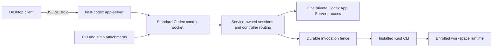

# Persistent Kast App Server

`:app-server` owns the persistent Codex broker and its client sessions. `:cli`
composes installed executables and exposes the command tree. Neither semantic
contracts nor IntelliJ runtime implementations belong in this module.

The desktop release gate is **unqualified**. See [compatibility and blockers](docs/compatibility.md)
for observed evidence, remaining client checks, and reproduction commands.

## Enable and attach

On the inspected macOS desktop build, run from the workspace to enroll:

```sh
kast app-server status
kast codex
# Alternatively:
kast codex desktop
```

`kast codex` performs enablement automatically: it records the canonical current
workspace, refreshes the login LaunchAgent, starts or safely recovers the broker,
and establishes the GUI daemon opt-in before launching the client. Explicit
`kast app-server enable` remains available for service-only setup. It rejects
known conflicting overrides and unsupported desktop builds.
Desktop host-specific configuration and interactive behavior still require the
release gate below. A currently running desktop process must be restarted by its
user to pick up the login environment.

`kast codex desktop` launches the desktop with a process-local `CODEX_CLI_PATH`
pointing to the installed `kast-codex` façade and forces stdio. Quit an already
running desktop first so its next process receives that environment. The desktop
starts the façade with `app-server` and exchanges native JSONL on stdin/stdout;
diagnostics go to stderr. The façade attaches to the same persistent service used
by the CLI. Client closure does not stop the service.

The shared upstream enables `features.code_mode_host=true` and uses Codex's
`--analytics-default-enabled` policy, matching the inspected desktop's launch
profile. Explicit Codex analytics configuration still takes precedence over that
default. Those exact options are accepted on the façade; other process options
and transport overrides reject before attachment. Configure shared settings in
`CODEX_HOME` rather than passing per-client overrides. `kast-codex` retains CLI
argument forwarding.

A custom desktop client can spawn `kast-codex app-server`, send `initialize`,
then `initialized`, and use the ordinary App Server protocol. No TCP listener or
client-specific RPC envelope is introduced. This launch pattern takes inspiration
from [Codapter](https://github.com/kcosr/codapter/tree/429812d8976c317d4333aa51ce5106eb511f6816);
Kast continues to use the real Codex server and existing tool broker.

```sh
kast app-server control release THREAD_ID CONNECTION_ID
kast app-server control claim THREAD_ID CONNECTION_ID
kast app-server stop
kast app-server disable
```

Status exposes bounded connection IDs and task state. A task has one controller;
claiming an occupied task conflicts, and handoff during an active turn or pending
server request fails. An observer must first successfully resume the task.

Stop publishes its suppression marker under the startup lock, removes only the
identity-proven service, and waits for retirement. Attachments cannot restart it
for that login. Explicit enable or the next login bootstrap clears suppression.
Disable additionally removes the Kast-owned login agent and restores only
Kast-owned daemon environment changes. Enrollment and invocation evidence remain
on disk; disable does not erase execution history.

## Ownership and recovery



Each connection completes its own initialize/initialized exchange and retains its
own upstream request-ID space. A bounded outbound queue prevents one stalled
upstream writer from blocking other connections. Only the authoritative task
stream fans out notifications to observers; equal text deltas remain separate
events. Native server requests retain their responsible client and an explicit
response/resolution mapping. Kast never chooses an approval decision.

One workspace execution mutex serializes Kast reads and mutations while the
existing runtime remains authoritative for semantic validation. Workspace
admission follows canonical filesystem identity. Unenrolled thread creation and
unknown thread resume/fork traffic receive no Kast catalog or binding.

The service stores enrollment, thread/catalog bindings, and digest-only
invocation intent under `CODEX_HOME/broker`. It does not store conversation
history. Intent reaches durable storage before execution; a recovered started
invocation is uncertain and cannot run again automatically. Completed duplicate
calls within a live generation share one result. A restarted service rejects a
completed duplicate instead of fabricating its missing result.

Lost upstream work enters reconciliation-required state. Matching terminal turn
history or authoritative idle status can restore task control. This does not
clear an uncertain mutation's durable fence. Corrupt enrollment, thread bindings,
or invocation journals fail closed. The journal caps at 4,096 invocation records;
capacity exhaustion is an explicit rejection, not automatic eviction of replay
protection. When safe ownership recovery cannot converge,
`kast app-server repair --destructive` explicitly retires the installation's
launchd label, deletes only that physical installation's state and workspace
registry, re-enrolls the current workspace, and starts clean. Symlinks found
inside the state tree are deleted as links and never followed.

## Presentation and evidence

Kast returns two native text content entries: an operation/status summary and the
complete bounded structured outcome. `dynamicToolCall`, arguments, correlation,
status, duration, and content remain native in live events and history. There are
no fabricated MCP, file-change, or commentary items. Existing native tools and
client-owned responders keep their protocol identities.

Status separates transport, protocol, catalog, semantic readiness, and desktop
qualification. Startup and invocation logs contain typed stage/outcome evidence.
A status document includes the exact service log, saved configuration, workspace
registry, and `launch-environment` paths. Each service ensure atomically rewrites
the private launch-environment snapshot with all resolved non-secret settings,
including defaults. `KAST_DEBUG=1` additionally streams bounded launch stages to
the calling process's stderr.
A bounded session trail records admission, handshake, detach, transport failure,
reconciliation, and invocation outcome without source or argument payloads.

```sh
./gradlew :app-server:test :cli:test :cli:nativeTest verifyKastArchitecture
./gradlew installedProductTest installedCodexHostTest
./gradlew :app-server:generateCodexHostIntegrationManifest
```

The installed tests use disposable homes and remove their launchd enablement.
They test real Codex discovery and stdio attachment. They do not establish desktop
UI compatibility. The test resource `kast-schema.json` is the installed Kast
`--schema` boundary snapshot used to keep protocol tests independent of CLI
implementation imports.
