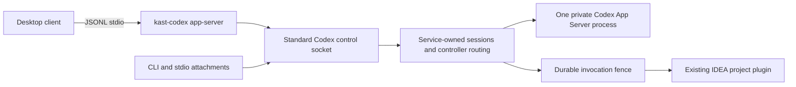

# Persistent Kast App Server

`:app-server` owns the persistent Codex broker and its client sessions. `:cli`
composes installed executables and exposes the command tree. Neither semantic
contracts nor IntelliJ runtime implementations belong in this module.

The desktop release gate is **unqualified**. See [compatibility and blockers](docs/compatibility.md)
for observed evidence, remaining client checks, and reproduction commands.

Provider qualification reads the bounded `share/kast/provider-catalog.json` artifact
and checks the complete tool set against the canonical registry. The build derives
this artifact from the shared hosted schema owner. Startup no longer runs
`kast --version` or `kast --schema`; it rejects missing or incompatible catalogs
and changes between qualification and provider startup. Installed payload admission,
IDEA compatibility, and Codex schema qualification retain their existing owners.

## Enable and attach

Enable persistent integration from the workspace to enroll:

```sh
kast app-server enable
kast app-server status
kast codex
```

Enabled integration defaults to the installation-owned endpoint at `state/run/c.sock`
(with the owned short-path transport when needed). `kast codex` explicitly selects
that endpoint; the desktop façade attaches to the same coordinator. A standalone
Codex daemon can keep its own public socket without blocking Kast. The real Codex
upstream remains installation-private at `state/run/u.sock`.

`KAST_APP_SERVER_PUBLIC_ENDPOINT=codex-control` explicitly selects the canonical
public endpoint at `$CODEX_HOME/app-server-control/app-server-control.sock` for
stock-client discovery. Installation persists an explicit selection; endpoint
policy participates in service identity. Disabled host integration always retains
the private coordinator endpoint.

Canonical mode never replaces an unknown incumbent. An occupied endpoint reports
`public-socket-owned` before attempting Kast's status protocol. To transfer that
endpoint from a standalone Codex daemon, stop it with `codex app-server daemon stop`
and retry enablement. A refused connection grants no socket deletion authority.
Canonical startup acquires its socket lease, binds the endpoint, qualifies the
catalog and Codex schemas, and completes native `initialize` / `initialized` before
publishing readiness. The private coordinator publishes its control readiness
independently; client attachment still requires host and protocol qualification.

Installation validates the candidate configuration and executable before retiring
the previous service. Once installation is committed, activation failure reports
`installed-activation-pending`, with a finite process failure and `kast codex` as
the resume command. The saved configuration and installed launchers remain usable.
The next launch re-runs enrollment and bounded service reconciliation without
reinstalling; a client starts only after service readiness succeeds. Installation
with activation disabled reports `not-requested` rather than implying readiness.

`kast codex` enrolls the workspace and ensures the persistent service. It retains
explicit `--remote` attachment during client qualification. Stock Codex 0.154.0
daemon discovery passed installed acceptance; interactive tool execution remains
a separate gate. Its implicit TUI route can fall back to an embedded server after
attachment failure, so ordinary launch is not yet a qualified fail-closed route.

`kast codex desktop` launches the desktop with a process-local `CODEX_CLI_PATH`
pointing to the installed `kast-codex` façade and forces stdio. Quit an already
running desktop first so its next process receives that environment. The desktop
starts the façade with `app-server` and exchanges native JSONL on stdin/stdout;
diagnostics go to stderr. The façade attaches to the same persistent service used
by the CLI. Client closure does not stop the service.

The shared upstream enables `features.code_mode_host=true` and uses Codex's
`--analytics-default-enabled` policy, matching the inspected desktop's launch
profile. Explicit Codex analytics configuration still takes precedence over that
default. Those exact options are accepted on the façade; other process options
and transport overrides reject before attachment. Configure shared settings in
`CODEX_HOME` rather than passing per-client overrides. `kast-codex` retains CLI
argument forwarding.

A custom desktop client can spawn `kast-codex app-server`, send `initialize`,
then `initialized`, and use the ordinary App Server protocol. No TCP listener or
client-specific RPC envelope is introduced. This launch pattern takes inspiration
from [Codapter](https://github.com/kcosr/codapter/tree/429812d8976c317d4333aa51ce5106eb511f6816);
Kast continues to use the real Codex server and existing tool broker.

```sh
kast app-server control release THREAD_ID CONNECTION_ID
kast app-server control claim THREAD_ID CONNECTION_ID
kast app-server stop
kast app-server disable
```

Status exposes bounded connection IDs and task state. A task has one controller;
claiming an occupied task conflicts, and handoff during an active turn or pending
server request fails. An observer must first successfully resume the task.

Stop publishes its suppression marker under the startup lock, removes only the
identity-proven service, and waits for retirement. Attachments cannot restart it
for that login. Explicit enable or the next login bootstrap clears suppression.
Disable additionally removes the Kast-owned login agent. Enrollment and invocation evidence remain
on disk; disable does not erase execution history.

## Daemon management

`kast app-server register` registers the current workspace through the running
coordinator. Start it with `kast app-server enable` first. Registration no longer
writes the registry from a standalone CLI process. Initial enable/repair and
login bootstrap retain their existing installation responsibilities.

The owned Unix socket serves a versioned, bounded `/kast-management` WebSocket
route for passive coordinator/session status, workspace registration, and controller
claim/release. It uses no
Codex handshake and does not admit the optional host. The client first verifies
the published installation owner, state epoch, service generation and service
identity; the daemon rejects a mismatched target or lifecycle fence before
registration. The registration acknowledgment retains the exact canonical root,
workspace identity and registry revision. Registration remains idempotent.

Each connection accepts one request. Management and runtime status share the
existing control connection limit. Requests and replies have a 16 KiB bound;
registration reserves enough reply space before writing. Lost replies report
an unobserved outcome and are never retried automatically. Protocol, coordinator
enrollment and controller failures retain their finite codes through the CLI.

Controller actions target an existing connection and delegate to the shared session
owner, preserving observer membership, controller leases, active-turn protection
and pending approval protection. Native Codex connections cannot claim or release
control by asserting a different connection ID. They retain passive legacy status.
Public status inspects existing session state without initializing Codex or probing
an optional upstream. Pending, rejected and closed hosts remain distinct; an
oversized inventory reports capacity failure instead of an empty inventory.

The management route also owns workspace preparation operations. Preparation opens
only an exact canonical settings root through the selected IDEA lifecycle client.
Concurrent requests for that root share one server-generated request ID. Pending
operations poll the same native operation; status reads never open, import or
restart it. Host/request mismatches, regressing stages, deadlines and unavailable
IDEA installations remain finite rejections. Native trust and unsaved-document
gates still apply.

Preparation retains at most 256 operations for a daemon lifetime and rejects
excess roots without evicting completed evidence. Requests keep running when a
management client disconnects. Daemon shutdown settles pending records and leaves
IDEA projects open. Structured stage/outcome events exclude roots and payloads.
Completion records describe observed readiness; each semantic request still
requires fresh native admission. Automatic tool-demand integration follows this
management slice.

Service lifecycle, automatic workspace preparation, deferred updates and durable
storage migration remain separate work.

## Ownership and recovery



Each connection completes its own initialize/initialized exchange and retains its
own upstream request-ID space. A bounded outbound queue prevents one stalled
upstream writer from blocking other connections. Only the authoritative task
stream fans out notifications to observers; equal text deltas remain separate
events. Native server requests retain their responsible client and an explicit
response/resolution mapping. Kast never chooses an approval decision.

One workspace execution mutex serializes Kast reads and mutations while the
existing runtime remains authoritative for semantic validation. Workspace
admission follows canonical filesystem identity. A new thread automatically
registers its canonical working directory when no registered root contains it;
`kastWorkspaceRoot` can select and register an explicit containing root. No
separate registration command is required. Existing overlapping registrations
still require an explicit root. Resume, fork, and invocation validation remain
read-only and require the durable binding. Unknown threads receive no Kast
catalog or binding.

The service stores enrollment, thread/catalog bindings, and digest-only
invocation intent under `CODEX_HOME/broker`. It does not store conversation
history. Intent reaches durable storage before execution; a recovered started
invocation is uncertain and cannot run again automatically. Completed duplicate
calls within a live generation share one result. A restarted service rejects a
completed duplicate instead of fabricating its missing result.

Lost upstream work enters reconciliation-required state. Matching terminal turn
history or authoritative idle status can restore task control. This does not
clear an uncertain mutation's durable fence. Corrupt enrollment, thread bindings,
or invocation journals fail closed. The journal caps at 4,096 invocation records;
capacity exhaustion is an explicit rejection, not automatic eviction of replay
protection. When safe ownership recovery cannot converge,
`kast app-server repair --destructive` explicitly retires the installation's
launchd label, deletes only that physical installation's state and workspace
registry, re-enrolls the current workspace, and starts clean. Symlinks found
inside the state tree are deleted as links and never followed.

## Presentation and evidence

Kast executes through `item/tool/call` and returns native dynamic-tool text
content containing one independently parseable JSON envelope. A compact source
read with returned text prepends that unchanged source as a separate text item;
clients parse the final envelope item. The existing CLI
envelope preserves process completion separately from the canonical
`complete`, `qualified`, or `rejected` outcome, including its qualifications and
failure details. No summary prefix or newline splitting is required. Broker
admission and result-size failures also return a JSON rejection with their exact
finite failure code. Cancellation retains its cancelled status and uncertain
effect.
For display, the broker projects its owned `dynamicToolCall` items into the standard
expandable `mcpToolCall` shape, with the provider namespace as `server`, unchanged
arguments, and raw text in `result.content`. The final JSON envelope from Kast also
projects into the supported `result.structuredContent` field. When unchanged
source text precedes that envelope, both original text items remain in
`result.content`. Malformed and non-object final payloads remain raw text without
a manufactured structured result. This is a display adaptation, not an
MCP execution backend. The installed desktop client's generic dynamic-tool row
only displays a name and discards result content.

The same pure projection handles live events and every supported history carrier,
so reloading does not depend on a presentation cache. Call IDs, tool names, status,
duration, original content, and additional upstream fields are retained. Failed
calls keep their result and a native error marker. Media descriptors display as raw
JSON text. There is no custom Markdown, file-change item, or companion commentary.
Unowned tools pass through unchanged. Both input and projected output must satisfy
the selected Codex binary's generated schemas.

The `tool_display` service-log stage records projection completion or rejection
without arguments or results. A contradictory lifecycle includes its finite failure
reason. Display qualification is covered by the App Server tests; the optional
installed-schema check also exercises every lifecycle/history projection witness:

```shell
codex app-server generate-json-schema --experimental --out /tmp/kast-codex-schemas
KAST_CODEX_SCHEMA_DIRECTORY=/tmp/kast-codex-schemas ./gradlew :app-server:test
```

The raw shape has been validated against schemas from Codex CLI 0.154.0 and the
desktop-bundled Codex 0.153.4. Desktop renderer source inspection established the missing dynamic content; this does not
constitute a live visual acceptance test of an installed Kast build.

Status separates launchd lifecycle observation, public endpoint kind/path/ownership,
transport, native protocol, catalog, upstream and semantic readiness. A live launchd
label is reported as `alive`, not proof of protocol readiness. Canonical status
uses an identity-correlated coordinator observation and a fresh native handshake.
Private coordinator status does not start an optional host. `semantic: unobserved`
remains explicit: a transport or catalog observation grants no IDEA read authority. Startup and invocation logs contain typed stage/outcome evidence.
A status document includes the exact service log, saved configuration, workspace
registry, and `launch-environment` paths. Each service ensure atomically rewrites
the private launch-environment snapshot with all resolved non-secret settings,
including defaults. `KAST_DEBUG=1` additionally streams bounded launch stages to
the calling process's stderr.
A bounded session trail records admission, handshake, detach, transport failure,
reconciliation, and invocation outcome without source or argument payloads.

```sh
./gradlew :app-server:test :cli:test :cli:nativeTest verifyKastArchitecture
./gradlew installedProductTest installedCodexHostTest
./gradlew :app-server:generateCodexHostIntegrationManifest
```

The installed tests use disposable homes and remove their launchd enablement.
They test real Codex discovery and stdio attachment. They do not establish desktop
UI compatibility. The test resource `kast-schema.json` is the installed Kast
`--schema` boundary snapshot used to keep protocol tests independent of CLI
implementation imports.

The coordinator no longer launches or reserves isolated workspace workers. Its
control route admits only passive, identity-correlated status and rejects legacy
worker demands. The configured CLI connects semantic operations to the existing
IDEA plugin; enrollment, sessions, approvals and durable invocation settlement
remain broker responsibilities.
