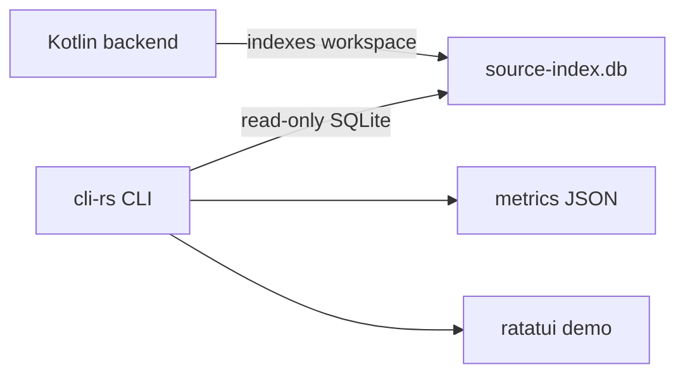

# Source index reader

`cli-rs` can answer a subset of metrics and demo queries without a
running daemon by reading `source-index.db` directly. The database is
still produced by Kast's Kotlin analysis backend. The Rust CLI is a
read-only consumer of that cache.

## Boundary

The direct reader opens SQLite with read-only flags, checks the source
index schema, and runs queries over the existing tables. It does not
write the database, schedule indexing, or infer compiler facts that are
not already present in the cache.



The schema check is intentionally strict. If the database is missing or
does not match the expected schema version, commands fail with an
explicit error instead of presenting stale relation data as current.

## Query surfaces

The direct reader powers two public surfaces:

| Surface | Use case |
|---------|----------|
| `kast metrics ...` | Machine-readable rankings, impact views, coupling, search, and graph JSON. |
| `kast demo` | Interactive symbol walking and spatial structure views with source previews. |

`kast demo` is the presentation surface for walking from symbol to symbol or
inspecting workspace/file/declaration structure during a terminal session.

## Local benchmark evidence

Timing checks are local evidence, not CI gates. Build the Rust CLI and
the benchmark helper together, then point the helper at a real
`source-index.db` and a focal symbol that exists in that database.

```console
cargo build --release --locked --bin kast --bin kast-metrics-bench
target/release/kast-metrics-bench \
  --workspace-root /absolute/path/to/workspace \
  --database /absolute/path/to/source-index.db \
  --symbol com.example.Foo \
  --query Foo \
  --iterations 5
```

The helper runs Rust direct SQLite timings for `fan-in`, `graph`,
`search`, and `impact`. Metrics commands no longer fall back to JVM
JSON-RPC, so stale or schema-incompatible indexes fail directly instead
of hiding the read path being measured. It prints JSON with per-operation
`minMs`, `medianMs`, `maxMs`, raw `timingsMs`, and any skipped or failed
comparison runs.

When a compatible JVM/Kotlin `kast` binary is available, pass it with
`--kotlin-bin` to compare the same operation set against that path. If no
compatible binary is provided or detected, the report records the Kotlin
comparison as skipped instead of failing the Rust benchmark.

## Confidence model

Metrics and demo snapshots include index confidence derived from the
database contents:

- `semanticBasis` is `K2_RESOLVED` when declaration rows are present,
  `LEXICAL` when only identifier paths are available, and `HEURISTIC`
  otherwise.
- `indexCompleteness` compares files with reference rows against the
  file manifest.
- `level` is derived from that semantic basis and completeness.

These fields describe the evidence in the cache. They should be used to
qualify claims about completeness rather than ignored.

## Source preview

The demo reads source files only to render the preview pane. The graph,
relation rows, and spatial declaration tree come from SQLite. If a
source file cannot be read, the demo reports that in the preview pane
while keeping the indexed symbol and structure views available.

This makes the demo robust to partial checkouts and moved files, but it
also means source previews are only as fresh as the workspace files on
disk. Run `kast up` or refresh the workspace before relying on a demo
snapshot for current-state review.
