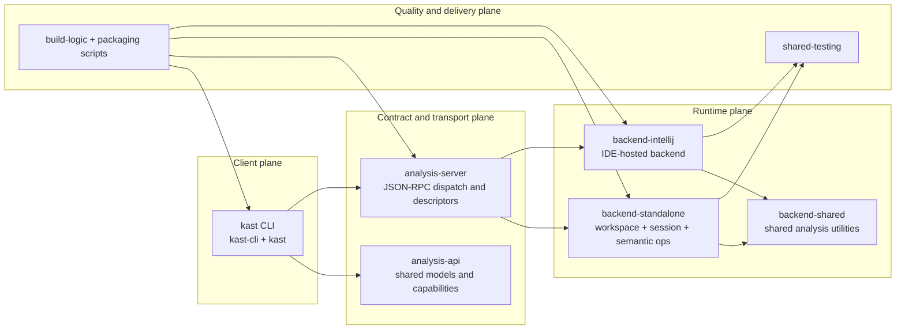
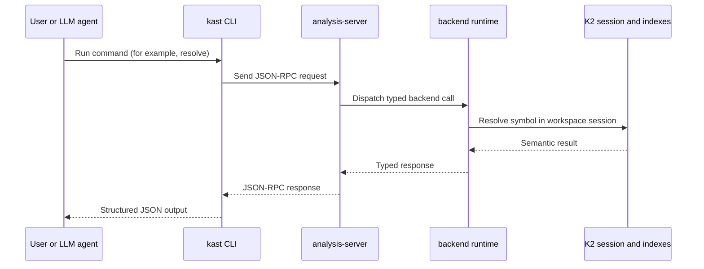

This page is for advanced users and developers who need a defensible,
module-level model of Kast. It explains what each module owns, why the
boundaries exist, and how the command surface maps to deeper runtime
capabilities.

## High-level architecture

Kast follows a client-daemon design. The CLI stays lightweight, while the
backend keeps Kotlin semantic state warm.

The core decision is to isolate semantic runtime cost in long-lived backends,
so repeat queries reuse session state instead of rebuilding compiler context on
every command.

## Module ownership map

The following map reflects the current ownership model used across the repo.

| Module | Owns | Why this boundary exists |
| --- | --- | --- |
| `analysis-api` | Shared contract, serializable models, capability flags, and edit validation types | Keeps protocol semantics stable across CLI and backends |
| `kast-cli` | Operator-facing command parsing, lifecycle orchestration, and native entrypoint | Keeps user workflows centralized and scriptable |
| `kast` | JVM shell and wrapper packaging, including `internal daemon-run` | Separates runtime packaging concerns from control-plane parsing |
| `analysis-server` | JSON-RPC transport, dispatch, descriptor lifecycle, and local binding rules | Isolates transport concerns from semantic logic |
| `backend-standalone` | Headless runtime, workspace discovery, K2 session bootstrap, indexing, and semantic operations | Concentrates stateful analysis behavior in one runtime |
| `backend-intellij` | IDE-hosted runtime, plugin lifecycle, and project service wiring | Reuses IntelliJ project model when the IDE is already running |
| `backend-shared` | Shared analysis helpers used by both runtime hosts | Avoids duplicate semantic utility code |
| `shared-testing` | Contract fixtures and fake backend infrastructure | Pins behavior consistency across implementations |
| `build-logic` | Gradle conventions, wrapper generation, and runtime-lib sync | Keeps build and packaging rules centralized |

## Design choices and rationale

Kast keeps several explicit design choices that shape everyday behavior.

### Choice 1: JSON-RPC contract as the stable center

The contract is explicit and capability-gated. This keeps clients from assuming
an operation exists when a backend cannot provide it.

### Choice 2: Stateful daemon for semantic work

Kotlin semantic analysis has meaningful startup and indexing cost. A daemonized
model pays that cost once per workspace, then serves warm-path queries faster.

### Choice 3: Bounded advanced traversals

Operations such as `call-hierarchy` are intentionally bounded by depth,
fan-out, total edges, and time limits. The result includes truncation metadata,
so callers can distinguish complete from bounded answers.

### Choice 4: Planned mutation over blind rewrite

Rename and edit application use plan-and-apply semantics with expected file
hashes. This protects against stale plans and reduces accidental drift between
analysis time and write time.

## Command granularity model

Kast exposes one CLI, but not every command has the same audience.

### Tier 1: Primary commands (most usable)

These commands are the default operational path for most teams.

- Workspace lifecycle: `workspace ensure`, `workspace status`, `workspace stop`
- Runtime contract check: `capabilities`
- Core read analysis: `resolve`, `references`, `diagnostics`
- Controlled mutation: `rename`, `apply-edits`

### Tier 2: Advanced primitives

These commands are powerful building blocks that are often consumed by experts,
agent workflows, or automation requiring higher precision.

- `call-hierarchy`
- `outline`
- `workspace-symbol`
- `type-hierarchy`
- `insertion-point`
- `workspace refresh`
- `optimize-imports`

Treat Tier 2 commands as supported primitives, not hidden features. They are
critical for advanced workflows even when they are not part of the default
human path.

## End-to-end lifecycle for one request

This sequence shows how a single semantic query moves across layers.

## Full supported scope in one view

Across standalone and IntelliJ-hosted backends, Kast supports:

- Symbol resolution, references, diagnostics, and file outline
- Workspace symbol search, call hierarchy, and type hierarchy
- Semantic insertion point queries
- Rename planning and edit application
- Import optimization and workspace refresh
- Workspace lifecycle and capability reporting

Use `capabilities` in automation before relying on any operation, especially
when switching runtime hosts.

## Next steps

After you absorb this model, continue with command-level details or the
LLM-specific integration path.

- [Run analysis commands](run-analysis-commands.md)
- [Command reference](command-reference.md)
- [Use Kast from an LLM agent](use-kast-from-an-llm-agent.md)
