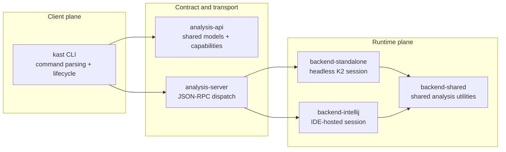
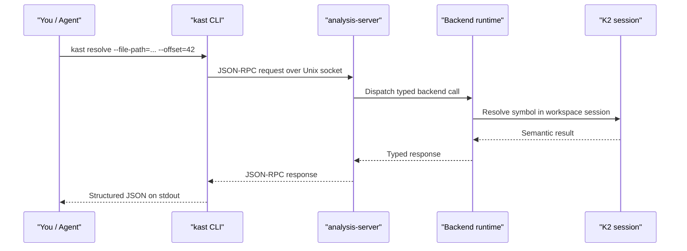
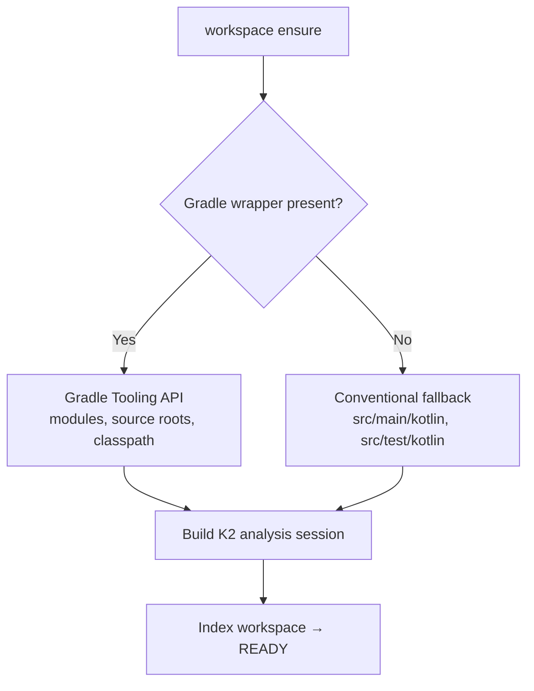

# How Kast works

This page explains the architecture behind Kast — what each module
owns, how a request flows from your terminal to the K2 engine and back,
and why the system is designed the way it is. Read this when you want to
understand the "why" behind the behavior you see.

## High-level architecture

Kast follows a client-daemon design. The CLI is a lightweight control
plane. The backend keeps Kotlin semantic state warm across requests.

The core design decision: isolate semantic runtime cost in long-lived
backends so repeat queries reuse session state instead of rebuilding
compiler context on every command.

## Module ownership

Each module has a clear boundary. Changes belong in the narrowest module
that owns the behavior.

| Module | Owns | Why it exists |
|--------|------|---------------|
| `analysis-api` | Shared contract, serializable models, capability flags, edit validation | Keeps protocol semantics stable across all consumers |
| `kast-cli` | Command parsing, lifecycle orchestration, native entrypoint, distribution | Centralizes user-facing workflows |
| `analysis-server` | JSON-RPC transport, dispatch, descriptor lifecycle | Isolates transport concerns from semantic logic |
| `backend-standalone` | Headless runtime, workspace discovery, K2 session bootstrap | Concentrates stateful analysis in one runtime |
| `backend-intellij` | IDE-hosted runtime, plugin lifecycle, project service | Reuses IntelliJ project model when IDE is running |
| `backend-shared` | Shared analysis helpers for both runtimes | Avoids duplicate semantic utility code |
| `shared-testing` | Contract fixtures and fake backend infrastructure | Pins behavior consistency across implementations |
| `build-logic` | Gradle conventions, wrapper generation, runtime-lib sync | Keeps build and packaging rules centralized |

## End-to-end request flow

This sequence shows how a single command moves from your terminal through
every layer and back.

Every step returns structured data. There is no string scraping or
regex parsing anywhere in the pipeline.

## Why a daemon?

Starting a Kotlin analysis session is the expensive part. It involves
discovering the workspace layout, resolving classpaths, and building
compiler indexes. Kast pays that cost once per workspace and keeps the
session warm.

- **First command is slower** — workspace discovery, session startup,
  and initial indexing happen up front.
- **Later commands are fast** — the backend reuses loaded state.
- **One process holds the analysis context** — caches and indexes stay
  with the workspace until you stop the daemon.

When you use the IntelliJ plugin backend, IntelliJ itself is the
long-lived process. The plugin starts the Kast server as part of the
IDE lifecycle.

## Design decisions

These choices shape everyday behavior. Understanding them helps you
predict what Kast will and won't do.

### JSON-RPC contract as the stable center

The wire protocol is explicit and capability-gated. Clients check
`capabilities` before assuming an operation exists. This keeps the
contract honest and backends from advertising work they can't perform.

### Bounded traversals

Operations like `call-hierarchy` are intentionally bounded by depth,
fan-out, total edges, and time limits. Every result includes truncation
metadata so callers can distinguish "the tree is complete" from "Kast
stopped on purpose."

### Planned mutation over blind rewrite

Rename and edit application use plan-and-apply semantics with SHA-256
file hashes. You plan, review, and then apply. If any file changed
between planning and applying, Kast rejects the apply with a clear
conflict error. This protects against stale plans and reduces
accidental drift.

### Workspace-scoped analysis

Kast attaches one daemon to one workspace root and builds one analysis
session for that workspace. All results — references, call hierarchy,
diagnostics, edits — are scoped to files inside that session. Code
outside the workspace root is invisible.

## Workspace discovery

How the daemon finds your project structure depends on your environment.

For Gradle projects, Kast uses the Gradle Tooling API to discover
modules, source roots, and classpath information. This gives it full
visibility into multi-module workspaces. For non-Gradle projects, it
falls back to conventional source root directories.

## Command tiers

Not every command targets the same audience. Kast organizes its surface
into two tiers.

### Tier 1: primary commands

The default operational path for most users and agents.

- **Workspace lifecycle:** `workspace ensure`, `workspace status`,
  `workspace stop`
- **Runtime check:** `capabilities`
- **Core reads:** `resolve`, `references`, `diagnostics`
- **Controlled mutation:** `rename`, `apply-edits`

### Tier 2: advanced primitives

Powerful building blocks for expert workflows, agent automation, and
deep analysis.

- `call-hierarchy`, `type-hierarchy`
- `outline`, `workspace-symbol`
- `insertion-point`
- `workspace refresh`, `optimize-imports`

Tier 2 commands are fully supported. They appear as a separate tier
because they address specialized needs, not because they're less
stable.

## Next steps

- [Behavioral model](behavioral-model.md) — the rules and limits
  behind Kast results
- [Kast vs LSP](kast-vs-lsp.md) — why Kast exists alongside the
  Language Server Protocol
