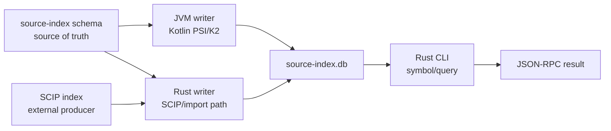

# SCIP ingestion audit

!!! note "Status"

    This is an audit RFC. It identifies refactor candidates and test gates
    that should be implemented before Kast accepts external SCIP data. It
    does not describe a shipped SCIP importer.

This page is for contributors who need to reduce onboarding overhead around
Kast's source index and prepare a future integration where non-JVM indexers
can still feed the repo-local `kast` CLI without requiring an installed JVM or
JDK. The first target is SCIP, the Sourcegraph-originated Code Intelligence
Protocol. The user-facing prompt used the spelling "SCIF"; this page assumes
that meant SCIP.

The goal is not to make every backend pluggable at once. The narrow target is
to make the source-index database schema the source of truth, then let
external producers create code-intelligence facts that Kast can query through
the existing CLI and JSON-RPC surface.

## Repository layout note

The active Rust CLI now lives in `cli-rs/` inside this monorepo. During the
recent monorepo migration, the original Rust repository remains available as
the sibling checkout `../kast-rs`. Use `../kast-rs` when auditing historical
Rust ownership, validating migration drift, or checking whether a CLI behavior
predates the monorepo copy.

## SCIP context

SCIP is a language-agnostic index format for code navigation features such as
go to definition and find references. The current project home is
[scip-code.org](https://scip-code.org/), and the schema and CLI live in the
[scip-code/scip](https://github.com/scip-code/scip) repository. Sourcegraph
announced in 2026 that SCIP is moving to a community-governed open source
project, so Kast should treat it as an external standard rather than a
Sourcegraph-only artifact.

## Current shape

Kast already has the right high-level split for this work: the CLI owns the
operator-facing control plane, `analysis-api` owns the shared contract,
`analysis-server` owns JSON-RPC dispatch, and the backend runtimes own Kotlin
semantic state.

The source-index path cuts across that split:

- Kotlin runtime code writes SQLite source-index data through
  `SqliteSourceIndexStore`.
- `backend-shared` has PSI scanners that produce file, declaration, and
  reference rows from Kotlin PSI.
- `backend-intellij` can hydrate a source-index database from a remote URI.
- Rust CLI code owns `symbol/query` and reads the SQLite database directly.
  The active copy is `cli-rs/`; the original Rust repository is `../kast-rs`.
- `analysis-api` has serializable `symbol/query` skill models that overlap
  with Rust request and response structs.

That split is workable, but only if the durable index contract is explicit.
Right now, a new contributor has to read Kotlin storage code, Rust query code,
and skill contracts to understand one indexed query path.

The schema should become the alignment point for this path. Kotlin data
classes, Rust structs, and SCIP importer models should be bindings or adapters
around the same durable source-index schema, not competing sources of truth.

## Audit findings

| Priority | Finding | Evidence | Why it matters |
| --- | --- | --- | --- |
| P0 | Source-index schema version must stay rooted outside language bindings | The active monorepo now declares `source_index_schema_version` in `packaging/homebrew/release-state.json`; earlier drift had Kotlin writing version `7` while Rust readers accepted version `6` | A Kotlin-written DB can be rejected by the Rust-owned query path whenever the version is duplicated. SCIP import would hit the same drift immediately. |
| P0 | `symbol/query` wire models are duplicated | Kotlin models live in `analysis-api`; Rust has private serde structs with the same request and response concepts | Contract changes can compile in one language while breaking the other. |
| P0 | The durable source-index schema is implicit | Storage tables, Kotlin row data classes, and Rust row structs collectively define the contract | A Rust-only writer cannot be built safely while the JVM writer is the practical source of truth. |
| P1 | Scanner APIs are PSI-shaped instead of producer-shaped | `PsiSourceIndexScanner` and `PsiReferenceScanner` produce useful rows, but their input boundary is IntelliJ PSI | SCIP import should not need a JVM parser or PSI just to emit declaration and reference rows. |
| P2 | Backend behavior reuse is uneven | Hierarchy traversal is shared in `backend-shared`, while other backend flows still repeat orchestration and test adapters | Contributors must rediscover which behavior belongs in shared code and which belongs in each host. |

## Target architecture

Keep `kast rpc` as the integration surface. Make the database schema the
language-neutral contract, then add SCIP as a producer feeding the existing
source-index path instead of adding a separate SCIP query API.

The reusable boundary should be the schema and its documented write rules, not
IntelliJ PSI and not JVM-only row writers. SQLite remains the persistence
format, but writers in Kotlin and Rust should both target the same schema
contract. Rust remains the owner of operational source-index reads and should
also be allowed to own a write path when the producer is non-JVM.

### Required schema contract

Before importing SCIP, define a narrow source-index schema contract that can be
implemented by both the current Kotlin PSI scanner path and a Rust-only SCIP
adapter:

| Contract area | Minimum fields | Current source |
| --- | --- | --- |
| Source file | absolute path, identifiers, package, module path, source set, imports | `FileIndexUpdate` |
| Declaration | fully qualified name, kind, visibility, path, offset, module path, source set, supertypes | `DeclarationRow` |
| Reference | source path, source offset, optional source declaration, target symbol, optional target path and offset, edge kind | `SymbolReferenceRow` |

The contract must include DDL or migration definitions, schema version rules,
required indexes, write ordering, replacement semantics, and compatibility
fixtures. Kotlin row classes and Rust serde/database structs should be checked
against that contract. A SCIP importer may write through a Rust schema binding;
it should not need to load the JVM writer path.

## Refactor plan

### 1. Make the source-index schema the source of truth

Extract the source-index schema into a language-neutral artifact that drives
Kotlin writers, Rust readers, and future Rust writers. This can be generated
SQL, checked-in migrations plus a schema manifest, or another explicit format,
but it must be readable without starting a JVM.

Acceptance criteria:

- One version value drives Kotlin schema creation, Rust schema checks, and
  Rust writer compatibility.
- The schema artifact documents tables, indexes, replacement semantics, and
  compatibility rules.
- A Kotlin-created DB with declarations can be queried through
  `kast rpc '{"method":"symbol/query",...}'`.
- A Rust-created fixture DB with the same declarations can be queried through
  the same `symbol/query` path without a JVM or JDK installed.
- The active monorepo copy and `../kast-rs` either agree or have an explicit
  migration note explaining the intentional difference.
- Schema changes fail fast if docs, CLI resources, or query tests are stale.

### 2. Add a Rust source-index writer against the schema

Implement the smallest Rust writer that can create a valid source-index
database from schema-level facts. It should support the same replacement
semantics needed by current Kotlin writers before it grows SCIP-specific
behavior.

Acceptance criteria:

- The Rust writer creates schema-current databases without invoking JVM code.
- The Kotlin and Rust writers produce equivalent query results for the same
  source-file, declaration, and reference fixtures.
- Database PRAGMAs, interning rules, and required indexes remain aligned with
  Rust read performance.
- The writer has focused tests in `cli-rs/` and migration-drift checks against
  `../kast-rs` while that repository remains relevant.

### 3. Stop duplicating `symbol/query` contracts by hand

Choose one authoritative schema for the request and response shape. The least
disruptive option is to keep the Kotlin serializable model as the source and
generate Rust serde DTOs or a JSON schema fixture consumed by Rust tests.

Acceptance criteria:

- Rust and Kotlin agree on success and failure envelopes, enum spellings, and
  optional fields.
- A fixture round-trips through Kotlin serialization and Rust deserialization.
- `cli-rs/resources/kast-skill/references/commands.json` stays aligned with
  the authoritative model.

### 4. Reframe the JVM ingestion API as one schema producer

Adapt the current Kotlin PSI path so it writes through the schema-owned
contract instead of implicitly defining that contract. The API can still use
Kotlin domain rows internally, but those rows must be validated against the
same fixtures and write rules as the Rust writer.

Acceptance criteria:

- Existing PSI indexing still writes the same database contents.
- `ReferenceIndexer` remains a JVM producer helper, not the universal ingestion
  boundary.
- Tests cover missing offsets, unknown reference targets, and unsupported edge
  kinds without losing the rest of the file's facts.

### 5. Add a tracer-bullet SCIP importer

Implement the smallest Rust-only SCIP import path that can populate
declarations and references for one tiny fixture project. Keep unsupported
SCIP data explicit: ignore it with a counted warning or store it only after
the schema contract has a real consumer for it.

Acceptance criteria:

- A fixture SCIP index imports into the Kast source index without invoking JVM
  code.
- `symbol/query` returns imported declarations through the existing CLI path.
- Graph evidence works for at least one imported reference edge.
- The importer reports unsupported SCIP fields without failing the whole
  import.

### 6. Consolidate reusable backend orchestration only where tests prove value

After the source-index contract is stable, audit repeated standalone and
IntelliJ flows. Promote behavior to `backend-shared` only when both hosts
already need the same semantics and tests can prove identical observable
results.

Acceptance criteria:

- Shared code remains host-agnostic or clearly compile-only IntelliJ platform
  code.
- Contract tests protect standalone and IntelliJ response equivalence for any
  moved behavior.
- Host-specific lifecycle, read locks, and project discovery stay in their
  owning backend units.

## Test strategy

Every implementation slice should start with characterization tests in the
narrowest owning unit.

| Slice | First tests | Validation command |
| --- | --- | --- |
| Schema source | Kotlin-created and Rust-created DB fixtures accepted by Rust `symbol/query` | `./gradlew :index-store:test` plus targeted Rust tests in `cli-rs/` and `../kast-rs` |
| Rust writer | Rust writes source-file, declaration, and reference fixtures without JVM code | `cargo test --manifest-path cli-rs/Cargo.toml` |
| Contract generation | Shared `symbol/query` fixtures deserialize in both runtimes | `./gradlew :analysis-api:test`, `cargo test --manifest-path cli-rs/Cargo.toml`, and `cargo test --manifest-path ../kast-rs/Cargo.toml` while migration compatibility matters |
| JVM producer | PSI scanner rows persist exactly as before through the schema contract | `./gradlew :index-store:test` and affected backend tests |
| SCIP importer | Tiny SCIP fixture produces searchable declarations and graph edges without JVM code | importer unit tests plus `kast rpc` fixture smoke test |
| Backend consolidation | Standalone and IntelliJ contract fixtures match observable JSON | affected backend contract tests |

Broaden to `./gradlew build` or `./kast.sh build` only when the slice touches
packaging, generated docs, CLI distribution, or cross-module public contracts.

## Review gates

Treat the following as contract changes:

- Any source-index schema or table-layout change.
- Any language binding generated from, or manually aligned with, the
  source-index schema.
- Any `symbol/query` request, response, enum, or failure-envelope change.
- Any new public CLI command or JSON-RPC method.
- Any change to packaged skill resources, extension tool names, or docs that
  describe the machine contract.

Before merging those changes, enumerate the consumers listed in the root agent
guide and update the matching docs, generated resources, and tests together.

## Next steps

Continue from the schema source-of-truth work. The immediate schema-version
drift is fixed by the external release-state value; the remaining work is to
make the DDL, table semantics, compatibility rules, and Rust writer fixtures
equally explicit before introducing the SCIP importer.
