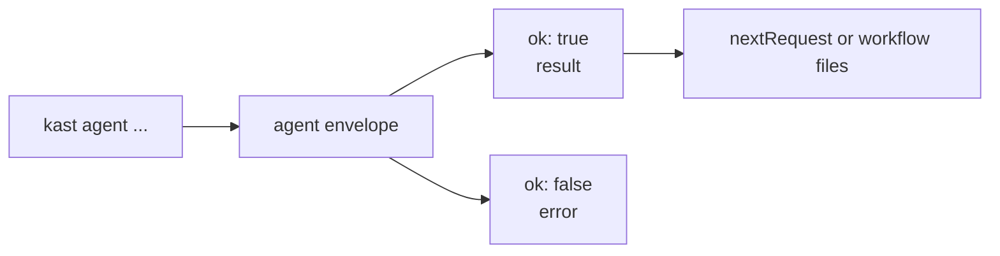
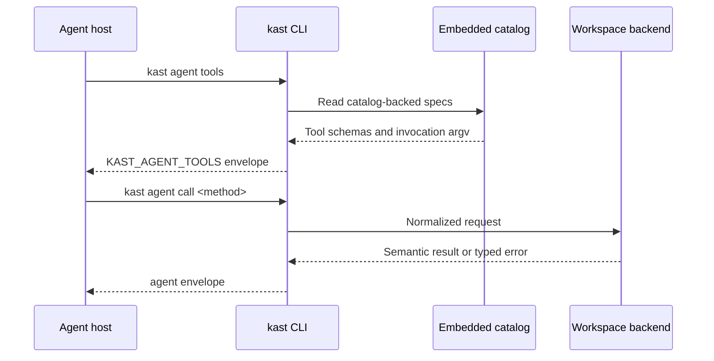

# Agent Automation Commands

`kast agent` is the advanced CLI surface for scripts, CI steps, and coding
agents. It is part of the public command tree because it is the preferred
machine-oriented command path.

## Agent Envelope

Every `kast agent` command emits one envelope on stdout. JSON is the default
and remains the canonical script format. Use `kast agent --format toon ...`
only when the host can consume TOON and needs a denser, prompt-friendly
encoding for large read-only responses. Treat `ok: false` as a failed
operation even when the process exited cleanly.

```json title="Envelope shape"
{
  "ok": true,
  "method": "raw/resolve",
  "request": { "method": "raw/resolve" },
  "result": {}
}
```

The envelope fields are the same for JSON and TOON output. Stderr may contain
human-readable startup or progress messages. Scripts should parse stdout and
keep stderr for diagnostics.

Request inputs stay JSON regardless of stdout encoding. Keep `--params`,
`--params-file`, and `--request-file` payloads as JSON, and keep workflow files
as JSON artifacts.



| Envelope field | Contract |
|----------------|----------|
| `ok` | Boolean success signal for scripts; do not rely on process exit alone |
| `method` | Catalog or alias method actually invoked |
| `request` | Normalized request payload after CLI flag parsing |
| `result` | Present only when `ok` is true |
| `error` | Present when the operation failed or the backend rejected the request |

## Bring Up A Repository

Use `kast setup` when a repository should be ready for an agent in one
step. It installs harness-agnostic agent guidance, installs the packaged skill
under `.agents/skills/kast`, and warms the runtime for the resolved workspace
root.

```console title="Plan and run agent bring-up"
kast setup --dry-run
kast setup --workspace-root "$PWD"
kast setup --workspace-root "$PWD" --backend=headless
kast setup --agents-md "$PWD/cli-rs/AGENTS.md" --workspace-root "$PWD" --dry-run
```

In a smart interactive terminal, the first eligible `kast setup` can offer
automatic IDEA setup. If accepted, choose whether Kast saves IDEA as the
default backend and automatic IDEA launch as global machine defaults or for
this repository only. Project-open local guidance setup is enabled by default,
so the JetBrains plugin is still installed or refreshed at machine scope and
harness-agnostic guidance is still written under the workspace. Use
`--no-open-ide` to skip that first-run prompt, and use `--output json` in
scripts so onboarding never prompts.

When `--workspace-root` is supplied, setup targets that repository instead of
the shell's current directory. The command reports the selected setup command
and runtime command in both human and JSON output.
In JSON dry-runs, both `setup.installCommand` and `runtimeCommand` start with
the executable token used for the dry run, so copied binaries and absolute CLI
paths remain directly callable. `stage`, `nextActions`, and `manualSteps`
explain what happened and what the user should do next.

!!! tip "Plan before mutating a repository"
    Use `kast setup --dry-run` when the harness, setup target, or backend is
    not obvious. The dry run reports the resource install command and runtime
    warmup command without writing repository files.

## Setup

Use `kast setup` to install harness-agnostic agent resources. The default
setup writes the packaged skill to `.agents/skills/kast` and creates an
ignored root `AGENTS.local.md` with a Kast-managed fenced region:
`<kast files="*.kt, *.kts" type="instructions" replaceTools="grep,search,write">`.
User guidance outside that fence remains authored repository text.

```console title="Install harness-agnostic agent guidance"
kast setup --dry-run
kast setup
kast setup --agents-md "$PWD/cli-rs/AGENTS.md" --force
```

Default setup adds `AGENTS.local.md` to `.git/info/exclude` when the workspace
is a Git repository. Pass `--agents-md <path/to/AGENTS.md>` or
`--agents-md <path/to/AGENTS.local.md>` to explicitly create or patch a scoped
guidance file. In JSON dry-runs, `skillTarget`, `agentsMdTargets`, and
`installCommand` report the exact writes and equivalent command.

| Harness | Typical target | Use when |
|---------|----------------|----------|
| `copilot` | `.github` | The repository should expose the Copilot LSP package and tool catalog |
| `skill` | `.agents/skills` or `.codex/skills` | The host loads reusable skills but not the Copilot package |
| `instructions` | `.agents/instructions` or `.codex/instructions` | The host reads Markdown instructions without a skill runtime |
| `auto` | Detected from config or existing roots | The same command should adapt across repositories |

## Tool Discovery

Use `kast agent tools` when a CLI-capable host needs the same catalog-derived
tool surface that Copilot loads from the active CLI, without loading a Copilot
SDK, MCP adapter, or the full packaged skill. The command has no backend
dependency and returns tool names, catalog methods, descriptions, default args,
mutation metadata, and params JSON Schemas.

```console title="List catalog-backed tools"
kast agent tools
kast agent --format toon tools
```

Invoke one of the returned specs through the returned
`result.invocation.argv`, replacing `<method>` with the spec's `method`, then
pass a params object or `--params-file`. The legacy `command` field remains a
readable `kast agent call` hint, while `argv` preserves the exact executable
token used to discover the tools. The `catalogSha256` field identifies the
embedded command catalog used to build the tool list.

Before registering or invoking returned tools, validate the discovery envelope:
`ok` is true, `method` is `agent/tools`, `result.type` is `KAST_AGENT_TOOLS`,
`schemaVersion` is at least 3, `catalogSha256` is a SHA-256 hex string,
`toolCount` matches the returned tools length, and `result.invocation.argv`
has the `agent call <method>` shape. Treat a failed validation as a stale
binary or package install.



## Catalog calls

Use catalog calls for method-specific requests. They prepare the request object
and return a stable agent envelope: JSON by default, or TOON when requested
with `kast agent --format toon ...`.

```console title="Resolve and trace from a file offset"
APP_FILE="$PWD/src/main/kotlin/App.kt"

kast agent call raw/resolve --params "{\"position\":{\"filePath\":\"$APP_FILE\",\"offset\":42}}"
kast agent call raw/references --params "{\"position\":{\"filePath\":\"$APP_FILE\",\"offset\":42},\"includeDeclaration\":true}"
kast agent call raw/call-hierarchy --params "{\"position\":{\"filePath\":\"$APP_FILE\",\"offset\":42},\"direction\":\"INCOMING\",\"depth\":3}"
```

Use name-based methods when you know a Kotlin declaration name but not a file
offset.

```console title="Find and resolve by name"
kast agent call raw/workspace-symbol --params '{"pattern":"OrderService","maxResults":20}'
kast agent call symbol/resolve --params '{"symbol":"OrderService","kind":"class"}'
kast agent call symbol/references --params '{"symbol":"OrderService","kind":"class","includeDeclaration":true}'
```

## Structured calls

Use `kast agent call <method>` when a payload is too large for flags or when an
agent already has a structured request object.

```console title="Call a catalog method with a params file"
kast agent call raw/apply-edits --params-file /tmp/apply-edits.json
```

The input may be a params object, a full request, a prior agent envelope, or a
`nextRequest` object. Keep nested edit plans in files and pass them with
`--params-file`.

## File-backed workflows

`kast agent workflow` writes deterministic evidence files for multi-step
operations. Use `--dry-run` to create input and workflow files without calling
the backend.

```console title="Workflow evidence"
kast agent workflow verify --out-dir .kast-workflows/verify
kast --output json agent workflow package-verify \
  --workspace-root "$PWD" \
  --require-copilot --copilot-target-dir "$PWD/.github" \
  --require-skill --skill-target-dir "$PWD/.codex/skills" \
  --require-instructions --instructions-target-dir "$PWD/.codex/instructions"
kast agent workflow symbol --symbol OrderService --references --out-dir .kast-workflows/symbol
kast agent workflow rename-plan \
  --file-path "$PWD/src/main/kotlin/App.kt" \
  --offset 42 \
  --new-name processOrderSafely \
  --out-dir .kast-workflows/rename
```

Use `package-verify` when a script or agent must prove repository-local
resources are current before relying on them. `--require-copilot`,
`--require-skill`, and `--require-instructions` fail closed against the install
manifest. When a Copilot, skill, or instructions package was installed into a
nonstandard host root, pass the same setup target root with
`--copilot-target-dir`, `--skill-target-dir`, or `--instructions-target-dir`.
Failed required resource checks include `requiredResources.issues[].recoveryArgv`
with the exact `kast setup ... --force` invocation to run.
In `--dry-run` mode, catalog-backed workflow steps report `nextRequest`;
`package-verify` reports `nextCommandArgv` because it is native CLI verification,
not a backend JSON-RPC method.

Mutating workflow commands require explicit mutation opt-in. Do not treat a
dry-run workflow as proof that files changed.

## Catalog Calls

Use `kast agent call <method>` when a workflow does not fit and the task needs a
specific catalog method. The input may be a params object, a full JSON-RPC
request, or a prior agent envelope with `nextRequest`; the output is the agent
envelope, using JSON unless `--format toon` is requested.
