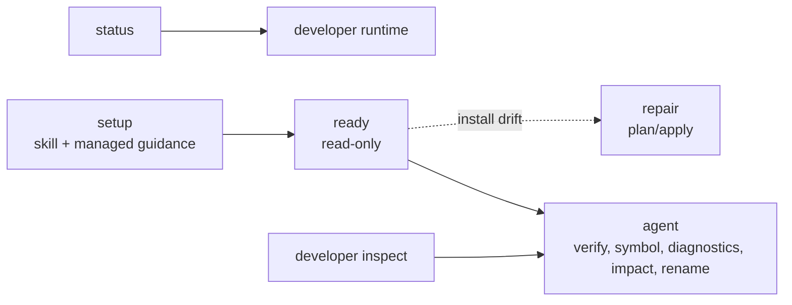

# Commands

Kast keeps the public CLI small. Human operator commands default to readable
text and accept `--output json`; `kast agent` defaults to compact TOON and
accepts `--output json` for scripts.

## Command Groups



| Group | Commands | Use when |
| --- | --- | --- |
| Setup | `setup` | Install `.agents/skills/kast/SKILL.md` and one managed `<kast>...</kast>` region |
| Readiness | `ready` | Read task readiness without mutation |
| Repair | `repair` | Plan or apply managed install-state repair |
| Agent automation | `agent verify`, `agent symbol`, `agent diagnostics`, `agent impact`, `agent rename`, `agent lsp` | Run typed compiler-backed agent operations |
| Runtime | `status`, `developer runtime ...` | Inspect, start, refresh, or stop the workspace backend |
| Inspect | `developer inspect paths`, `developer inspect metrics`, `developer inspect demo`, `developer inspect catalog` | Inspect paths, demos, catalogs, and source-index metrics |
| Machine | `developer machine plugin`, `developer machine defaults`, `developer machine shell` | Manage local IDE plugin links, developer defaults, and shell integration |
| Release | `developer release package ...`, `developer release activate bundle`, `developer release generate`, `developer release validate` | Build, activate, or validate release artifacts |

## Workspace And Backend Selection

Most commands default to the current workspace. Pass `--workspace-root` when a
command should target a different repository.

Backend selection belongs on readiness/status style commands and backend
lifecycle commands:

```console
kast ready --workspace-root "$PWD" --backend=headless
kast status --workspace-root "$PWD" --backend=idea
kast agent verify --workspace-root "$PWD" --backend=headless
```
