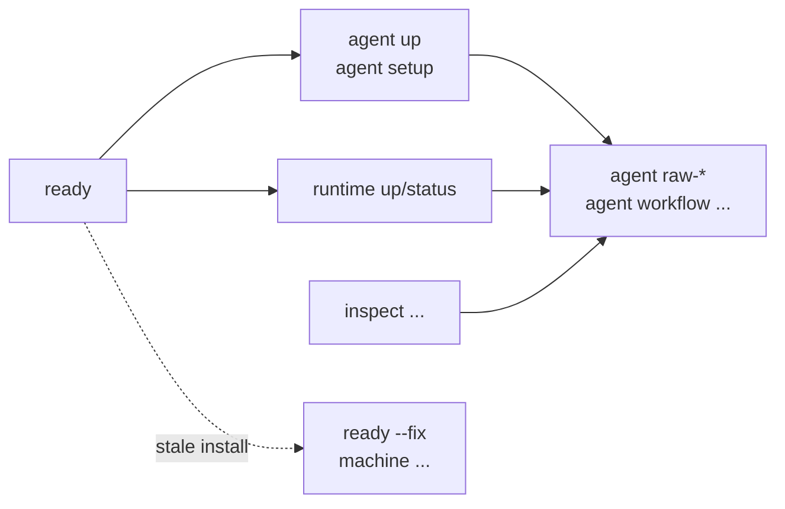

# Commands

Kast keeps the public CLI small. Human operator commands default to readable
text and accept `--output json` when scripts need structured payloads. Advanced
agent commands emit one JSON object on stdout so they can be chained in tools.

## Command groups

Start with the group that matches the job in front of you. Run `kast help` or
`kast help <command>` locally for the exact flags supported by your installed
binary.



| Group | Commands | Use when |
|-------|----------|----------|
| Readiness | `ready` | Prove the active binary, manifest, and task surface are usable |
| Agent automation | `agent up`, `agent setup ...`, `agent tools`, `agent workflow ...`, `agent ...` | Bring a repository up for agents, install resources, discover tools, start LSP, and script semantic workflows |
| Runtime | `runtime up`, `runtime status`, `runtime restart`, `runtime stop`, `runtime capabilities` | Start, inspect, refresh, or stop the workspace backend |
| Inspect | `inspect paths`, `inspect metrics`, `inspect demo`, `inspect catalog` | Inspect paths, catalogs, demos, and source-index metrics |
| Machine | `machine plugin`, `machine shell` | Manage local IDE plugin links and shell integration |
| Release | `release package ...`, `release activate bundle`, `release generate`, `release validate` | Build, activate, or validate release artifacts |

## Output modes

Operator commands are designed for humans first. They render readable summaries
in terminals and plain text in captured logs. Add `--output json` to preserve
the structured payload for automation.

=== "Human terminal"

    ```console title="Readable by default"
    kast runtime status
    ```

=== "Script"

    ```console title="Structured output"
    kast --output json runtime status
    ```

`kast agent` is different by design. It always emits a single JSON envelope
with `ok`, `method`, `request`, and either `result` or `error`. Use it when a
script, agent, or CI step needs stable machine output.

| Surface | Output default | Use it for |
|---------|----------------|------------|
| `kast ready` and `kast runtime ...` | Human-readable text | Operator inspection and repair loops |
| `kast --output json ...` | Structured JSON for supported operator commands | CI and scripts that still use high-level operator commands |
| `kast agent ...` | One JSON envelope on stdout | Agent tools, command chaining, and stable semantic evidence |

## Workspace selection

Most commands default to the current workspace. When run below a project root,
Kast walks upward to a Gradle marker or `.kast` directory. Pass
`--workspace-root` only when the command should target a different repository.

Backend selection is explicit when it matters:

```console title="Select the backend"
kast runtime up --backend=headless
kast runtime status --backend=idea
kast agent health --workspace-root "$PWD" --backend=headless
```

## Debug escape hatch

!!! warning "Prefer the public agent surface"
    Raw `kast rpc` still exists for low-level debugging and compatibility. The
    published command docs teach `kast agent` first because it normalizes
    inputs, wraps results consistently, and works better for scripts.
