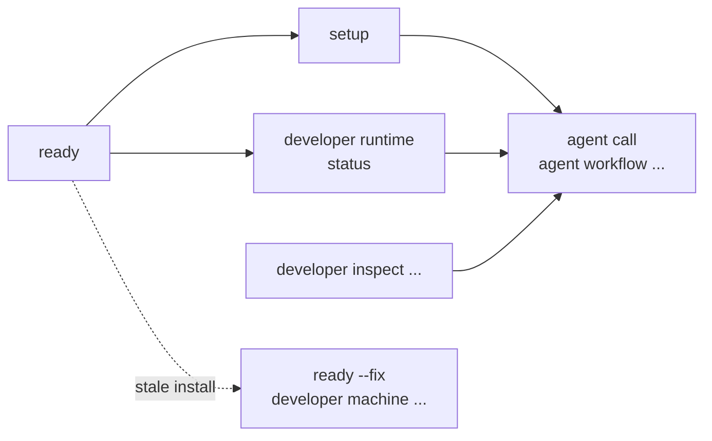

# Commands

Kast keeps the public CLI small. Commands default to compact TOON outside
interactive human terminals and switch to readable text only when Kast can see
an interactive non-agent terminal. Pass `--output json` when scripts need JSON
payloads.

## Command groups

Start with the group that matches the job in front of you. Run `kast help` or
`kast help <command>` locally for the exact flags supported by your installed
binary.



| Group | Commands | Use when |
|-------|----------|----------|
| Readiness | `ready` | Prove the active binary, manifest, and task surface are usable |
| Setup | `setup` | Run readiness repair, install repository guidance, optionally configure IDEA, and warm the backend |
| Agent automation | `agent tools`, `agent call <method>`, `agent workflow ...`, `agent lsp` | Discover tools, start LSP, and script semantic workflows |
| Runtime | `status`, `developer runtime ...` | Inspect, start, refresh, or stop the workspace backend |
| Inspect | `developer inspect paths`, `developer inspect metrics`, `developer inspect demo`, `developer inspect catalog` | Inspect paths, catalogs, demos, and source-index metrics |
| Machine | `developer machine plugin`, `developer machine defaults`, `developer machine shell` | Manage local IDE plugin links, developer defaults, and shell integration |
| Release | `developer release package ...`, `developer release activate bundle`, `developer release generate`, `developer release validate` | Build, activate, or validate release artifacts |

## Output modes

Commands are AXI-oriented by default: captured, piped, CI, and agent-process
invocations use compact TOON on stdout. Interactive non-agent terminals get the
most readable human output unless `[cli] dynamicOutput = false` is set in
`config.toml`. Add `--output json` for JSON-only automation.

=== "Human terminal"

    ```console title="Readable when interactive"
    kast status
    ```

=== "Script"

    ```console title="JSON output"
    kast --output json status
    ```

`kast agent` always emits a single envelope with `ok`, `method`, `request`, and
either `result` or `error`. Use it when a script, agent, or CI step needs
stable machine output.

| Surface | Output default | Use it for |
|---------|----------------|------------|
| `kast ready` and `kast developer runtime ...` | TOON outside interactive human terminals; readable text in interactive human terminals | Operator inspection and repair loops |
| `kast --output json ...` | Structured JSON for supported commands | CI and scripts that require JSON |
| `kast agent ...` | One TOON envelope on stdout unless `--output json` is selected | Agent tools, command chaining, and stable semantic evidence |

## Workspace selection

Most commands default to the current workspace. When run below a project root,
Kast walks upward to a Gradle marker or `.kast` directory. Pass
`--workspace-root` only when the command should target a different repository.

Backend selection is explicit when it matters:

```console title="Select the backend"
kast setup --backend=headless
kast status --backend=idea
kast agent call health --params '{}' --workspace-root "$PWD" --backend=headless
```
