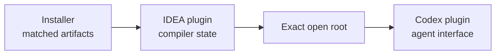

# The Kast Workstation Model

Kast separates machine installation, compiler state, and user interaction so
each concern has one owner.

## The installer owns machine identity

The installer selects one CLI, one IDEA plugin ZIP, and one Codex marketplace
generation. Reconciliation is synchronous and requires the IDE to be closed.
Nothing watches the machine afterward, because installation is an occasional
transaction rather than continuous work.

The bundle does not project a global skill. Codex's native plugin selection is
the only workstation agent integration.

## IDEA owns semantic state

The Kotlin compiler already lives inside IDEA or Android Studio with the loaded
project model. The Kast IDEA plugin exposes that state for the exact open root
instead of starting another local JVM. This also means two worktrees are two
different semantic workspaces.

## Codex owns interaction

Developers describe outcomes to Codex. The installed plugin decides which
requests can use compiler-backed operations and keeps installer, release, and
runtime-management commands outside the normal task surface.

This boundary keeps the visible workflow small without weakening semantic
identity, plan-first mutations, diagnostics, or compatibility admission.
