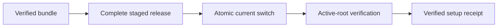

# The Kast Setup Model

Kast has one installation authority: `kast setup`. The same transaction serves
workstations, headless Linux hosts, hosted agents, local development, and
packaged releases.

Every release artifact lives below `KAST_HOME`. The manifest binds its paths,
roles, versions, and checksums; the receipt identifies the active release and
manifest digests. Consumers therefore resolve one authority instead of
combining package-manager state, shell shims, IDE state, and repair receipts.

Codex routing and hooks are published separately from
`amichne/kast-marketplace`. They track that marketplace's `main` branch and
delegate compatibility and execution to the active CLI instead of joining the
release digest.

Setup never edits `current` in place. It stages and validates a complete
release, archives recognized prior Kast state, switches `current` atomically,
then verifies the active CLI. If verification fails, the switch is rolled back.
Interrupted staging is disposable, repeated setup converges, and an exclusive
lock serializes concurrent writers.

The IDEA plugin still owns the compiler-backed runtime for each exact open
workspace. That is runtime state, not a second installation authority: the
plugin and CLI both come from the active setup release.
