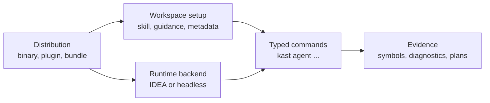

# Operating Model

Kast is easier to operate when each layer has a separate job. Distribution puts
the binary and runtime on a host. Workspace setup gives a repository the agent
guidance it needs. Runtime backends answer semantic requests. Typed commands
turn those requests into stable CLI workflows. Evidence is the result agents
and developers can act on.

## The Layer Boundary

The layers deliberately do not collapse into one installer or one raw request
pipe.

| Layer | What it owns | What it does not own |
| --- | --- | --- |
| Distribution | Homebrew install, JetBrains plugin install, Linux headless bundle, runtime manifests | Per-command semantic evidence |
| Workspace setup | Agent skill, managed guidance region, plugin-prepared metadata | Machine runtime installation |
| Runtime backend | IDEA or headless analysis state | Public command taxonomy |
| Typed commands | Readiness, repair, runtime lifecycle, semantic inspection, plan-first mutations | Arbitrary raw RPC as a public workflow |
| Evidence | Symbols, references, callers, diagnostics, impact, edit plans | Unbounded certainty when results are truncated or limited |

## Why Setup Differs By Host

macOS developer machines already have the IDE that owns Kotlin project state.
The JetBrains plugin is therefore the workspace setup authority on macOS after
the root installer refreshes the binary and plugin.

Linux CI, hosted agents, and server images need a self-contained runtime. The
headless bundle installs the binary, backend runtime, and install manifest
together, then `kast setup` installs repository guidance where needed.

Both lanes converge on the same `kast` command surface.

## Why Commands Stay Typed

Typed commands preserve the public contract. `kast agent symbol`,
`diagnostics`, `impact`, `rename`, and mutation commands name the user intent
directly, expose shallow flags, and produce bounded evidence.

Raw request files, generated catalog lookup, byte offsets, and implementation
class names are poor public contracts because they leak internal structure and
make agent behavior harder to audit. They can exist as implementation detail or
developer tooling, but published workflows should stay on typed commands.

## Why Plans Precede Writes

Kast expects agents and developers to inspect a plan before mutating code.
Rename, file creation, declaration insertion, implementation insertion,
statement insertion, and declaration replacement all use `--apply` as the
explicit write gate.

The plan is the review surface: selected identity or scope, content file,
diagnostics, conflicts, and write set. If any of those facts are wrong, the
right next step is to refine the selector or inspect the backend state, not to
fall back to a text edit.

## Source Of Truth

Public docs summarize the operating model. Agent-only ADRs own durable product
surface decisions, especially ADR 0006 for the forward system definition and
ADR 0011 for the journey-first documentation model.

Use [command surface](../reference/commands.md) for lookup facts and
[how Kast thinks about evidence](../learn/evidence-model.md) for the evidence
model readers need during semantic work.
