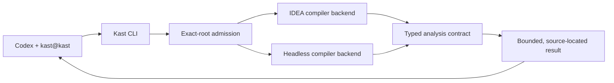
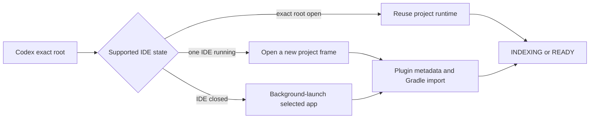

# Kast Architecture

Kast separates installation authority from semantic runtime authority. That
separation lets one verified release serve multiple exact workspaces without
pretending that installing a binary also proves a compiler is ready.

## Setup chooses one release

`kast setup` stages a manifest-bound release containing the CLI and its matched
backend artifacts. It verifies the complete release before switching the
active `current` link. This is persistent machine state.

The Codex marketplace is distributed independently. Its routing skill and
hooks locate the active CLI; they do not become another semantic backend.

## Admission chooses one exact workspace

For each semantic task, the CLI normalizes the requested workspace and
classifies it as a primary checkout, linked worktree, disposable checkout, or
standalone Gradle workspace. It then selects a compatible backend for that
exact root.

Automatic routing accepts a single ready candidate. Multiple ready candidates
remain ambiguous until the caller selects one. A mutation additionally
requires prepared workspace authority, so Kast does not apply compiler-based
edits through a runtime attached to a different checkout.

On macOS, admission also owns the normal project-opening path:

The IDE application process may host several worktrees, but each canonical
root has separate metadata, descriptors, leases, sockets, and indexes. A
private one-shot request lets only the selected plugin process open the
requested root and prevents duplicate project frames.

Kast requests background launch and never calls focus APIs. It preserves the
active IDEA frame's public placement where possible; fullscreen, display, and
native project-tab behavior remain macOS and JetBrains responsibilities.

## The backend owns compiler truth

On macOS, the IDEA plugin owns project models, Kotlin PSI, indexing, and
compiler analysis. Its semantic admission remains pending until Kotlin modules,
SDKs, dependencies, PSI, and diagnostics are usable. On supported non-IDE
hosts, the packaged headless backend implements the same analysis contract.

The macOS runtime reports `INDEXING` as soon as the exact server is reachable.
It reports `READY` only after Gradle completion, IDEA smart mode, Kotlin
semantic admission, and Kast reference-index completion. One failed phase
produces `DEGRADED` with an actionable cause.

Both backends return the shared Kotlin models defined by `analysis-api`.
Callers therefore consume typed symbols, relationships, diagnostics, edits,
and coverage instead of backend-specific PSI objects.

## Results carry their limits

Kast projects backend results into compact CLI views. Exact paths and symbol
identity survive that projection. So do limitations: indexing, unavailable
source modules, missing reference indexes, bounded relationship results, and
unsupported capabilities remain visible instead of being converted into an
empty success.
