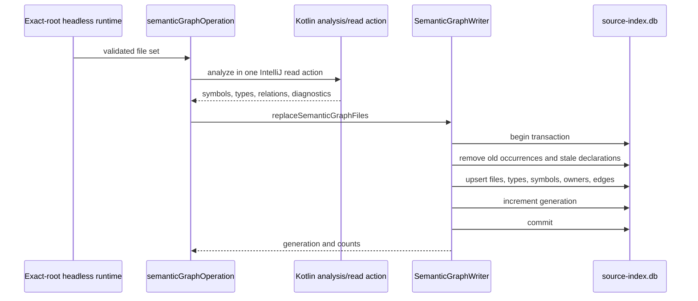
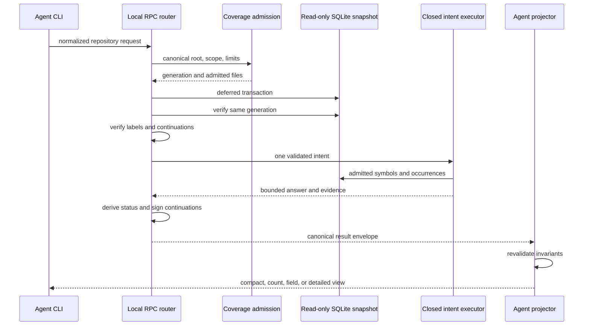

# Repository Intelligence: Authority, Evidence, and Certainty

Repository intelligence is Kast's read-only semantic router over the
compiler-backed source index. It accepts a closed question contract, proves
which source files are in scope, executes one bounded operation against one
graph generation, and projects a result that retains its evidence and limits.

The important distinction is between *finding* a likely compiler identity and
*proving* a claim about it. Lexical terms and optional precomputed labels may
help retrieval. Only the compiler-derived index can establish symbol identity,
ownership, type relations, calls, references, source locations, and coverage.

## Architectural contract

Five invariants define the subsystem:

1. One canonical workspace root owns each request.
2. Gradle ownership and compiler coverage decide which Kotlin files may
   contribute evidence.
3. A query reads one SQLite generation and rejects a moving snapshot.
4. Retrieval hints can select existing compiler identities but cannot create
   or alter semantic facts.
5. Results retain ambiguity, incompleteness, truncation, and continuation
   state instead of converting them into confident answers.

These invariants form an authority chain. Later stages may narrow or project
earlier evidence, but they may not replace it with a weaker source of truth.

## Project-scale view

At project scale, Kotlin produces the facts and Rust routes bounded questions
over those facts. The Codex plugin is guidance and invocation wiring; it is not
another semantic backend.

The interactive component view shows the system boundaries. Each component
opens its source-backed role; the producer and query sequences below retain the
granular write and read contracts.

<kast-view view-id="runtime-components" browser="true"></kast-view>

The major boundary is the database, not the process boundary. The admitted
headless runtime writes compiler evidence to the same workspace source index
that the Rust CLI opens read-only. A query does not ask a foreground IDE to
recompute facts on demand.

## Authorities are deliberately separate

Several authorities participate in an answer. Keeping them separate prevents
installation state, file discovery, search ranking, or output formatting from
being mistaken for compiler truth.

### Workspace authority

`query/entrypoint.rs` resolves the RPC request against the canonical workspace
root. Continuations bind that exact root, and repository-contained input paths
are canonicalized before use. A token or label file created for another
checkout is therefore not portable authority. Runtime readiness and persisted
graph coverage remain separate facts about that root.

### Build and scope authority

`coverage/scope.rs` resolves requested modules and source sets through the
persisted Gradle workspace inventory. It rejects unknown or ambiguous project
identities instead of guessing from directory names.

Each eligible file becomes one of four states:

| State | Meaning |
| --- | --- |
| `INDEXED` | Gradle ownership is proven and the semantic row matches current content. |
| `EXCLUDED` | The file is outside the requested compilation-owned scope. |
| `FAILED` | Index production recorded a failure for the file or module. |
| `STALE` | The stored content hash no longer matches the current source. |

Coverage is complete only when the inventory is complete, module progress and
counts agree, ownership is proven, and there are no pending, failed, or stale
files. This is why file enumeration alone cannot support a definitive absence
claim.

Runtime readiness and repository snapshot publication are not, by themselves,
proof of repository semantic-graph completeness. Semantic refresh is an
explicit producer path. Repository coverage compares the compilation-owned
inventory with `semantic_files` and their content hashes for the requested
scope.

### Compiler authority

`SemanticGraphResult.kt` defines overload-safe compiler identities and
source-located relations. Identity, ownership, type facts, and occurrence
provenance outrank display-name or text similarity; deliberate omissions
remain visible in coverage. [Compiler-backed evidence](compiler-evidence.md)
describes that model in detail.

### Snapshot authority

`source-index.db` is the workspace evidence store. The query first reads
coverage, then opens a deferred read transaction and checks that the database
generation still matches. It retries this admission once. Two observed
movements fail with `REPOSITORY_QUERY_UNSTABLE`.

Generation equality prevents a response from combining coverage from one
snapshot with symbols or edges from another. It does not make current source
files immutable; content hashes and file-state classification provide that
separate check.

### Projection authority

The raw query result is not rendered directly. The repository projector in
`cli-rs/src/agent/projection/repository/input.rs` parses a closed schema and
rechecks generation equality, coverage accounting, status and evidence
coherence, continuation compatibility, selected identities, paths, and
findings.

This second validation boundary keeps a malformed internal result from
becoming a persuasive agent-facing answer merely because it is valid JSON.

## Evidence production from Kotlin to SQLite

The write path is intentionally narrower than the query surface. The headless
runtime extracts typed facts for selected Kotlin files and the index store
replaces those files atomically.

`SemanticGraphOperations.kt` hashes the selected file text and extracts facts
inside the private runtime read action. `SemanticGraphWriter` then replaces those files in
one locked SQL transaction, removes superseded occurrences, repairs ownership,
increments the shared generation, and commits. An exception rolls back both
rows and generation. One exact workspace therefore owns one atomic persisted
evidence snapshot.

## The request contract is closed

`RepositoryQueryParams` rejects unknown fields and unsupported cross-field
combinations before execution. Closed intents, relations, directions,
projections, metrics, context sources, and central bounds make unsupported
internal questions fail before they can acquire plausible output. The public
`kast` surface exposes the smaller operations listed in the
[CLI reference](../reference/cli.md).

## Query execution retains one snapshot

After validation, every intent runs under the same coverage-derived execution
scope and SQLite transaction.

`RepositoryExecutionScope` is constructed from coverage and owns the admitted
path set. Discovery documents, relation endpoints, occurrence paths,
architecture nodes, and context targets must all pass that scope boundary.

The final envelope records the canonical root, inventory and graph generation,
scope, coverage, applied filters, limits, ordering, truncation, continuation,
qualification, and schema version. Consumers can therefore distinguish a
semantic answer from the conditions under which it was obtained.

## Certainty is a result property

The query executor derives one internal status from ambiguity, answer presence,
coverage, and truncation. `ANSWERED` requires usable evidence and complete
coverage. `AMBIGUOUS` refuses to choose among identities. `EMPTY` proves
absence only across complete, untruncated coverage; otherwise the result is
`QUALIFIED_EMPTY`.

Truncation and non-positive results under incomplete coverage also produce a
qualification string. Signed continuations allow bounded graph and per-edge
evidence results to resume without silently changing the root, query, scope,
generation, or occurrence position.

!!! note "Incomplete positive answers fail closed"

    A positive intent outcome with incomplete compiler coverage returns
    `REPOSITORY_COVERAGE_INCOMPLETE` before the result envelope is built. The
    error carries the coverage limitations and exact-root index recovery.
    Partial compiler evidence cannot therefore appear as `ANSWERED`.

## Discovery may rank, but only the compiler identifies

Resolve supports three discovery paths:

1. An exact canonical key bypasses ranking.
2. Natural-language discovery builds compiler-derived documents and applies
   deterministic lexical and structural ranking.
3. Rust regex matches the same admitted compiler-derived document fields.

Ambiguity is checked before selection. Candidate ordering is deterministic,
using match score and canonical key. A similar display name is never enough to
merge overloads or choose one silently.

The discovery loaders require both `semantic_symbols` and
`semantic_edge_occurrences`. A database missing those compiler semantic tables
fails with `REPOSITORY_INDEX_INVALID` and an index-recovery remedy instead of
returning an apparently definitive empty corpus.

### Precomputed labels are retrieval-only

A version-1 label artifact can participate in natural-language retrieval
without an exact canonical key. It must remain inside the workspace and bind
each entry to a current compiler identity and source content hash. Verified
labels can extend retrieval text; they cannot introduce symbols, edges,
locations, owners, types, coverage, or answer evidence.

## Traversal preserves occurrence evidence

Graph operations load typed edge occurrences only when source, target, and
occurrence files are admitted. Paths and impact traversals are directional,
bounded, and deterministically ordered.

Local call targets may be lifted to their callable owner for a callable-level
view. That transformation is recorded as
`LIFT_LOCAL_CALL_TO_CALLABLE_OWNER`; it is not presented as a direct compiler
edge. Grouped edges retain their source occurrences so a consumer can inspect
the compiler-located evidence behind a relationship.

Traversal and evidence use separate signed continuation types. Their claims
bind the canonical root, normalized query hash, traversal hash, graph
generation, coverage composition, schema version, and resume state. A token
from a changed question or snapshot is rejected rather than approximately
resumed.

## Architecture and context make different tradeoffs

Architecture operations convert the admitted graph into a native compressed
sparse row representation. Closed projections cover boundaries, hubs, strongly
connected components, communities, thin bridges, and public API consumers.
Findings retain canonical identities and compiler occurrences.

This path currently materializes the full admitted architecture graph before
applying the result limit. That is deterministic and simple, but it makes
whole-scope memory and latency the practical ceiling for very large
repositories.

Context relationships are contained non-Kotlin evidence, never compiler
authority. They derive closed relationships from Git-visible documentation,
Gradle, schemas, workflows, and Rust sources. Full-file reads, one shared
result budget, and no paging trade broader context for I/O and visible
truncation.

## Bounds are part of the internal query contract

Limits protect consumers from hidden unbounded output. They do not imply that
every implementation has sublinear memory use.

Some operations still load all admitted nodes or occurrences before truncating
the response. Discovery, neighbor-term enrichment, architecture projections,
and traversal storage are the main hotspots. Optimize those only with measured
repository evidence, because streaming changes deterministic ordering,
ambiguity detection, topology algorithms, and continuation semantics.

## Typed failures identify the broken authority

A typed failure identifies whether root containment, Gradle scope, graph
coverage, SQLite admission, snapshot stability, a continuation, a label
artifact, or a context read failed. It must not collapse that failure into an
empty result. Follow [Troubleshoot Kast](../how-to/troubleshoot.md) for
recovery.

## Tradeoffs and current ceilings

Repository intelligence retains several visible implementation ceilings:

1. Per-intent payloads remain dynamic even though shared result state fails
   closed.
2. Bounded output can still require whole-graph or full-file work before
   truncation.
3. SQLite generation pinning prevents mixed persisted snapshots, but source
   files can still move around that transaction.
4. Path-and-offset identities make moved declarations invalidate
   continuations and label artifacts.
5. Compiler type extraction can fall back to normalized source text, and file
   replacement does not yet prune every orphaned global type row.

These ceilings shape certainty and performance. Streaming or paging would
also change deterministic ordering, ambiguity detection, topology, and
continuation semantics, so measured evidence must justify that trade.

## Continue with maintainer operations

Use [Maintain repository intelligence](../how-to/maintain-repository-intelligence.md)
to route a change, choose focused proof, recover an exact-root index, and
assemble exact-commit release evidence. The broader
[Kast architecture](architecture.md) explains runtime and backend admission,
while [Compiler-backed evidence](compiler-evidence.md) defines the underlying
symbol and relation model.
