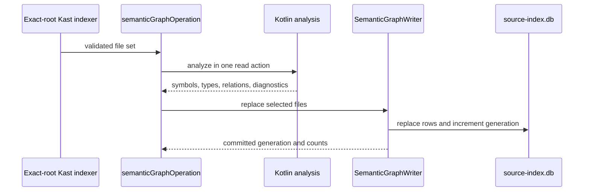
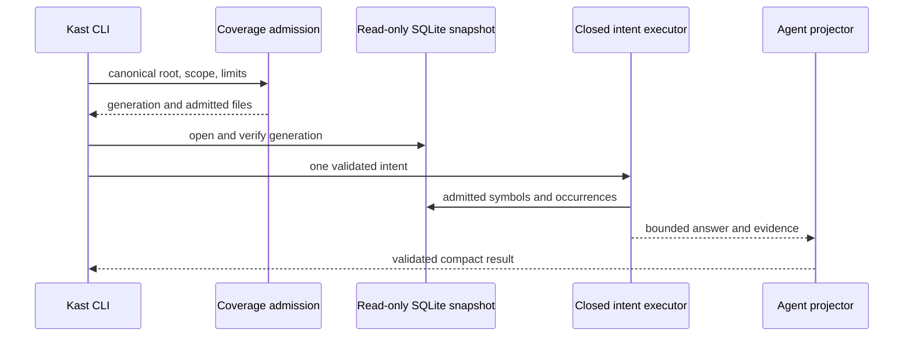

# Repository Intelligence: Authority, Evidence, and Certainty

Repository intelligence is Kast's read-only semantic router over the
compiler-backed source index. It accepts a closed question contract, proves
which source files are in scope, executes one bounded operation against one
graph generation, and preserves evidence limits in the result.

Finding a likely identity is not the same as proving a claim about it. Lexical
terms and optional precomputed labels can help retrieval. Only the
compiler-derived index can establish symbol identity, ownership, type
relations, calls, references, source locations, and coverage.

## Architectural contract

Five invariants define repository intelligence:

1. One canonical workspace root owns each request.
2. Gradle ownership and compiler coverage decide which Kotlin files contribute
   evidence.
3. A query reads one SQLite generation and rejects a moving snapshot.
4. Retrieval hints may select existing identities but cannot create facts.
5. Results retain ambiguity, incompleteness, truncation, and continuation
   state.

The interactive component view shows where Kotlin produces facts and where
Rust routes bounded questions over them.

<kast-view view-id="runtime-components" browser="true"></kast-view>

## Authorities remain separate

Several authorities participate in one answer. Their separation prevents
installation state, file discovery, search ranking, or formatting from being
mistaken for compiler truth.

### Workspace authority

The request entrypoint resolves one canonical root. Continuations bind that
root, and repository-contained paths are canonicalized before use. An indexer
or label artifact from another checkout is not portable authority.

Kast reuses an eligible indexer only when its exact-root identity matches. If
none exists, Kast creates an isolated indexer. Process readiness and persisted
graph coverage remain separate facts.

### Build and scope authority

Coverage resolves requested modules and source sets through the persisted
Gradle workspace inventory. It rejects unknown or ambiguous identities instead
of guessing from directory names.

Each eligible file has one explicit state:

| State | Meaning |
| --- | --- |
| `INDEXED` | Gradle ownership is proven and the semantic row matches current content. |
| `EXCLUDED` | The file is outside the requested compilation-owned scope. |
| `FAILED` | Index production recorded a failure for the file or module. |
| `STALE` | The stored content hash no longer matches the current source. |

Coverage is complete only when the inventory, module progress, ownership, and
content hashes agree with no pending, failed, or stale files. File enumeration
alone cannot support a definitive absence claim.

### Compiler authority

`SemanticGraphResult.kt` defines overload-safe compiler identities and
source-located relations. Identity, ownership, type facts, and occurrence
provenance outrank display-name or text similarity. Deliberate omissions remain
visible in coverage.

[Compiler-backed evidence](compiler-evidence.md) describes that model.

### Snapshot authority

`source-index.db` is the workspace evidence store. A query reads coverage,
opens a deferred read transaction, and verifies that the generation did not
move. Repeated movement fails with a typed unstable-snapshot result.

Generation equality prevents coverage from one snapshot from being combined
with symbols from another. Content hashes provide the separate proof that
current source still matches retained rows.

### Projection authority

The agent projector parses a closed internal schema and rechecks generation,
coverage accounting, status, continuation compatibility, selected identities,
paths, and findings. Valid JSON alone is not sufficient evidence.

## The indexer writes one atomic snapshot

The write path is narrower than the query surface. The exact-root indexer
extracts facts for selected Kotlin files. The index store replaces those files
atomically.

`SemanticGraphOperations.kt` hashes selected source and extracts facts inside
the compiler read boundary. `SemanticGraphWriter` removes superseded
occurrences, repairs ownership, advances the shared generation, and commits in
one locked transaction. An exception rolls back both rows and generation.

## Queries retain one snapshot

Every intent runs under one coverage-derived scope and SQLite transaction.

The final envelope records root, inventory and graph generations, scope,
coverage, applied filters, limits, ordering, truncation, continuation,
qualification, and schema version.

## Certainty is a result property

`ANSWERED` requires usable evidence and complete coverage. `AMBIGUOUS` refuses
to choose among identities. `EMPTY` proves absence only across complete,
untruncated coverage. Otherwise the result is qualified.

!!! note "Incomplete positive answers fail closed"

    A positive outcome with incomplete compiler coverage fails before an
    answer envelope is built. Partial compiler evidence cannot appear as an
    unqualified answer.

Signed continuations bind root, query, scope, generation, and occurrence
position. Resuming a page cannot silently change any of those facts.

## Retrieval never becomes semantic authority

Exact canonical keys bypass ranking. Lexical discovery may rank candidates,
but ambiguity remains visible. Labels can accelerate repeated terms only when
their schema, generation, canonical keys, and source hashes match.

**Precomputed labels are retrieval-only.** They cannot create a symbol, edge,
source location, or complete-coverage claim.

## Current limits remain visible

Some bounded operations still load all admitted nodes or occurrences before
truncating output. SQLite pinning prevents mixed retained snapshots, but source
files can still change around the transaction. Path-and-offset identities also
make moved declarations invalidate continuations and labels.

These are explicit limits, not reasons to weaken identity or coverage. Use
[Maintain repository intelligence](../how-to/maintain-repository-intelligence.md)
to route a change and recover evidence.
