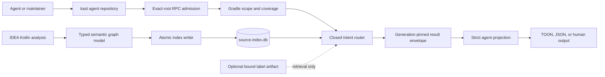
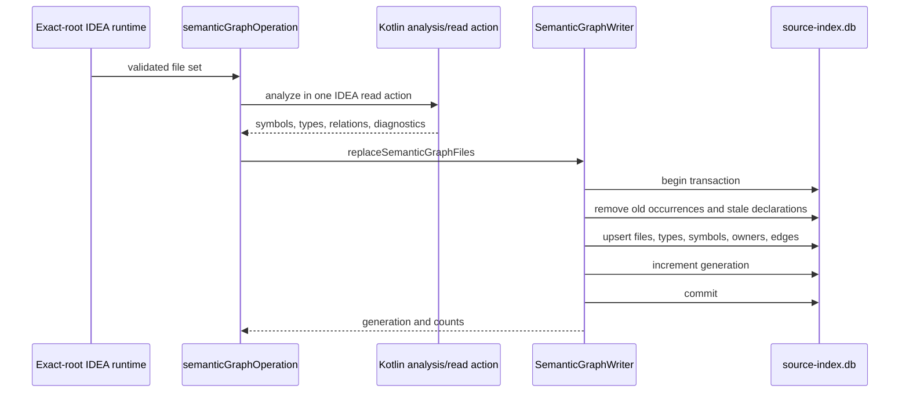
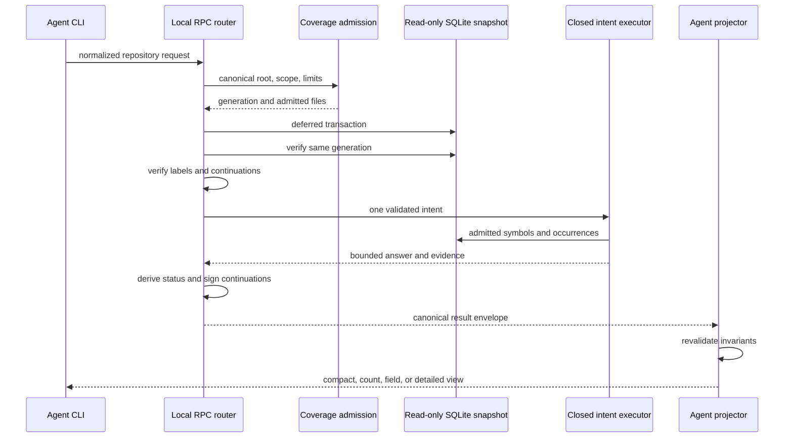

# Repository Intelligence Architecture

Repository intelligence is Kast's read-only semantic router over the
compiler-backed source index. It accepts a closed question contract, proves
which source files are in scope, executes one bounded operation against one
graph generation, and projects a result that retains its evidence and limits.

The important distinction is between *finding* a likely compiler identity and
*proving* a claim about it. Lexical terms and optional precomputed labels may
help retrieval. Only the compiler-derived index can establish symbol identity,
ownership, type relations, calls, references, source locations, and coverage.

## Architectural contract

Five invariants define the subsystem and should survive every change:

1. One canonical workspace root owns each request.
2. Gradle ownership and compiler coverage decide which Kotlin files may
   contribute evidence.
3. A query reads one SQLite generation and rejects a moving snapshot.
4. Retrieval hints can select existing compiler identities but cannot create
   or alter semantic facts.
5. Results retain ambiguity, incompleteness, truncation, and continuation
   state instead of converting them into confident answers.

These invariants form an authority chain. Later stages may narrow or project
earlier evidence, but they may not replace it with a weaker source of truth.

## Project-scale view

At project scale, Kotlin produces the facts and Rust routes bounded questions
over those facts. The Codex plugin is guidance and invocation wiring; it is not
another semantic backend.



The major boundary is the database, not the process boundary. The IDEA backend
writes compiler evidence to the same workspace source index that the Rust CLI
opens read-only. The query does not ask the IDE to recompute facts on demand.

## Authorities are deliberately separate

Several authorities participate in an answer. Keeping them separate prevents
installation state, file discovery, search ranking, or output formatting from
being mistaken for compiler truth.

### Workspace authority

`query/entrypoint.rs` resolves the RPC request against the canonical workspace
root. Continuations bind that exact root, and repository-contained input paths
are canonicalized before use. A token or label file created for another
checkout is therefore not portable authority.

On macOS, the canonical bootstrap remains:

```console
kast developer runtime up \
  --workspace-root "$PWD" \
  --backend idea \
  --accept-indexing
```

`INDEXING` means the exact-root runtime is reachable. It is not semantic
readiness. Operations that require complete compiler evidence must wait for
`READY`.

### Build and scope authority

`coverage/scope.rs` resolves requested modules and source sets through the
persisted Gradle workspace inventory. It rejects unknown or ambiguous project
identities instead of guessing from directory names.

Each eligible file becomes one of four states:

| State | Meaning |
| --- | --- |
| `INDEXED` | Gradle ownership is proven and the semantic row matches current content. |
| `EXCLUDED` | The file is outside the requested compilation-owned scope. |
| `FAILED` | Index production recorded a failure for the file or module. |
| `STALE` | The stored content hash no longer matches the current source. |

Coverage is complete only when the inventory is complete, module progress and
counts agree, ownership is proven, and there are no pending, failed, or stale
files. This is why file enumeration alone cannot support a definitive absence
claim.

Runtime readiness and repository snapshot publication are not, by themselves,
proof of repository semantic-graph completeness. Semantic refresh is an
explicit producer path. Repository coverage compares the compilation-owned
inventory with `semantic_files` and their content hashes for the requested
scope.

### Compiler authority

`SemanticGraphResult.kt` defines the host-neutral compiler evidence model.
Canonical keys are overload-safe identities. Symbols carry declaration kind,
name, owner, Kotlin path, source range, visibility, modality, origin, type
facts, and flags such as `expect`, `actual`, and `override`.

Relations identify both endpoint keys and the source occurrence. Their
contexts distinguish facts such as a call, return type, parameter type,
generic argument, inheritance edge, or implementation edge. External targets
may be omitted deliberately, but that omission is counted in coverage.

### Snapshot authority

`source-index.db` is the workspace evidence store. The query first reads
coverage, then opens a deferred read transaction and checks that the database
generation still matches. It retries this admission once. Two observed
movements fail with `REPOSITORY_QUERY_UNSTABLE`.

Generation equality prevents a response from combining coverage from one
snapshot with symbols or edges from another. It does not make current source
files immutable; content hashes and file-state classification provide that
separate check.

### Projection authority

The raw query result is not rendered directly. The repository projector in
`cli-rs/src/agent/projection/repository/input.rs` parses a closed schema and
rechecks generation equality, coverage accounting, status and evidence
coherence, continuation compatibility, selected identities, paths, and
findings.

This second validation boundary keeps a malformed internal result from
becoming a persuasive agent-facing answer merely because it is valid JSON.

## Evidence production from Kotlin to SQLite

The write path is intentionally narrower than the query surface. IDEA extracts
typed facts for selected Kotlin files and the index store replaces those files
atomically.



`SemanticGraphOperations.kt` hashes file text, requires analyzed diagnostics,
extracts facts inside the IDEA read action, and returns coverage tied to the
write generation. The operation also computes a fingerprint from the selected
and removed paths.

`SemanticGraphWriter.replaceSemanticGraphFiles` holds the store write lock and
uses one SQL transaction. It deletes superseded occurrences, updates files and
types, inserts boundary and authoritative symbols, repairs owner links, writes
edge occurrences, and increments the generation before commit. Any exception
rolls the transaction back.

The persisted graph is normalized around these tables:

| Table family | Evidence retained |
| --- | --- |
| `semantic_files` | Path, package, module, content hash, refresh state, diagnostics. |
| `semantic_symbols` | Canonical identity, owner, kind, names, flags, types, source range. |
| `semantic_types` and `semantic_type_edges` | Stable type facts and their typed structure. |
| `semantic_edge_occurrences` | Source, target, relation kind, context, and occurrence range. |
| `schema_version` | Schema identity and current source-index generation. |

The store uses SQLite WAL mode and one database per exact workspace. Worktree
overlay support may retain a repository base identity, but the active query
still resolves one concrete database through Kast's workspace paths.

## Rust module ownership

The Rust implementation is split by semantic responsibility rather than CLI
screen. `repository_intelligence.rs` composes these modules into one private
subsystem.

| Area | Responsibility | Primary sources |
| --- | --- | --- |
| `contract/` | Closed request, result, query syntax, label, and continuation types. | `request.rs`, `result.rs`, `label_index.rs` |
| `coverage/` | Gradle scope, file eligibility, file states, coverage paging. | `scope.rs`, `read.rs`, `query.rs` |
| `discovery/` | Exact-key, natural-language, regex, ranking, and ambiguity. | `resolve.rs`, `search.rs`, `regex.rs` |
| `graph/` | Edge admission, path search, impact traversal, evidence paging. | `storage.rs`, `query.rs`, `traversal.rs`, `path.rs` |
| `architecture/` | CSR projections, metrics, communities, cycles, bridges. | `query.rs`, `projection.rs`, `findings.rs` |
| `context/` | Source-backed relations to docs, Gradle, schemas, workflows, Rust. | `query.rs`, `relations.rs`, `targets.rs` |
| `query/` | Snapshot pinning, intent dispatch, status, continuations, envelope. | `entrypoint.rs`, `execution.rs`, `continuation.rs` |
| Agent projection | Closed parse, invariant checks, output views. | `agent/projection/repository/` |

Changes that cross these boundaries usually need proof at both sides. For
example, adding an intent is not only a new algorithm: it changes request
validation, dispatch, the canonical result, projection, CLI construction,
protocol reference, and integration tests.

## The request contract is closed

`RepositoryQueryParams` rejects unknown fields and validates cross-field
combinations before execution. A question can select one of six intents:

| Intent | Observable question |
| --- | --- |
| `RESOLVE` | Which exact compiler identity matches this name or description? |
| `PATH` | What directed semantic path connects two identities? |
| `INCOMING_IMPACT` | Which admitted identities can reach the selected identity? |
| `OUTGOING_IMPACT` | Which admitted identities are reachable from it? |
| `ARCHITECTURE` | What boundary, topology, or metric finding exists in this scope? |
| `CONTEXT_RELATIONSHIP` | Which admitted non-Kotlin artifact relates to a compiler identity? |

Relations, directions, architecture projections, metrics, and context sources
are enums rather than free-form strings. Limits are validated centrally:
traversal depth is at most 6, result count is 1 through 500, and evidence per
edge is 1 through 50.

Regex is a discovery syntax for resolve operations. It is not a general query
language, and its compilation failure is returned as a typed invalid query.

## Query execution retains one snapshot

After validation, every intent runs under the same coverage-derived execution
scope and SQLite transaction.



`RepositoryExecutionScope` is constructed from coverage and owns the admitted
path set. Discovery documents, relation endpoints, occurrence paths,
architecture nodes, and context targets must all pass that scope boundary.

The final envelope records the canonical root, inventory and graph generation,
scope, coverage, applied filters, limits, ordering, truncation, continuation,
qualification, and schema version. Consumers can therefore distinguish a
semantic answer from the conditions under which it was obtained.

## Certainty is a result property

The query executor derives one public status from ambiguity, answer presence,
coverage, and truncation.

| Status | Meaning |
| --- | --- |
| `ANSWERED` | The operation returned usable answer evidence from complete compiler coverage. |
| `AMBIGUOUS` | Discovery found multiple identities and refused to choose. |
| `EMPTY` | No answer exists in complete coverage and execution was not truncated. |
| `QUALIFIED_EMPTY` | No answer was found, but incomplete coverage or a bound prevents definitive absence. |

Truncation and non-positive results under incomplete coverage also produce a
qualification string. Signed continuations allow bounded graph and per-edge
evidence results to resume without silently changing the root, query, scope,
generation, or occurrence position.

!!! note "Incomplete positive answers fail closed"

    A positive intent outcome with incomplete compiler coverage returns
    `REPOSITORY_COVERAGE_INCOMPLETE` before the result envelope is built. The
    error carries the coverage limitations and exact-root index recovery.
    Partial compiler evidence cannot therefore appear as `ANSWERED`.

Internally, intent executors currently return `serde_json::Value` with
`answered`, `ambiguous`, and `truncated` markers. A shared parser requires all
three booleans and converts their valid combinations into closed empty,
answered, ambiguous, or ambiguous-with-answer states. Missing or malformed
markers return `REPOSITORY_RESULT_INVALID` rather than acquiring default
values.

## Discovery may rank, but only the compiler identifies

Resolve supports three discovery paths:

1. An exact canonical key bypasses ranking.
2. Natural-language discovery builds compiler-derived documents and applies
   deterministic lexical and structural ranking.
3. Rust regex matches the same admitted compiler-derived document fields.

Ambiguity is checked before selection. Candidate ordering is deterministic,
using match score and canonical key. A similar display name is never enough to
merge overloads or choose one silently.

The discovery loaders require both `semantic_symbols` and
`semantic_edge_occurrences`. A database missing those compiler semantic tables
fails with `REPOSITORY_INDEX_INVALID` and an index-recovery remedy instead of
returning an apparently definitive empty corpus.

### Precomputed labels are retrieval-only

A version-1 label artifact is optional and only participates in
natural-language retrieval without an exact canonical key. Its trust boundary
is deliberately strict:

- The path must remain inside the canonical workspace and name a regular file.
- Admission and read metadata must identify the same file.
- The file is limited to 8 MiB and strict JSON.
- It may contain at most 50,000 unique compiler canonical keys.
- Each entry has 1 through 16 labels of at most 160 characters.
- Every key must exist in the active compiler snapshot.
- Every entry's content hash must match the compiler-indexed source file.

Verified labels are appended to a retrieval field for an existing compiler
identity. They cannot introduce symbols, edges, locations, owners, types, or
coverage, and they are never evidence in the answer.

## Traversal preserves occurrence evidence

Graph operations load typed edge occurrences only when source, target, and
occurrence files are admitted. Paths and impact traversals are directional,
bounded, and deterministically ordered.

Local call targets may be lifted to their callable owner for a callable-level
view. That transformation is recorded as
`LIFT_LOCAL_CALL_TO_CALLABLE_OWNER`; it is not presented as a direct compiler
edge. Grouped edges retain their source occurrences so a consumer can inspect
the compiler-located evidence behind a relationship.

Traversal and evidence use separate signed continuation types. Their claims
bind the canonical root, normalized query hash, traversal hash, graph
generation, coverage composition, schema version, and resume state. A token
from a changed question or snapshot is rejected rather than approximately
resumed.

## Architecture and context are specialized projections

Architecture operations convert the admitted graph into a native compressed
sparse row representation. Closed projections cover boundaries, hubs, strongly
connected components, communities, thin bridges, and public API consumers.
Findings retain canonical identities and compiler occurrences.

This path currently materializes the full admitted architecture graph before
applying the result limit. That is deterministic and simple, but it makes
whole-scope memory and latency the practical ceiling for very large
repositories.

Context relationships deliberately use a different evidence class. They
inventory Git-visible Markdown, Gradle, schema, workflow, and Rust files, then
derive closed relations such as `DOCUMENTS`, `CONFIGURES_MODULE`,
`IMPLEMENTS_PROTOCOL`, and `CONSUMES_SCHEMA`.

Context files are contained and checked against replacement during read, but
the current implementation reads each admitted file in full and does not
apply a byte limit. Context relations, findings, unresolved references, and
ambiguity records share one aggregate result budget. Admission is
deterministic: ambiguity evidence first, then relations, unresolved
references, and findings. Omitting any record sets `truncated: true`.

Context results are not pageable. Treat the read and resumption limits as
operating constraints when enabling broad context sources in a large
repository.

## Bounds are part of the public contract

Limits protect consumers from hidden unbounded output. They do not imply that
every implementation has sublinear memory use.

| Bound | Current contract |
| --- | --- |
| Traversal depth | Maximum 6 |
| Query results | 1 through 500 |
| Evidence occurrences per edge | 1 through 50 |
| Coverage page size | 1 through 200 |
| CLI continuation | At most 16,384 printable ASCII characters |
| Label artifact | 8 MiB and 50,000 entries |

Some operations still load all admitted nodes or occurrences before truncating
the response. Discovery, neighbor-term enrichment, architecture projections,
and traversal storage are the main hotspots. Optimize those only with measured
repository evidence, because streaming changes deterministic ordering,
ambiguity detection, topology algorithms, and continuation semantics.

## Failure classes identify the broken authority

Typed error codes are intended to route recovery instead of exposing a generic
empty result.

| Error family | Broken authority |
| --- | --- |
| `REPOSITORY_WORKSPACE_*` | Canonical root or workspace containment. |
| `INVALID_REPOSITORY_SCOPE` / `AMBIGUOUS_REPOSITORY_SCOPE` | Gradle project or source-set identity. |
| `GRAPH_COVERAGE_*` | File inventory, semantic coverage, or generation stability. |
| `REPOSITORY_INDEX_*` | SQLite availability, schema, or required semantic tables. |
| `REPOSITORY_QUERY_UNSTABLE` | Coverage and execution could not pin one generation. |
| `*_REPOSITORY_CONTINUATION` | Token schema, signature, root, query, or snapshot binding. |
| `*_REPOSITORY_LABEL_INDEX` | Label containment, schema, size, identity, or hash binding. |
| `REPOSITORY_CONTEXT_*` | Context file admission, read, or replacement race. |

The error code should identify the failed authority, while the message and
remedy should tell an agent what to inspect or rerun. A filesystem path or SQL
exception without a recovery action is an AXI defect, even when it fails
closed.

## Current limitations

The following boundaries are intentional documentation of current behavior,
not promises of future implementation:

1. Operation-specific intent fields remain dynamic JSON even though the shared
   state markers now cross a typed, fail-closed boundary.
2. Context reads have no byte ceiling and context results cannot resume.
3. Several result-bounded operations materialize the admitted graph before
   truncating output.
4. Question, canonical-key, and module strings are validated for shape but do
   not all have explicit length ceilings.
5. Source content hashes are read before the query transaction; generation
   pinning protects persisted rows, but there is no final filesystem
   revalidation after every query.
6. Some unavailable-database coverage errors still lack the same structured
   remedy as missing semantic-table failures.
7. Class and callable canonical keys include source path and offset; ordinary
   local keys are path-, offset-, and kind-based. Moving declarations can
   invalidate continuations and label artifacts even when display names stay
   the same.
8. Type extraction can fall back to normalized source text when compiler type
   analysis throws, and file replacement does not currently prune orphaned
   rows from the global semantic type table.

These limits should stay visible in review and release evidence. A benchmark
can prove performance and answer quality for its frozen corpus; it does not
erase a known certainty or recovery gap.

## Continue with maintainer operations

Use [Maintain repository intelligence](../how-to/maintain-repository-intelligence.md)
to route a change, choose focused proof, recover an exact-root index, and
assemble exact-commit release evidence. The broader
[Kast architecture](architecture.md) explains runtime and backend admission,
while [Compiler-backed evidence](compiler-evidence.md) defines the underlying
symbol and relation model.
