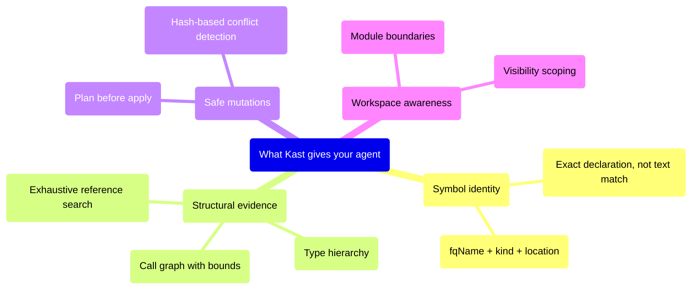

# What Kast gives your agent

LLM agents can already search files and rewrite text. What they usually
lack is a semantic runtime that understands Kotlin the way a compiler does.
Kast fills that gap with four capabilities that text search can never
provide: stable symbol identity, structural call graph evidence,
exhaustive reference search, and conflict-safe edit plans.



## Symbol identity — not string matching

When your agent asks "what is `processOrder`?", text search returns every
line containing that string. Kast resolves the exact declaration at a
specific position and returns the fully qualified name, kind, return type,
parameters, and source location. Your agent can refer to the symbol
unambiguously for the rest of the conversation.

```text title="Example agent prompt"
Use kast to resolve the processOrder function on OrderService.
Tell me its fully qualified name and return type.
```

## Structural evidence — not line matches

When your agent needs to know "who calls this function?", `grep` returns
files that mention the name. Kast returns a bounded call hierarchy tree
with traversal stats and truncation metadata. Your agent knows exactly
which functions are actual callers, how deep the tree goes, and where
expansion was cut short.

When your agent asks "is this used anywhere?", Kast returns every
reference along with `searchScope.exhaustive` — a boolean proving whether
every candidate file was searched. No more hedging with "I found these
references, but there might be more."

## Safe mutations — not find-and-replace

When your agent needs to rename a symbol, find-and-replace rewrites bytes
without knowing whether each match is the right symbol. Kast's two-phase
flow generates a rename plan with exact edits and SHA-256 file hashes.
The agent reviews the plan, then applies it. If any file changed between
planning and applying, Kast rejects the apply with a clear error.

## Workspace awareness — not file-by-file

Kast analyzes entire Gradle workspaces as a single session. Your agent
gets visibility into module boundaries, dependency relationships, and
symbol visibility scoping. When Kast reports a reference search as
`exhaustive`, it means the search covered every module that could
possibly contain a usage — not just the files the agent happened to open.

## What your agent can do with Kast

Here are the specific tasks that become reliable when your agent has
semantic code intelligence:

- **Resolve a symbol** before summarizing usage — the agent knows exactly
  which declaration it's talking about.
- **Find all references** and report whether the search was complete —
  the agent doesn't have to guess.
- **Walk a call graph** with explicit bounds — the agent can explain
  where the tree was truncated and why.
- **Plan a rename** with conflict detection — the agent can verify edits
  before touching disk.
- **Find implementations** of an interface — the agent gets concrete
  subclasses, not string matches.
- **Check diagnostics** to verify code compiles after changes — the agent
  catches errors without running the build.

## Next steps

- [Talk to your agent](talk-to-your-agent.md) — how to prompt your agent
  to use Kast effectively
- [Install the skill](install-the-skill.md) — get the packaged Kast
  skill into your workspace
- [Direct CLI usage](direct-cli.md) — when agents call the CLI directly
