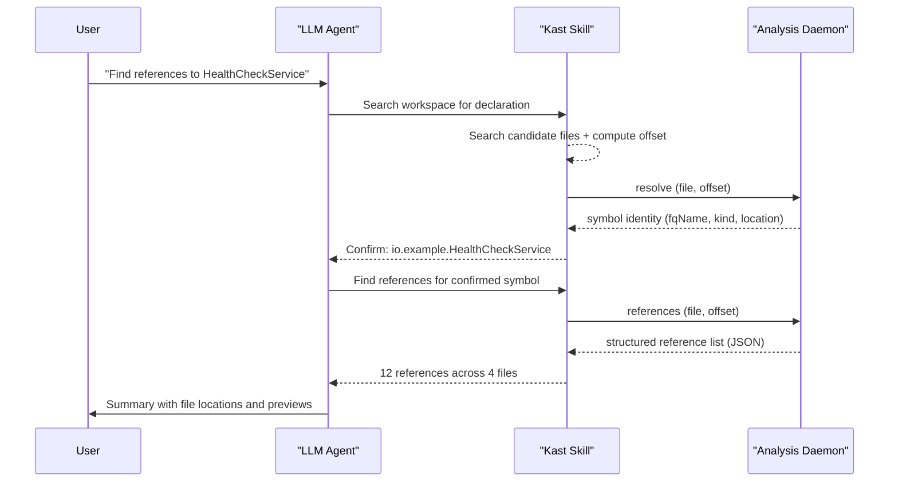

# Talk to your agent about Kast

The packaged Kast skill lets you describe Kotlin symbols the way you'd
describe them to another engineer. You don't need to know file offsets,
absolute paths, or JSON-RPC payloads. Name the symbol naturally, say
what you want done, and the skill bridges your request into the semantic
lookup Kast needs.

## Start with a conversational reference

Name the target the way you naturally know it — a class name, a function
name, a property on a containing type. Then say what the agent should do
and what the answer should include.

Three things to include in your prompt:

1. **The symbol** — name it naturally, for example "the `processOrder`
   function on `OrderService`."
2. **The action** — what should the agent do? Resolve, find references,
   show callers, plan a rename.
3. **The answer shape** — what should the result include? Fully qualified
   name, declaration location, caller summary, truncation status.

```text title="Example: Resolve a symbol"
Use the kast skill to resolve the retryDelay property on RetryConfig.
Tell me where it's declared and what type Kast reports.
```

```text title="Example: Find references"
Use the kast skill to find references to HealthCheckService in this
workspace. Confirm the declaration first, then summarize the callers.
```

```text title="Example: Call hierarchy"
Use the kast skill to show the incoming call hierarchy for
HealthCheckService.runChecks. Resolve the symbol first, then summarize
the top callers and any truncation.
```

## Follow the golden path

The most reliable flow keeps the agent narrow at each stage. Resolve
first, confirm identity, then expand. This avoids the common failure
mode where the agent guesses which symbol you mean and gets it wrong.



The key steps in this flow:

1. Name the target in conversational terms.
2. Ask the agent to resolve the symbol before it gathers references.
3. Confirm the reported symbol kind, fully qualified name, and
   declaration match what you meant.
4. Ask for references, call hierarchy, rename impact, or diagnostics
   only after the identity is confirmed.

## Add context when the name is ambiguous

Some workspaces have repeated names. When the skill finds multiple
candidates, add context to narrow the match.

- Name the containing type: "`retryDelay` on `RetryConfig`."
- Name the module or package: "`loadUser` in the API module."
- Mention a nearby caller: "the `processOrder` called by
  `CheckoutController`."
- Specify the kind: "the `Config` class, not the `config` property."

```text hl_lines="2" title="Disambiguating by containing type"
Find references to the timeoutMillis property on HttpClientConfig,
not the local variable with the same name.
```

```text hl_lines="1" title="Disambiguating by module"
Resolve loadUser in the API module, the function used by
UserController.
```

## Ask for a result you can act on

A good answer isn't just "found it." Ask the agent to summarize the parts
that help you decide what to do next.

Useful fields to ask about:

- **`fqName`** — the stable, fully qualified identity of the symbol
- **Symbol kind** — CLASS, FUNCTION, PROPERTY, INTERFACE
- **Declaration location** — file, line, and column
- **References grouped by file** — see usage patterns at a glance
- **Truncation status** — whether the call hierarchy was cut short
- **`searchScope.exhaustive`** — whether all candidate files were
  searched

## Let the skill bridge the mechanics

The packaged skill handles the low-level work so you don't have to.
When your request is clear enough, the skill:

- Discovers the correct `kast` executable through its resolver script
- Ensures the workspace daemon is ready before running analysis
- Searches for likely declaration sites from your human reference
- Translates the selected declaration into the file and offset Kast
  needs
- Verifies the target with `resolve` before expanding into
  `references`, `call-hierarchy`, or `rename`

## Next steps

- [Install the skill](install-the-skill.md) — get the packaged Kast
  skill into your workspace
- [Direct CLI usage](direct-cli.md) — when agents call the CLI
  directly instead of through the skill
