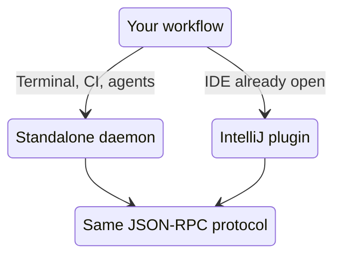
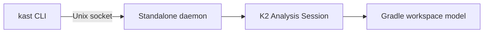
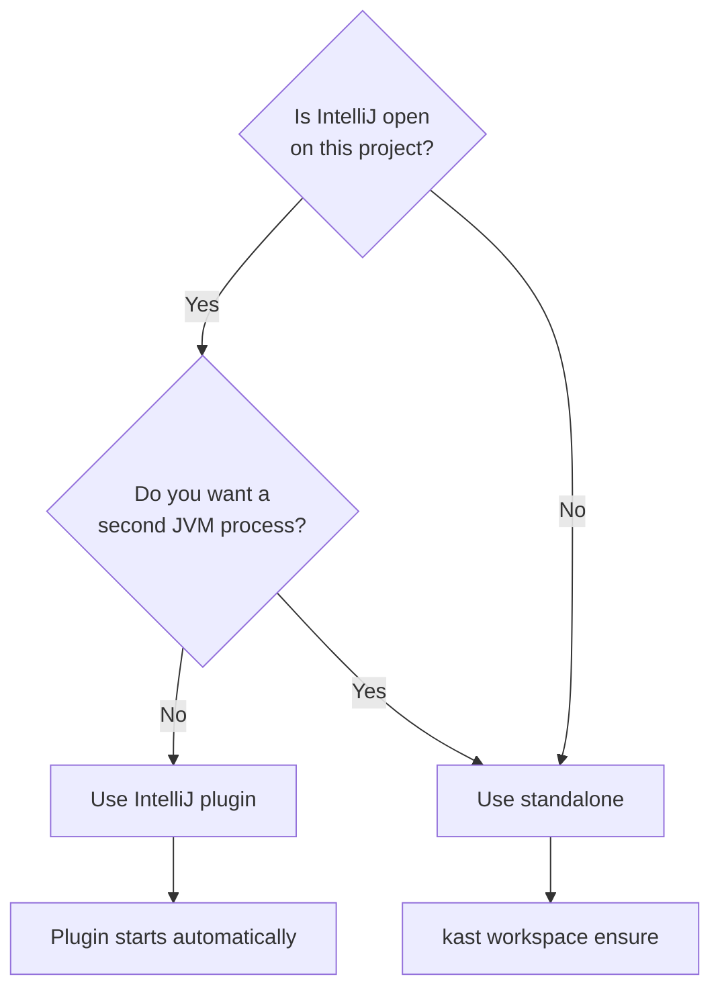

# Backends

Kast ships two backend implementations. Both speak the same JSON-RPC
protocol over Unix domain sockets, so your scripts, agents, and tools
work identically regardless of which one is running. The difference is
where the analysis session lives.

## At a glance

## Standalone backend

The standalone backend runs as an independent JVM process outside any
IDE. The `kast` CLI starts it on demand and manages its lifecycle.

**When to use it:**

- Terminal workflows and shell scripts
- CI pipelines where no IDE is running
- LLM agents operating headless
- Any machine where IntelliJ is not installed

**How it works:**

1. You run a `kast` command with `--workspace-root`.
2. The CLI checks for an existing daemon for that workspace.
3. If none is running, it starts one and waits for READY.
4. The daemon discovers your project layout through the Gradle Tooling
   API (or conventional source roots as a fallback).
5. It bootstraps a K2 analysis session from extracted IntelliJ platform
   libraries bundled in the distribution.
6. Your command runs against the warm session.

## IntelliJ plugin backend

The IntelliJ plugin backend runs inside a running IntelliJ IDEA
instance. It piggybacks on the IDE's existing K2 analysis session,
project model, and indexes.

**When to use it:**

- You already have IntelliJ open on the project
- You want Kast analysis without a second JVM process
- You want the IDE's richer project model and index state

**How it works:**

1. IntelliJ opens a project.
2. The plugin starts a Kast server automatically on a Unix domain
   socket.
3. It writes a descriptor file so external clients can discover the
   socket path.
4. External tools connect through the socket and get the same JSON-RPC
   interface.

!!! tip
    To disable the plugin without uninstalling it, set the
    `KAST_INTELLIJ_DISABLE` environment variable before launching
    IntelliJ.

## Capability comparison

Both backends support the full Kast capability set. Use `capabilities`
to confirm support at runtime.

| Capability               | Standalone | IntelliJ plugin |
|--------------------------|:----------:|:---------------:|
| Symbol resolution        | ✓          | ✓               |
| Find references          | ✓          | ✓               |
| File outline             | ✓          | ✓               |
| Workspace symbol search  | ✓          | ✓               |
| Call hierarchy           | ✓          | ✓               |
| Type hierarchy           | ✓          | ✓               |
| Semantic insertion point | ✓          | ✓               |
| Diagnostics              | ✓          | ✓               |
| Rename                   | ✓          | ✓               |
| Apply edits              | ✓          | ✓               |
| File operations          | ✓          | ✓               |
| Optimize imports         | ✓          | ✓               |
| Workspace refresh        | ✓          | ✓               |
| Workspace files          | ✓          | ✓               |

## How to choose

Use this decision flowchart when you're not sure which backend fits.

**Choose standalone when:**

- No IDE is running
- You need headless operation (CI, agents)
- You want explicit daemon lifecycle control

**Choose IntelliJ plugin when:**

- IntelliJ is already open
- You want to avoid a second JVM process
- You want the IDE's project model without separate discovery

## Using both

You can have both backends running for the same workspace. Each has its
own daemon descriptor under `~/.config/kast/daemons/`. The CLI
discovers available daemons and connects to the first one it finds. If
you want to target a specific backend, use `--transport` to specify the
socket path directly.

## Next steps

- [How Kast works](../architecture/how-it-works.md) — the full
  architecture story
- [Quickstart](quickstart.md) — run your first analysis command
