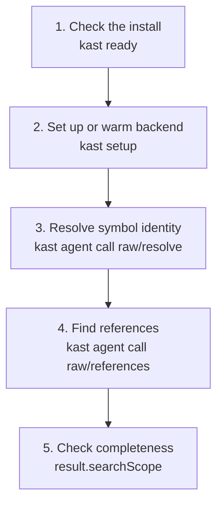

# Quickstart

This walkthrough starts a backend, resolves one Kotlin symbol, and finds its
references through the CLI. The lifecycle commands render readable summaries;
the advanced `kast agent` commands return JSON envelopes for scripts.

## Before you begin

You need Kast installed and a Kotlin workspace on disk. Use the developer
machine install on macOS, or the Linux headless bundle on CI runners, hosted
agents, and server images.



```console title="Check the active install"
kast ready
kast developer inspect paths
```

Run the remaining commands from the repository root or any subdirectory below
it. Kast walks upward to the nearest Gradle or `.kast` marker when
`--workspace-root` is omitted.

## Step 1: start a backend

Use the backend that matches the machine. The headless backend works well for
servers and CI. The IDEA backend reuses an already-open IDEA or Android Studio
project on developer machines.

=== "Headless"

    ```console title="Start or warm a headless backend"
    kast setup --backend=headless --no-open-ide
    kast status --backend=headless
    ```

=== "IDEA"

    ```console title="Reuse an open IDEA or Android Studio project"
    kast setup --backend=idea --no-open-ide
    kast status --backend=idea
    ```

Use JSON output for automation:

```console title="Machine-readable status"
kast --output json status --backend=headless
```

## Step 2: resolve a symbol

Pick a Kotlin file and a byte offset that lands on an identifier. The command
returns one JSON object with the normalized request and result.

```console title="Resolve a symbol at a file offset"
APP_FILE="$PWD/src/main/kotlin/App.kt"

kast agent call raw/resolve \
  --params "{\"position\":{\"filePath\":\"$APP_FILE\",\"offset\":42}}" \
  --backend=headless
```

The important fields are in `result`: fully qualified name, kind, signature,
and source location. That is compiler-backed symbol identity, not a text match.

| Field | Why it matters |
|-------|----------------|
| `result.fqName` | Names the declaration the Kotlin analysis engine resolved |
| `result.kind` | Distinguishes classes, functions, properties, and other declaration shapes |
| `result.signature` | Gives scripts a stable comparison point when overloads exist |
| `result.location` | Feeds the next command without falling back to text search |

## Step 3: find references

Use the same file and offset to ask for usages. Include the declaration when
you want one complete evidence list.

```console title="Find references"
kast agent call raw/references \
  --params "{\"position\":{\"filePath\":\"$APP_FILE\",\"offset\":42},\"includeDeclaration\":true}" \
  --backend=headless
```

Read `result.searchScope.exhaustive` before claiming the list is complete. If
it is false, compare the candidate and searched file counts in the payload.

!!! warning "Completeness is data, not intent"
    Treat partial reference results as bounded evidence. A successful command
    proves that the request ran; only an exhaustive search scope proves that the
    returned list is complete for the selected backend and workspace state.

## Step 4: bridge from a name to an offset

When you do not have an offset, search declarations by name first. Feed the
returned `location.filePath` and `location.startOffset` into the offset-based
commands.

```console title="Find declarations by name"
kast agent call raw/workspace-symbol \
  --params '{"pattern":"OrderService","maxResults":20}' \
  --backend=headless
```

This keeps the workflow semantic. Use text search only when you are looking for
plain text, comments, or literals.

## Step 5: stop when finished

Stop the backend when you want to free local resources. Long-lived developer
machines can keep a warm backend running.

```console title="Stop the backend"
kast developer runtime stop --backend=headless
```

## Next commands

The next page to read depends on the job. Use lifecycle commands for runtime
state, agent commands for semantic reads and scripts, and recipes for common
multi-command workflows.

- [Lifecycle commands](../commands/lifecycle.md)
- [Agent automation commands](../commands/agent.md)
- [Recipes](../recipes.md)
