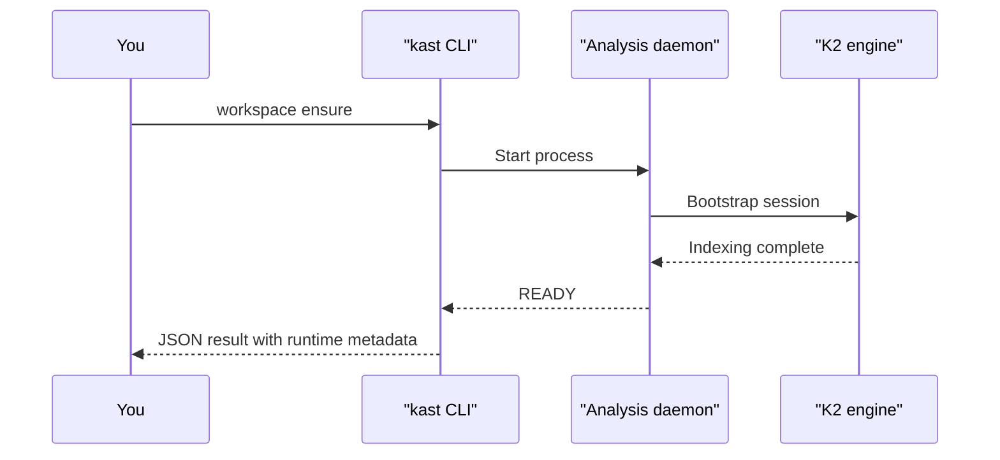

# Quickstart

This page walks you through a complete first session — from starting a
workspace daemon to resolving a symbol and finding its references. By the
end, you'll have run three commands and seen structured JSON output from
each one.

## Before you begin

Make sure you have:

- The `kast` CLI installed (see [Install](install.md))
- A Kotlin workspace on your machine (any Gradle or standalone Kotlin
  project)
- The absolute path to that workspace root

## Step 1: Start the workspace daemon

Tell Kast which workspace to analyze. This starts the daemon and waits
until it finishes indexing.

```console linenums="1" title="Start the daemon"
kast workspace ensure \
  --workspace-root=/absolute/path/to/workspace
```



The first start takes longer because the daemon discovers your project
structure and indexes every Kotlin file. Later commands reuse that warm
state.

!!! tip
    Pass `--accept-indexing=true` if you want the command to return as
    soon as the daemon is servable, even if indexing hasn't finished.
    Queries during indexing may return partial results.

## Step 2: Resolve a symbol

Pick any Kotlin file in your workspace and an offset pointing at a
symbol you want to identify. Kast returns the fully qualified name,
kind, parameters, return type, and source location.

```console linenums="1" title="Resolve a symbol"
kast resolve \
  --workspace-root=/absolute/path/to/workspace \
  --file-path=/absolute/path/to/workspace/src/main/kotlin/App.kt \
  --offset=42
```

```json hl_lines="3-4" title="Example response"
{
  "result": {
    "fqName": "com.example.App.processOrder",
    "kind": "FUNCTION",
    "returnType": "OrderResult",
    "parameters": [
      { "name": "orderId", "type": "String" }
    ],
    "location": {
      "filePath": "/workspace/src/main/kotlin/App.kt",
      "startLine": 12, "startColumn": 5
    }
  }
}
```

## Step 3: Find references

Using the same file and offset, ask Kast for every reference to that
symbol across the workspace.

```console linenums="1" title="Find references"
kast references \
  --workspace-root=/absolute/path/to/workspace \
  --file-path=/absolute/path/to/workspace/src/main/kotlin/App.kt \
  --offset=42
```

```json hl_lines="10-11" title="Example response"
{
  "result": {
    "declaration": {
      "fqName": "com.example.App.processOrder",
      "kind": "FUNCTION"
    },
    "references": [
      {
        "filePath": "/workspace/src/.../CheckoutController.kt",
        "startLine": 45,
        "preview": "app.processOrder(orderId)"
      }
    ],
    "searchScope": {
      "exhaustive": true,
      "candidateFileCount": 12,
      "searchedFileCount": 12
    }
  }
}
```

Notice `searchScope.exhaustive: true` — this means Kast searched every
candidate file. The reference list is complete, not a sample.

## Step 4: Stop the daemon

When you're done, stop the daemon to free resources.

```console title="Stop the daemon"
kast workspace stop \
  --workspace-root=/absolute/path/to/workspace
```

## What just happened

In four commands, you:

1. **Started a workspace daemon** that indexed your entire Kotlin
   codebase into a live analysis session.
2. **Resolved a symbol** to its exact declaration with full type
   information — not a string match, but a compiler-backed identity.
3. **Found every reference** with a proof of completeness
   (`exhaustive: true`).
4. **Stopped the daemon** cleanly.

Every command returned structured JSON that a script, agent, or pipeline
can parse directly. No regex, no guessing, no "might have missed some."

## Next steps

- [Understand symbols](../what-can-kast-do/understand-symbols.md) —
  everything Kast tells you about a declaration
- [Trace usage](../what-can-kast-do/trace-usage.md) — references,
  call hierarchy, and type hierarchy
- [Kast for agents](../for-agents/index.md) — how LLM agents use
  these same commands
