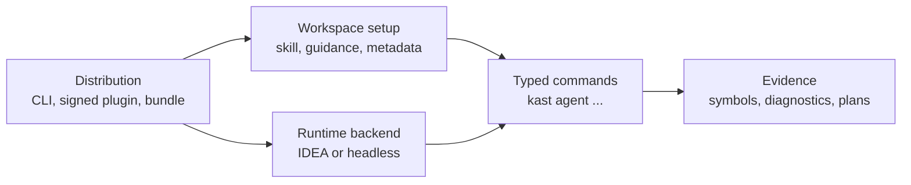

# Kast

Kast gives agents compiler-backed Kotlin and Gradle evidence while keeping the
developer path simple: install the machine support, open the project, and let
the agent use Kast when a task needs semantic confidence.

## Start By Reader Job

Choose the path by what you are trying to do. Every path converges on the same
typed `kast` command surface.

<div class="grid cards" markdown>

-   :octicons-download-24:{ .lg .middle } **Install on macOS**

    ---

    Install the Homebrew CLI and the signed plugin through JetBrains, then open
    your project.

    [:octicons-arrow-right-24: macOS install](install/macos.md)

-   :octicons-server-24:{ .lg .middle } **Install on Linux**

    ---

    Install the headless bundle for CI, hosted agents, server images, or
    mirrored artifact stores.

    [:octicons-arrow-right-24: Headless install](install/headless-linux.md)

-   :octicons-play-24:{ .lg .middle } **Try it on your code**

    ---

    Open a read-only semantic story built from symbols, relationships, impact,
    and diagnostics in the repository you already have open.

    [:octicons-arrow-right-24: Run the repository demo](learn/repository-demo.md)

-   :octicons-zap-24:{ .lg .middle } **Run the first workflow**

    ---

    See the semantic workflow agents run behind the scenes.

    [:octicons-arrow-right-24: First semantic workflow](learn/first-semantic-workflow.md)

-   :octicons-terminal-24:{ .lg .middle } **Choose a command**

    ---

    Pick the high-level command family for inspection, editing, automation, or
    release work.

    [:octicons-arrow-right-24: Choose a command](use/choose-a-command.md)

</div>

## Operating Model

Kast separates the visible install path from the agent-facing semantic work.
That keeps setup foolproof for developers while still giving agents typed,
compiler-backed operations when they need evidence.



| Layer | Reader question | First page |
| --- | --- | --- |
| Distribution | How do I install Kast? | [Install](install/macos.md) |
| Workspace setup | What prepares a project for agents? | [Automate with agents](use/automate-with-agents.md) |
| Runtime backend | What answers semantic requests? | [Runtime and output](reference/runtime-and-output.md) |
| Semantic commands | What does the agent ask Kast to do? | [Agent commands](reference/agent-commands.md) |
| Evidence | What does Kast prove that text search cannot? | [How Kast thinks about evidence](learn/evidence-model.md) |

## Reference Paths

Use reference pages when you need lookup accuracy rather than a task flow.

- [Command surface](reference/commands.md) lists curated public command groups.
- [Agent commands](reference/agent-commands.md) lists typed semantic commands.
- [Mutation selectors](reference/mutation-selectors.md) describes edit targets
  and anchors.
- [Runtime and output](reference/runtime-and-output.md) covers backend
  selection and readable or JSON output.
- [Runtime artifact contract](distribute/runtime-artifact-contract.md) records
  bundle, manifest, checksum, and ledger facts.

## When Something Fails

Use the [troubleshooting matrix](troubleshoot.md) to separate install issues,
backend state, indexing, semantic failures, and mutation planning. Most readers
should start with the visible symptom, not the internal command sequence.

??? info "Agent checks"
    Agents and support scripts can use read-only checks before retrying a
    semantic operation.

    ```console
    kast --output json ready --for agent --workspace-root "$PWD"
    kast --output json agent verify --workspace-root "$PWD"
    kast --output json status --workspace-root "$PWD"
    ```
