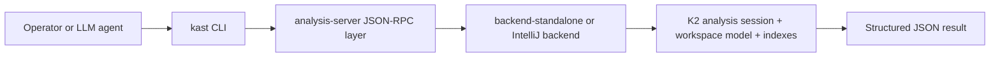

Kast is a Kotlin semantic analysis system that returns structured JSON for
humans, scripts, CI, and LLM-driven workflows. The fastest way to use these
docs is to choose the perspective that matches your goal, then follow that path
end to end.

## Choose your path

The documentation supports three primary perspectives. Each path highlights
what matters most for that audience and keeps lower-level detail available
without making the starting path noisy.

-   __Path 1: Capability overview (most readers)__

    ---

    Use this path when you want to understand what Kast can do and how to run
    the commands people use most often.

    Start here:

    - [Why Kast](why-kast.md)
    - [What you can do](what-you-can-do.md)
    - [Get started](get-started.md)
    - [Run analysis commands](run-analysis-commands.md)

-   __Path 2: Advanced architecture and module depth__

    ---

    Use this path when you need module-by-module understanding, architectural
    tradeoffs, and reasoning behind system boundaries.

    Start here:

    - [How Kast works](how-it-works.md)
    - [Architecture deep dive](architecture-deep-dive.md)
    - [Things to know](things-to-know.md)
    - [Command reference](command-reference.md)

-   __Path 3: LLM integration and agent workflows__

    ---

    Use this path when your main question is how an LLM agent can leverage
    Kast safely and repeatably.

    Start here:

    - [Use Kast from an LLM agent](use-kast-from-an-llm-agent.md)
    - [Run analysis commands](run-analysis-commands.md)
    - [LLM scaffolding reference](llm-scaffolding-reference.md)
    - [Things to know](things-to-know.md)

## Command surface model

Most teams only need a compact command set day to day:

- `workspace ensure`, `workspace status`, `workspace stop`
- `capabilities`
- `resolve`, `references`, `diagnostics`
- `rename` and `apply-edits` for controlled mutation

Kast also exposes advanced primitives such as `call-hierarchy`, `outline`,
`workspace-symbol`, `type-hierarchy`, and `insertion-point`. Those stay fully
supported, but they live behind the core path because they are most useful in
power-user or agent-driven workflows.

## System model at a glance

At runtime, Kast follows the same high-level flow for CLI users and agent
integrations.

This model keeps semantic state warm in a long-lived backend while preserving a
small CLI surface for common operations.

## Next steps

Pick one perspective path above, then continue into deeper pages only when you
need more granularity for automation or architecture work.
