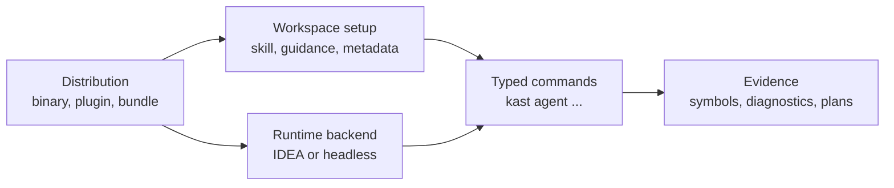

# Kast

Kast is a compiler-backed Kotlin and Gradle semantic control plane for
terminals, CI, hosted agents, and IDE-backed developer machines. Start from the
job you need to complete, then use the reference pages when you need exact
command names, selectors, or output-mode behavior.

## Start By Reader Job

Choose the path by what you are trying to do. Every path converges on the same
typed `kast` command surface.

<div class="grid cards" markdown>

-   :octicons-download-24:{ .lg .middle } **Install on macOS**

    ---

    Install the Homebrew binary, refresh the JetBrains plugin, open a
    repository, and verify readiness.

    [:octicons-arrow-right-24: macOS install](install/macos.md)

-   :octicons-server-24:{ .lg .middle } **Install on Linux**

    ---

    Install the headless bundle for CI, hosted agents, server images, or
    mirrored artifact stores.

    [:octicons-arrow-right-24: Headless install](install/headless-linux.md)

-   :octicons-zap-24:{ .lg .middle } **Run the first workflow**

    ---

    Verify the backend, resolve a symbol, run diagnostics, and plan a safe
    edit.

    [:octicons-arrow-right-24: First semantic workflow](learn/first-semantic-workflow.md)

-   :octicons-terminal-24:{ .lg .middle } **Choose a command**

    ---

    Pick the command family for setup, readiness, runtime, Kotlin inspection,
    safe edits, or release work.

    [:octicons-arrow-right-24: Choose a command](use/choose-a-command.md)

</div>

## Operating Model

Kast separates the install path, workspace setup, runtime backend, semantic
commands, and evidence returned to agents or scripts. Keeping those layers
separate makes failures easier to diagnose and keeps public automation on typed
commands instead of raw transport.



| Layer | Reader question | First page |
| --- | --- | --- |
| Distribution | How do I install the binary and runtime? | [Install](install/macos.md) |
| Workspace setup | How does a repository become ready for agents? | [Automate with agents](use/automate-with-agents.md) |
| Runtime backend | How do I prove a backend is reachable? | [Runtime and output modes](reference/runtime-and-output.md) |
| Semantic commands | How do I inspect Kotlin safely? | [Inspect Kotlin](use/inspect-kotlin.md) |
| Evidence | What does Kast prove that text search cannot? | [How Kast thinks about evidence](learn/evidence-model.md) |

## Reference Paths

Use reference pages when you need lookup accuracy rather than a task flow.

- [Command surface](reference/commands.md) lists curated public command groups.
- [Agent commands](reference/agent-commands.md) lists typed semantic commands.
- [Mutation selectors](reference/mutation-selectors.md) describes edit targets
  and anchors.
- [Runtime and output modes](reference/runtime-and-output.md) covers readiness,
  repair, backend selection, and structured output.
- [Runtime artifact contract](distribute/runtime-artifact-contract.md) records
  bundle, manifest, checksum, and ledger facts.

## When Something Fails

Start with read-only checks before applying repair or retrying mutations.

```console
kast --output json ready --for agent --workspace-root "$PWD"
kast --output json agent verify --workspace-root "$PWD"
kast --output json status --workspace-root "$PWD"
```

Use the [troubleshooting matrix](troubleshoot.md) to separate install drift,
backend state, indexing, semantic failures, and mutation planning.
