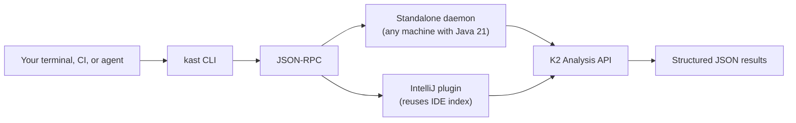

# IDE-grade Kotlin code intelligence — anywhere you need it

Kast gives you the same semantic analysis that powers IntelliJ IDEA, but as
a headless daemon with structured JSON output. Run it in your terminal, pipe
it through CI, hand it to an LLM agent, or spin it up on a cloud VM. Every
command returns machine-readable JSON that tells you exactly what the Kotlin
compiler knows — symbol identity, caller relationships, reference
exhaustiveness, and conflict-safe edit plans.



## What can Kast do?

Every section below shows a real capability. Each one includes the CLI
command, the JSON-RPC request, and a natural-language prompt you can hand
to an LLM agent. The response examples highlight the fields that make
Kast different from text search.

### Resolve a symbol — get exact identity, not a text match

When you point Kast at a position in a Kotlin file, it doesn't search for
a name. It resolves the exact declaration the compiler sees at that
location and returns its fully qualified name, kind, return type,
parameters, and source location.

=== "CLI"

    ```console title="Resolve the symbol at a specific file position"
    kast resolve \
      --workspace-root=/app \
      --file-path=/app/src/main/kotlin/com/example/OrderService.kt \
      --offset=142
    ```

=== "JSON-RPC"

    ```json title="JSON-RPC request"
    {
      "method": "symbol/resolve",
      "params": {
        "position": {
          "filePath": "/app/src/main/kotlin/com/example/OrderService.kt",
          "offset": 142
        }
      },
      "id": 1, "jsonrpc": "2.0"
    }
    ```

=== "Ask your agent"

    ```text title="Natural language prompt"
    Use kast to resolve the processOrder function on OrderService.
    Tell me its fully qualified name, return type, and parameters.
    ```

```json hl_lines="3-5" title="Response — the identity triple"
{
  "symbol": {
    "fqName": "com.example.OrderService.processOrder",
    "kind": "FUNCTION",
    "location": {
      "filePath": "/app/src/.../OrderService.kt",
      "startLine": 47,
      "preview": "processOrder"
    },
    "returnType": "Order",
    "parameters": [
      {
        "name": "cart",
        "type": "Cart"
      }
    ],
    "containingDeclaration": "com.example.OrderService"
  }
}
```

> `grep` can tell you where the name "processOrder" appears. Kast tells you
> *which* `processOrder` — its fully qualified identity, its return type,
> its parameters, and exactly where it's declared. When your workspace has
> overloads or similarly named functions, that distinction is everything.

### Find every reference — and know if the search was exhaustive

Kast finds every usage of a resolved symbol, then proves whether it
searched every file that could possibly contain a reference. The
`searchScope` metadata tells you the symbol's visibility, how many files
were candidates, how many were actually searched, and whether the result
is complete.

=== "CLI"

    ```console title="Find all references with exhaustiveness proof"
    kast references \
      --workspace-root=/app \
      --file-path=/app/src/main/kotlin/com/example/OrderService.kt \
      --offset=142
    ```

=== "JSON-RPC"

    ```json title="JSON-RPC request"
    {
      "method": "references",
      "params": {
        "position": {
          "filePath": "/app/src/.../OrderService.kt",
          "offset": 142
        },
        "includeDeclaration": true
      },
      "id": 1, "jsonrpc": "2.0"
    }
    ```

=== "Ask your agent"

    ```text title="Natural language prompt"
    Use kast to find all references to OrderService.processOrder
    in this workspace. Tell me if the search was exhaustive.
    ```

```json hl_lines="14-20" title="Response — searchScope proves completeness"
{
  "references": [
    {
      "filePath": "/app/src/.../CartService.kt",
      "startLine": 47,
      "preview": "orderService.processOrder(cart)"
    },
    {
      "filePath": "/app/src/.../CheckoutController.kt",
      "startLine": 112,
      "preview": "orderService.processOrder(validatedCart)"
    }
  ],
  "searchScope": {
    "exhaustive": true,
    "visibility": "PUBLIC",
    "scope": "DEPENDENT_MODULES",
    "candidateFileCount": 42,
    "searchedFileCount": 42
  }
}
```

> `grep` finds lines that match a string. It can't tell you whether it
> found *all* the usages, or whether some of those matches refer to a
> different symbol with the same name. Kast narrows the search based on
> Kotlin visibility rules and reports `exhaustive: true` when every
> candidate file was searched. No guesswork.

### Walk a call tree — with explicit bounds and truncation stats

Kast builds a bounded call hierarchy from a resolved symbol. You control
the depth, the maximum number of edges, and the fan-out per node. The
response includes traversal stats and marks every node where expansion
stopped, including why it stopped.

=== "CLI"

    ```console title="Get incoming callers with bounded traversal"
    kast call-hierarchy \
      --workspace-root=/app \
      --file-path=/app/src/main/kotlin/com/example/OrderService.kt \
      --offset=142 \
      --direction=INCOMING \
      --depth=5
    ```

=== "JSON-RPC"

    ```json hl_lines="5-8" title="JSON-RPC request — you set the bounds"
    {
      "method": "call-hierarchy",
      "params": {
        "position": { "filePath": "...", "offset": 142 },
        "direction": "INCOMING",
        "depth": 5,
        "maxTotalCalls": 512,
        "maxChildrenPerNode": 32
      },
      "id": 1, "jsonrpc": "2.0"
    }
    ```

=== "Ask your agent"

    ```text title="Natural language prompt"
    Use kast to show the incoming call hierarchy for
    OrderService.processOrder. Go 5 levels deep and tell me
    where the tree was truncated.
    ```

```json hl_lines="10-17" title="Response — stats reveal the traversal boundary"
{
  "root": {
    "symbol": {
      "fqName": "com.example.OrderService.processOrder"
    },
    "children": [
      "..."
    ]
  },
  "stats": {
    "totalNodes": 23,
    "totalEdges": 22,
    "truncatedNodes": 2,
    "maxDepthReached": 5,
    "timeoutReached": false,
    "maxTotalCallsReached": false
  }
}
```

> Text search can show you files that mention a function name. It can't
> tell you which mentions are actual callers, which resolve to a different
> symbol, and which branches were cut short. Kast gives you a structured
> tree with explicit truncation reasons on every bounded node.

### Plan a safe rename — with hash-based conflict detection

Kast separates rename *planning* from rename *execution*. First, you get
an edit plan with SHA-256 file hashes. Then you review the plan, and only
when you're ready, you send it back with the same hashes. If any file
changed between planning and applying, Kast rejects the apply.

=== "CLI"

    ```console title="Step 1: Generate a rename plan"
    kast rename \
      --workspace-root=/app \
      --file-path=/app/src/main/kotlin/com/example/OrderService.kt \
      --offset=142 \
      --new-name=submitOrder
    ```

=== "JSON-RPC"

    ```json title="JSON-RPC request"
    {
      "method": "rename",
      "params": {
        "position": { "filePath": "...", "offset": 142 },
        "newName": "submitOrder",
        "dryRun": true
      },
      "id": 1, "jsonrpc": "2.0"
    }
    ```

=== "Ask your agent"

    ```text title="Natural language prompt"
    Use kast to plan a rename of processOrder to submitOrder on
    OrderService. Show me the edit plan and file hashes before
    applying anything.
    ```

```json hl_lines="10-19" title="Response — edits + hashes for conflict detection"
{
  "edits": [
    {
      "filePath": "/app/src/.../OrderService.kt",
      "startOffset": 10,
      "endOffset": 22,
      "newText": "submitOrder"
    }
  ],
  "fileHashes": [
    {
      "filePath": "/app/src/.../OrderService.kt",
      "hash": "a1b2c3..."
    },
    {
      "filePath": "/app/src/.../CartService.kt",
      "hash": "d4e5f6..."
    }
  ],
  "affectedFiles": [
    "/app/src/.../OrderService.kt",
    "/app/src/.../CartService.kt"
  ]
}
```

> Find-and-replace rewrites bytes without knowing whether each match is
> the same symbol. It also can't detect that a file changed after you
> planned the edit. Kast's two-phase flow with SHA-256 hashes catches
> conflicts before they reach disk.

### Find implementations — see every concrete subclass

Point Kast at an interface or abstract class and get back every concrete
implementation in the workspace, along with their supertype chains and
an exhaustiveness flag.

=== "CLI"

    ```console title="Find all implementations of an interface"
    kast implementations \
      --workspace-root=/app \
      --file-path=/app/src/main/kotlin/com/example/PaymentProcessor.kt \
      --offset=28
    ```

=== "JSON-RPC"

    ```json title="JSON-RPC request"
    {
      "method": "implementations",
      "params": {
        "position": {
          "filePath": "/app/src/.../PaymentProcessor.kt",
          "offset": 28
        }
      },
      "id": 1, "jsonrpc": "2.0"
    }
    ```

=== "Ask your agent"

    ```text title="Natural language prompt"
    Use kast to find every class that implements PaymentProcessor.
    Tell me their fully qualified names and supertype chains.
    ```

```json hl_lines="3-4 22" title="Response — concrete implementations + exhaustiveness"
{
  "declaration": {
    "fqName": "com.example.PaymentProcessor",
    "kind": "INTERFACE"
  },
  "implementations": [
    {
      "fqName": "com.example.StripeProcessor",
      "kind": "CLASS",
      "supertypes": [
        "com.example.PaymentProcessor"
      ]
    },
    {
      "fqName": "com.example.PayPalProcessor",
      "kind": "CLASS",
      "supertypes": [
        "com.example.PaymentProcessor"
      ]
    }
  ],
  "exhaustive": true
}
```

> Text search for "PaymentProcessor" returns every mention of the name.
> Kast returns only the classes that actually implement the interface,
> with their inheritance chains and a flag confirming whether the search
> covered every file.

## Why not just use an LSP?

Language Server Protocol (LSP) implementations are designed for editors.
They assume a bidirectional, session-managed connection where the editor
sends file open/change/close events. Kast is designed for automation. The
table below shows where that design difference matters.

| Concern                | LSP                                | Kast                                                                          |
|------------------------|------------------------------------|-------------------------------------------------------------------------------|
| Protocol model         | Bidirectional editor session       | Request/response JSON over local socket                                       |
| Editor dependency      | Required — manages open file state | None — runs headless on any machine with Java 21                              |
| Rename safety          | Single-step apply                  | Two-phase plan→apply with SHA-256 conflict detection                          |
| Reference completeness | No metadata                        | `searchScope.exhaustive` with file counts                                     |
| Call hierarchy bounds  | Unbounded by default               | Explicit `depth`, `maxTotalCalls`, `maxChildrenPerNode` with truncation stats |
| Headless/CI support    | Not designed for it                | First-class — standalone daemon, no UI needed                                 |
| Output format          | LSP-specific types                 | Self-contained JSON you can pipe, parse, or store                             |

Kast isn't a replacement for your editor's LSP. It's the tool you reach
for when the work happens outside an editor — in scripts, CI pipelines,
agent loops, and cloud VMs.

[Full comparison →](architecture/kast-vs-lsp.md)

## Two backends, one protocol

Kast ships two backends. Both speak the same JSON-RPC protocol over Unix
domain sockets. You pick the one that matches where you're working; every
command works the same either way.

| Capability              | Standalone | IntelliJ plugin |
|-------------------------|------------|-----------------|
| Symbol resolution       | ✓          | ✓               |
| Find references         | ✓          | ✓               |
| Call hierarchy          | ✓          | ✓               |
| Type hierarchy          | ✓          | ✓               |
| Rename + apply edits    | ✓          | ✓               |
| Diagnostics             | ✓          | ✓               |
| Workspace symbol search | ✓          | ✓               |
| File outline            | ✓          | ✓               |
| Optimize imports        | ✓          | ✓               |
| Workspace files         | ✓          | ✓               |

**Standalone daemon** — runs on any machine with Java 21. No IDE needed.
Best for terminal workflows, CI, agents, and cloud VMs. The CLI manages
the daemon lifecycle for you.

**IntelliJ plugin** — runs inside a running IntelliJ IDEA instance,
reusing the IDE's existing project model and K2 session. Best when you
already have IntelliJ open. Zero additional setup.

[Learn more about backends →](getting-started/backends.md)

## Get running in 60 seconds

```console linenums="1" title="From zero to first result"
# Install
/bin/bash -c "$(curl -fsSL \
  https://raw.githubusercontent.com/amichne/kast/HEAD/kast.sh)"

# Start the daemon
kast workspace ensure \
  --workspace-root=/path/to/your/project

# Resolve a symbol
kast resolve \
  --workspace-root=/path/to/your/project \
  --file-path=/path/to/your/project/src/main/kotlin/App.kt \
  --offset=42
```

That's it. Three commands: install, start, query. The daemon stays warm
for subsequent commands, so everything after the first query is fast.

[Full install guide →](getting-started/install.md) ·
[Quickstart tutorial →](getting-started/quickstart.md)

## Next steps

<div class="grid cards" markdown>

- **Get started**

  ---

  Install Kast, run your first query, and understand the two backends.

  [Install →](getting-started/install.md)

- **See what Kast can do**

  ---

  Explore every capability with real examples and content tabs.

  [Understand symbols →](what-can-kast-do/understand-symbols.md)

- **Use Kast from an agent**

  ---

  Give your LLM agent semantic code intelligence it can't get from grep.

  [For agents →](for-agents/index.md)

- **Dive into the architecture**

  ---

  Module boundaries, request flow, daemon model, and design rationale.

  [How Kast works →](architecture/how-it-works.md)

</div>
