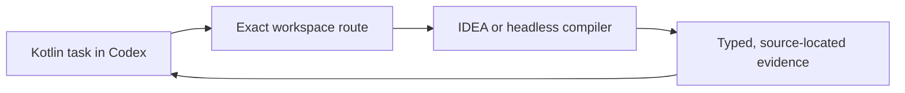

# Kast

Kast gives Codex compiler-backed Kotlin evidence from the project you already
have open in IntelliJ IDEA or Android Studio. On Linux and hosted agents, the
packaged headless backend provides the same typed analysis boundary.

Choose the page that matches what you need now.

-   :octicons-rocket-24:{ .lg .middle } **Learn the workflow**

    ---

    Complete one read-only task in the Kast repository and see what
    compiler-backed evidence looks like.

    [:octicons-arrow-right-24: Your first compiler-backed task](tutorials/first-compiler-backed-task.md)

-   :octicons-tools-24:{ .lg .middle } **Do a task**

    ---

    Install Kast, explore Kotlin code, plan an edit, or recover a blocked
    workspace.

    [:octicons-arrow-right-24: Browse the how-to guides](how-to/explore-kotlin-code.md)

-   :octicons-book-24:{ .lg .middle } **Look something up**

    ---

    Check the supported CLI and the boundary between the Codex plugin and the
    installed release.

    [:octicons-arrow-right-24: CLI reference](reference/cli.md)

-   :octicons-light-bulb-24:{ .lg .middle } **Understand the system**

    ---

    Learn why Kast binds compiler evidence to an exact workspace and how the
    runtime layers fit together.

    [:octicons-arrow-right-24: Architecture](explanation/architecture.md)

## Start here

If Kast is not installed, follow [Install or update Kast](how-to/install-or-update.md).
If it is installed and your project is open, begin with the
[tutorial](tutorials/first-compiler-backed-task.md). For a specific job, go
straight to [Explore Kotlin code](how-to/explore-kotlin-code.md) or
[Plan a safe Kotlin edit](how-to/plan-safe-edits.md).
