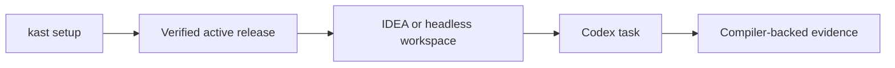

# Kast

Kast gives agents compiler-backed Kotlin context through IntelliJ IDEA, Android
Studio, or the packaged headless backend. Every host uses one setup path.

-   :octicons-download-24:{ .lg .middle } **Install Kast**

    ---

    Atomically install or replace the complete platform bundle.

    [:octicons-arrow-right-24: Install or update Kast](install/setup.md)

-   :octicons-comment-discussion-24:{ .lg .middle } **Work in Codex**

    ---

    Ask for Kotlin work normally; the plugin supplies semantic routing.

    [:octicons-arrow-right-24: Use Kast in Codex](use/codex.md)

-   :octicons-tools-24:{ .lg .middle } **Recover a task**

    ---

    Start from the failed phase and rerun the same setup transaction.

    [:octicons-arrow-right-24: Troubleshoot Kast](troubleshoot.md)

## What Runs Where

`kast setup` owns the active release. IDEA owns compiler state for an exact open
root; the headless backend owns compiler state on non-IDE hosts. Read the
[operating model](design/operating-model.md) or consult the [Codex plugin
reference](reference/codex-plugin.md).
