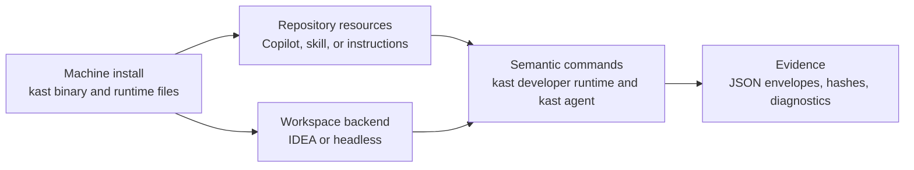

# Kast

Kast is a CLI for compiler-backed Kotlin code intelligence. Install the
machine-level binary once, add repository-local Copilot files where agents
should use it, then drive the workspace with `kast` commands.

## Start here

Choose the path by host first, then run the same semantic command surface from
the repository. Developer machines use the IDE-backed runtime; CI runners,
hosted agents, and server images use the headless runtime.

=== "Developer machine"

    Homebrew installs the global `kast` binary and version-coupled IDEA or
    Android Studio plugin. The repository command writes managed Copilot files
    under that repository's `.github` directory.

    ```console title="Install Kast, then enable one repository"
    brew tap amichne/kast
    brew install kast

    cd /path/to/your/repository
    kast setup
    ```

=== "Headless Linux"

    Use the Linux headless bundle when the machine is a CI runner, hosted
    agent, server image, or other host without Homebrew or an open developer
    IDE.

    ```console title="Install on Ubuntu or Debian"
    export KAST_UBUNTU_DEBIAN_VERSION="v1.2.3"
    ./scripts/install-ubuntu-debian.sh install
    ./scripts/install-ubuntu-debian.sh verify
    kast setup --backend=headless --no-open-ide
    ```

## Operating model

Kast separates the machine install, repository agent resources, runtime
backend, and semantic command layer. Keep those layers separate when debugging
or automating a workspace.



| Layer | First command | Proves |
|-------|---------------|--------|
| Machine install | `kast ready` | The active binary, manifest, and local paths are coherent |
| Repository resources | `kast setup ...` | Agent-facing files match the running CLI version |
| Runtime backend | `kast developer runtime status` | A workspace backend is reachable and reports capabilities |
| Semantic command layer | `kast agent ...` | The request uses compiler-backed Kotlin evidence |

## Command manual

The published docs are organized around the commands a developer can run.
`kast help` is the local command tree; these pages explain which command to
choose, what it reads or writes, and how to verify the result.

<div class="grid cards" markdown>

-   :octicons-download-24:{ .lg .middle } **Install**

    ---

    Install the machine binary, plugin, repository files, shell integration,
    and Linux headless bundle.

    [:octicons-arrow-right-24: Install](getting-started/install.md)

-   :octicons-zap-24:{ .lg .middle } **Quickstart**

    ---

    Start a backend, resolve a symbol, and find references through the CLI.

    [:octicons-arrow-right-24: Quickstart](getting-started/quickstart.md)

-   :octicons-terminal-24:{ .lg .middle } **Commands**

    ---

    Read the command groups: readiness, agent automation, runtime, inspect,
    machine, and release.

    [:octicons-arrow-right-24: Command overview](commands/index.md)

-   :octicons-book-24:{ .lg .middle } **Recipes**

    ---

    Copy focused command sequences for common Kotlin inspection, validation,
    and safe-edit workflows.

    [:octicons-arrow-right-24: Recipes](recipes.md)

</div>

## What Kast commands prove

Kast commands are useful when text search is not enough. They resolve the
declaration the Kotlin analysis engine sees, report whether reference and
hierarchy evidence was complete or bounded, and plan mutations with file hashes
before applying edits.

!!! tip "Automation boundary"
    Use `--output json` on operator commands when automation needs structured
    payloads. Use `kast agent call <method>` for pipe-friendly advanced catalog
    calls.
