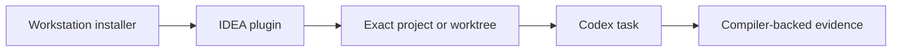

# Kast

Kast connects Codex to the Kotlin compiler running in IntelliJ IDEA or Android
Studio. The public workflow has one setup path and one working interface.

-   :octicons-download-24:{ .lg .middle } **Install Kast**

    ---

    Select the matched workstation bundle and prepare IDEA update discovery.

    [:octicons-arrow-right-24: Install on macOS](install/macos.md)

-   :octicons-comment-discussion-24:{ .lg .middle } **Work in Codex**

    ---

    Ask for Kotlin work normally; the plugin supplies semantic routing.

    [:octicons-arrow-right-24: Use Kast in Codex](use/codex.md)

-   :octicons-tools-24:{ .lg .middle } **Recover a task**

    ---

    Start from the visible symptom and return to the matched workstation path.

    [:octicons-arrow-right-24: Troubleshoot Kast](troubleshoot.md)

## What Runs Where

The installer owns the machine bundle. IDEA owns the compiler-backed runtime
for the exact open root. Codex is the only user-facing work surface. Read the
[operating model](design/operating-model.md) for the boundaries or consult the
[Codex plugin reference](reference/codex-plugin.md) for exact behavior.
