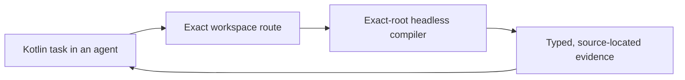

# Kast

Kast gives coding agents compiler-backed Kotlin evidence from one isolated
headless runtime for the exact workspace. A foreground editor can be open or
closed; it is not part of Kast routing or evidence production.

```mermaid
flowchart LR
    task["Kotlin task in an agent"] --> route["Exact workspace route"]
    route --> compiler["Exact-root headless compiler"]
    compiler --> result["Typed, source-located evidence"]
    result --> task
```

## Choose a reader path

Choose the page that matches what you need now.

-   :octicons-rocket-24:{ .lg .middle } **Learn by doing**

    ---

    Complete one read-only task in the Kast repository and see what
    compiler-backed evidence looks like.

    [:octicons-arrow-right-24: Your first compiler-backed task](tutorials/first-compiler-backed-task.md)

-   :octicons-tools-24:{ .lg .middle } **Complete a task**

    ---

    Install Kast, explore Kotlin code, plan an edit, or recover a blocked
    workspace.

    [:octicons-arrow-right-24: Browse the how-to guides](how-to/explore-kotlin-code.md)

-   :octicons-book-24:{ .lg .middle } **Look up facts**

    ---

    Check the supported CLI and the boundary between harness resources and the
    installed release.

    [:octicons-arrow-right-24: CLI reference](reference/cli.md)

-   :octicons-light-bulb-24:{ .lg .middle } **Understand why**

    ---

    Learn why Kast binds compiler evidence to an exact workspace and how the
    runtime layers fit together.

    [:octicons-arrow-right-24: Architecture](explanation/architecture.md)

## Start here

If Kast is not installed, follow [Install or update Kast](how-to/install-or-update.md).
If it is installed, begin from the exact project root with the
[tutorial](tutorials/first-compiler-backed-task.md). For a specific job, go
straight to [Explore Kotlin code](how-to/explore-kotlin-code.md) or
[Plan a safe Kotlin edit](how-to/plan-safe-edits.md).
