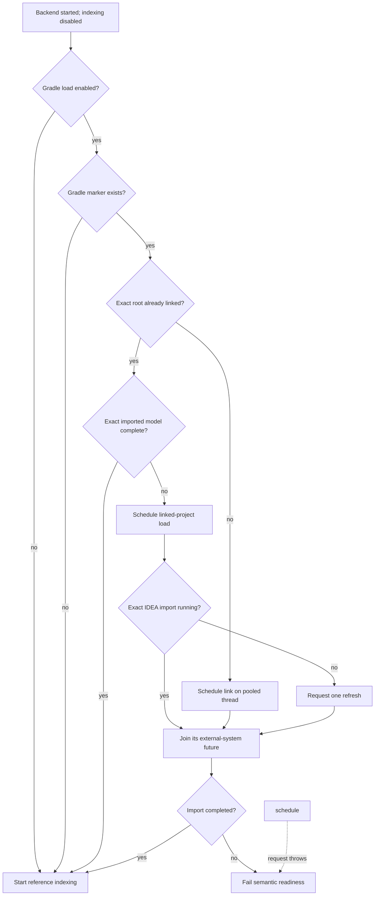
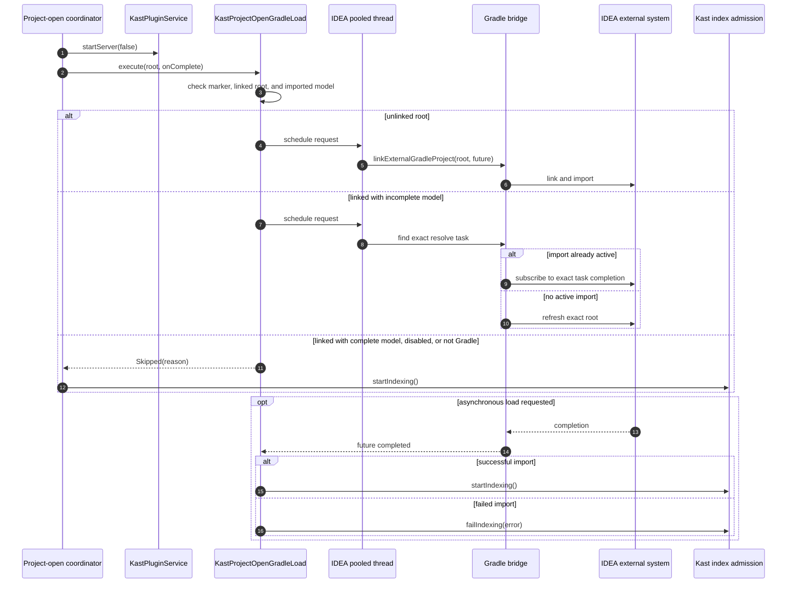

# IDEA Gradle Sync

Project-open startup separates server availability from semantic readiness.
`KastProjectOpenAutoIndexing` starts the backend first with indexing disabled.
It then delegates the Gradle decision to `KastProjectOpenGradleLoad`.

## Link boundary

The coordinator requests a link only when all of these facts hold:

1. `projectOpen.gradleLoadEnabled` is true.
2. The exact root contains a Gradle settings or build marker.
3. IDEA does not already list the exact root as a linked Gradle project.

The link runs on an IDEA pooled thread. `IdeaGradleProjectLoadBridge` completes
a `CompletableFuture` when the external-system import callback finishes.
Indexing starts from that completion callback, not from request submission.
An import error instead marks readiness as failed.

For an already linked root, the bridge first checks the exact imported model.
A ready model skips load. An incomplete model schedules a refresh, but the
pooled task first asks IDEA's external-system processing manager whether that
exact Gradle resolve is already running. If so, Kast joins its task-specific
completion events instead of starting a duplicate sync. If no import owns the
root, Kast requests one refresh. Both paths admit indexing only after the
external-system future succeeds.

## Imported model evidence

The same Java bridge provides a narrow, stable view of IDEA's Gradle model for
the Kotlin indexer:

- linked build and composite-build roots;
- imported external module identities;
- loaded IDEA module identities;
- imported source roots;
- module-to-Gradle-project associations;
- Gradle source-set names and source roots;
- whether the last import produced a complete, ready model.

`IdeaProjectIndexer` treats these rows as evidence. It does not guess module
ownership from directory names. An incomplete or internally inconsistent model
keeps the semantic index from claiming complete coverage.

## Continue the flow

The successful and skipped branches converge on
[indexing and generation](indexing-and-generation.md).

## Admission across restart

The service lifecycle retains Gradle admission as `Pending`, `Ready`, or
`Failed`. Configuration reload can request a restart, but the replacement
backend starts only after the old backend drain completes and receives the
same admission fact. A pending import therefore cannot be bypassed by restart,
and a failed import cannot become ready accidentally.
