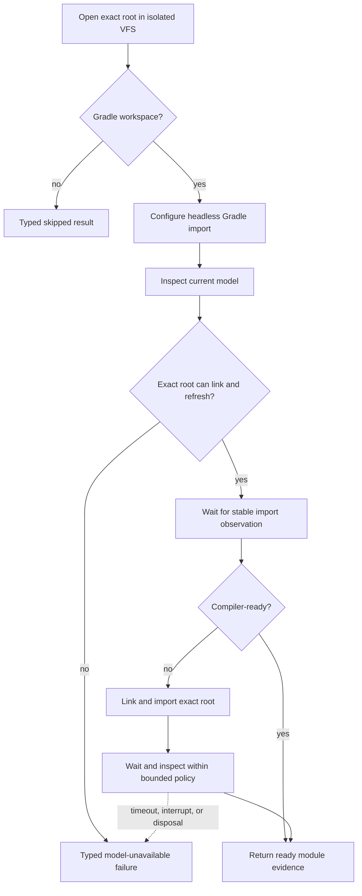

# Headless Gradle Sync

`HeadlessProjectOpener` opens the canonical root in the isolated VFS and passes
the detected workspace kind to `HeadlessGradleProjectBootstrap`. A non-Gradle
workspace has an explicit skipped result. A Gradle workspace must produce a
compiler-ready imported model.

## Settlement evidence

The awaiter samples lifecycle, active import tasks, Gradle project paths, and
module readiness. It requires a configured number of stable observations.
`Settled`, `TimedOut`, `Interrupted`, and `ProjectDisposed` are distinct typed
outcomes and retain the last observation plus a bounded transition trace.

Submission of an import request is not completion. The runtime does not report
semantic `READY` until the imported Kotlin modules have coherent JDK, SDK,
library, order-entry, PSI, and compiler resolution.

Continue with [Indexing and generation](indexing-and-generation.md).
