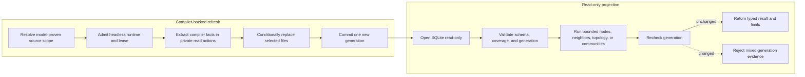

# Headless Graph Refresh and Queries

Graph refresh and graph reads share one exact-root database but retain
different authority. Refresh needs an admitted headless runtime and an exact
authenticated mutation lease. Read-only projections need a valid database,
scope proof, coverage, and one pinned generation.

## Refresh authority

The CLI normalizes and deduplicates selected files. Module, source-set, and
exclusive selectors require persisted Gradle ownership. The central admission
boundary rejects retired IDEA intent before the RPC or lease side effect.

The private compiler implementation requires analyzed diagnostics, extracts
canonical identities and typed occurrences, and passes provider-neutral facts
to `SemanticGraphWriter`. The writer replaces the selected files atomically.
An error rolls back rows and generation together.

## Query authority

Nodes use bounded keyset pagination. Neighbors use degree-bounded SQL reads.
Topology and communities materialize only the requested quotient graph. Every
result retains generation, scope, coverage, bounds, and limitations.

Coverage must account for stale, failed, excluded, and unproven files. A
non-empty result does not prove completeness. A generation movement before the
result returns is a typed consistency failure.

Continue with [Shutdown](shutdown.md).
