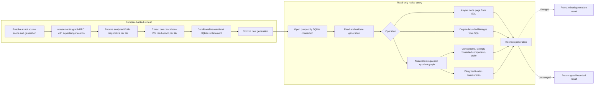
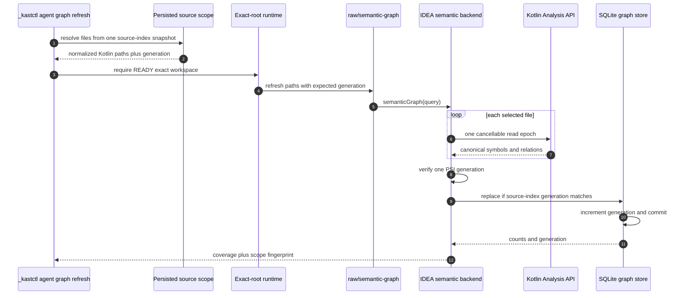

# Native Graph Refresh and Queries

The native graph command has two phases. Refresh asks the admitted IDEA backend
to extract compiler facts for a closed file scope. Query opens the resulting
SQLite database read-only and computes a bounded projection from one pinned
generation.

## Refresh

`execute_agent_native_graph_refresh` normalizes and deduplicates the requested
files. Module, source-set, and exclusive selectors are accepted only when one
persisted source-index snapshot proves Gradle ownership. The CLI retains that
snapshot's generation and sends it as `expectedGeneration` through a
READY exact-root runtime session.

Inside IDEA, `semanticGraphOperation`:

1. requires the semantic graph capability and current SQLite schema;
2. translates every selected and removed path to a workspace-relative path;
3. rejects source outside the active workspace;
4. requires analyzed Kotlin diagnostics for every refreshed file;
5. extracts compiler-resolved symbols, types, owners, containment, calls,
   inheritance, implementation, delegation, and type-reference occurrences;
6. classifies out-of-scope compiler targets as external evidence;
7. verifies that every per-file PSI read observed one project generation;
8. replaces all affected graph rows only if the source-index generation still
   matches the planned snapshot.

The refresh response retains file coverage, omitted external target count,
symbol count, relation occurrence count, scope fingerprint, and committed
generation. Cancellation or either generation conflict leaves the prior
committed graph intact.

## Query operations

| Operation | Result |
| --- | --- |
| `nodes` | A bounded SQL keyset page of canonical symbol identities. Resuming requires both `after-id` and the original generation. |
| `neighbors` | Degree-bounded incoming and outgoing SQL rows for one node, including relation kind, context, weight, and peer identity. |
| `summary` | Node and edge counts, connected components, strongly connected components, community count, timings, database size, and process memory evidence. |
| `topology` | Node keys, connected-component membership, strongly connected-component membership, and condensation topological order. |
| `communities` | A deterministic weighted Leiden partition at the requested resolution. |

## Scopes and quotient graphs

| Scope | Nodes | Edges |
| --- | --- | --- |
| Symbol | Canonical semantic symbols | Weighted links between source and target symbols |
| File | Semantic source files | Weighted links between source and target files |
| Package | Package identities | Weighted links between source and target packages |
| Module | Imported Gradle module identities | Weighted links between source and target modules |

Summary, topology, and communities convert the chosen projection to a compact
adjacency graph. They use iterative connected-component and
strongly-connected-component routines without another backend round trip.
The SQL loaders collapse rows with the same endpoints before allocation while
retaining both the typed occurrence-group count and the total relation weight.
Nodes and neighbors stay in SQLite and do not allocate the full graph.

Neighbors remain a typed view. Their bounded SQL reads return relation kind and
context rather than using the collapsed analytics representation.

When a repository base snapshot is available, overlay rows replace base rows
for changed files and tombstones remove deleted files. The effective graph
still receives one generation check before and after computation.

## Consistency failure

Nodes use keyset pagination instead of an unbounded offset scan. Neighbor reads
run inside a pinned read transaction and use source- and target-key indexes.
Every operation checks the requested generation before work and the live
generation before returning. A concurrent refresh therefore returns a typed
stale-generation failure, never a mixed graph.
