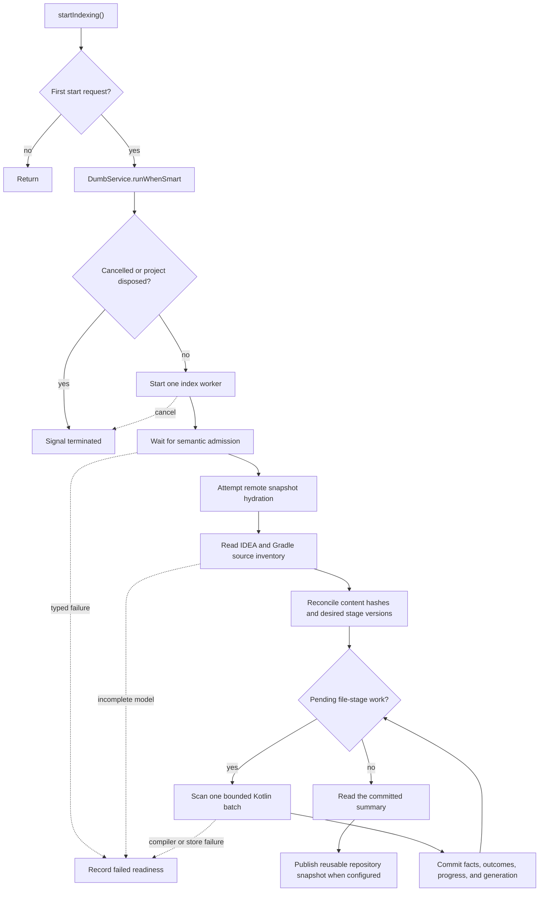
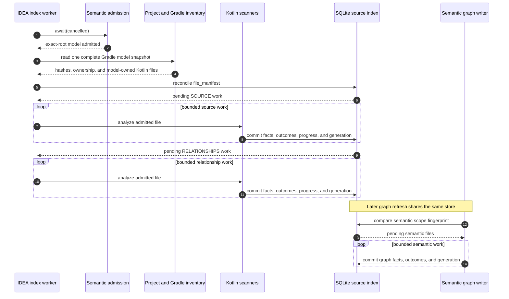

# IDEA Indexing and Generation

`KastIdeaProjectIndexing` owns one index attempt for the running backend. A
compare-and-set guard makes `start()` idempotent. The worker does not run until
IDEA leaves dumb mode and semantic admission accepts the project model. The
worker then reconciles persisted file-stage state and scans only pending work.

## Exact-root source inventory

The indexer derives candidates from IDEA project content and the imported
Gradle model. It normalizes each path and admits only files inside the exact
workspace root. Kotlin reference scanning uses IDEA indexes and project model
inventory; it does not recursively walk the repository.

One bridge read supplies the Gradle model to provenance and file inventory.
The indexer rejects an incomplete imported model before it reads project files.
For each admitted Kotlin file, it persists the content hash, module, source
set, and desired version of each indexing stage in `file_manifest`.

The store compares that manifest with `file_stage_outcomes`. An unchanged file
with a matching non-failed outcome produces no scan. A content or stage-version
change makes only the affected file-stage work pending. A changed or removed
relationship target also invalidates outcomes for source files that held
inbound references to that target. Adding a file or changing its content also
clears existing `LIMITED` relationship outcomes because new declarations may
resolve callers that previously had no target row. Facts for unchanged
requeued callers remain until the pending rescan replaces them.

This boundary improves both speed and accuracy:

- generated output and unrelated nested repositories do not enter by accident;
- Gradle module and source-set identities stay attached to each file;
- IDEA decides which source files belong to the loaded project;
- unchanged restarts perform no redundant source or relationship scans;
- cancellation stops future batches while preserving every committed batch.

## Durable file-stage authority

`KastIdeaBackendRuntime` creates one `SqliteSourceIndexStore` from the exact
`WorkspaceIdentity`. The backend, indexer, reference lookup, and semantic graph
writer share that store while the runtime is alive.

SQLite is the coverage authority for each file and stage:

| Persisted state | Coverage meaning |
| --- | --- |
| No matching outcome | The stage is pending. |
| Hash or stage version differs from the manifest | The stage is stale. |
| Matching `COMPLETE` outcome | The stage is complete for that file. |
| Matching `LIMITED` outcome | Valid facts remain usable, but coverage is not exact. |
| Matching `FAILED` outcome | The stage failed and remains pending for retry. |
| Semantic input fingerprint differs | The semantic graph is stale for the current scope. |

Each outcome records the file, stage, content hash, stage version, status, and
limitations. Semantic graph outcomes also record `stage_input_fingerprint`,
which binds reusable facts to the current semantic source scope.

The store derives module progress from `file_manifest` and relationship
outcomes after each commit. No caller marks a module complete independently.
The same rows classify a requested scope as complete, pending, stale, limited,
or failed after a restart.

## Bounded atomic commits

Source, relationship, and semantic graph work commit in bounded batches. Each
transaction writes its facts, file-stage outcomes, derived module progress, and
new generation together. A failed transaction rolls back all four. Cancellation
between batches leaves earlier commits available to the next IDEA session.

Each source or relationship scan carries the hash of the exact PSI text used to
extract its facts. If that hash differs from the pending manifest work, the
indexer does not commit the result and leaves the file pending for retry.

Relationship scanning keeps valid references when one target cannot resolve.
It records `UNRESOLVED_RELATIONSHIP` on that file's `LIMITED` outcome instead
of discarding the other facts.

Semantic graph refresh computes one content-aware input fingerprint for the
effective semantic source scope. It pairs each canonical source path with the
current IDEA content hash, so changing a dependency makes cached callers
pending. The response keeps its path-only scope fingerprint contract. Semantic
refresh is request-driven rather than part of background project indexing. It
reuses matching files and extracts only pending files. Each semantic batch
verifies both the source-index generation and the IDEA PSI generation before it
commits graph facts, stage outcomes, and the new generation. Summary reads
count requested symbols and edges in SQLite instead of materializing all graph
facts.

## Coverage honesty

`IdeaRelationshipCoverageAuthority` combines live IDEA and Gradle readiness
with persisted `RELATIONSHIPS` outcomes for the actual search scope. Pending,
stale, limited, or failed Kotlin files make that scope limited. A Java source
file in the same scope also makes coverage limited because this index owns
Kotlin source only.

A limited relationship search may still return valid positive results. It
cannot claim an exact empty result or exhaustive traversal. The command layer
applies the same rule to repository intelligence by reading `file_manifest`,
`file_stage_outcomes`, `pending_updates`, semantic file rows, and the persisted
scope fingerprint. It accepts complete coverage only when those rows describe
one matching generation and every selected file has current evidence.

## Generation meaning

A generation identifies a committed view of the shared source-index database.
It is not a timestamp and it is not inferred from file modification times.
Graph readers pin this value before enumeration or computation and verify it
again before returning. Each durable batch advances the generation, so an
interrupted attempt can resume from its last committed batch without treating
uncommitted work as complete.

The next page follows that contract through
[graph refresh and queries](graph-queries.md).
