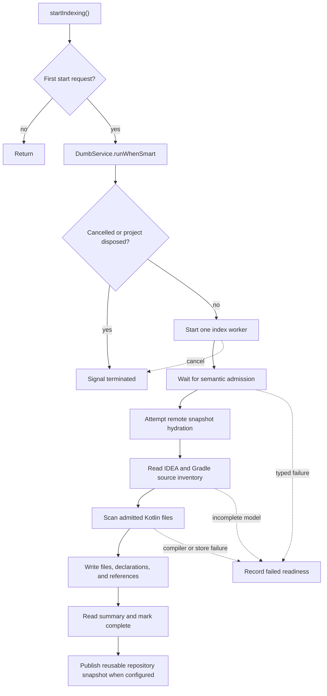
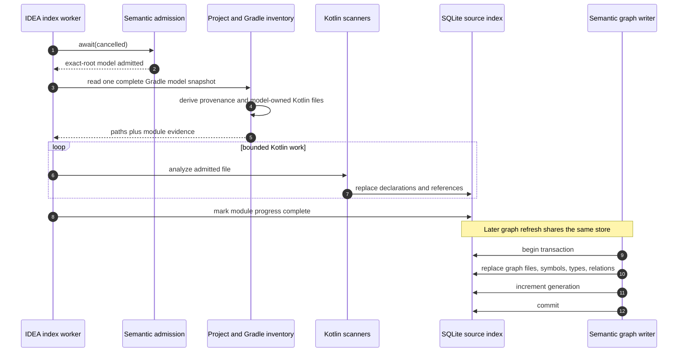

# IDEA Indexing and Generation

`KastIdeaProjectIndexing` owns one index attempt for the running backend. A
compare-and-set guard makes `start()` idempotent. The worker does not run until
IDEA leaves dumb mode and semantic admission accepts the project model.

## Exact-root source inventory

The indexer derives candidates from IDEA project content and the imported
Gradle model. It normalizes each path and admits only files inside the exact
workspace root. Kotlin reference scanning uses IDEA indexes and project model
inventory; it does not recursively walk the repository.

One bridge read supplies the Gradle model to both provenance and file
inventory. The indexer rejects an incomplete imported model before it reads
project files or replaces the committed index. A cancellation observed after
scanning also returns before the full-index save, so the previous manifest and
generation remain intact.

This boundary improves both speed and accuracy:

- generated output and unrelated nested repositories do not enter by accident;
- Gradle module and source-set identities stay attached to each file;
- IDEA decides which source files belong to the loaded project;
- cancellation can stop bounded batches without traversing the whole disk.

## SQLite ownership

`KastIdeaBackendRuntime` creates one `SqliteSourceIndexStore` from the exact
`WorkspaceIdentity`. The backend, indexer, reference lookup, and semantic graph
writer share that store while the runtime is alive.

The store contains two related forms of evidence:

1. Source inventory, module progress, declarations, and reference rows describe
   which Kotlin files the project index covered.
2. Semantic graph files, symbols, types, and relation occurrences describe
   compiler-resolved graph facts for refreshed files.

Graph file replacement is transactional. `SemanticGraphWriter` removes stale
rows, writes the complete replacement set, increments the source-index
generation inside the same transaction, and then commits. A failed write rolls
back both data and generation.

## Generation meaning

A generation identifies a committed view of the shared source-index database.
It is not a timestamp and it is not inferred from file modification times.
Graph readers pin this value before enumeration or computation and verify it
again before returning.

The next page follows that contract through
[graph refresh and queries](graph-queries.md).
