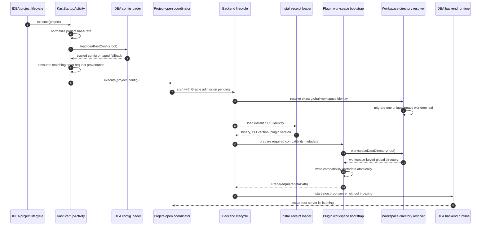

# IDEA Load and Bootstrap

`KastStartupActivity` is the project-open entry point. It normalizes
`Project.basePath`, loads the IDEA-trusted Kast configuration once, records
whether Kast requested this project open, and hands the project to
`KastProjectOpenAutoIndexing`.

The auto-indexing coordinator validates setup before it creates the backend.
The backend starts with indexing disabled so Gradle import and index admission
stay in one ordered flow.

## State placement

`WorkspaceDirectoryResolver` maps a normalized root to a stable directory
under the global Kast data root. A Git repository uses
`git/local/<common-directory-hash>` and each worktree retains an exact
top-level and Git-directory hash. Changing or removing `origin` cannot move
state. Before configuration is read, the Kotlin and Rust resolvers look for
the exact former remote-keyed worktree leaf. They atomically move one unique
match and fail closed on conflicts, ambiguity, symbolic links, invalid entries,
or excessive nesting. Repository snapshot siblings remain in place.

Other local workspaces use a deterministic path identity. An existing
local-workspace registry mapping remains readable for compatibility, but
resolution does not write a registry or lock file into the project.

The active install receipt ties configuration, data, cache, logs, runtime,
descriptors, sockets, binaries, and libraries to one Kast installation root.
Global configuration lives in that receipt's configuration root. Optional
workspace configuration lives at
`workspaceDataDirectory(root)/config.toml`; the IDEA loader permits only
IDEA-owned logical settings from that file. Compatibility metadata, snapshots,
and the source-index database use the same workspace-keyed global data
directory. `KAST_HOME` relocates the tied installation, and
`KAST_CONFIG_HOME` remains an explicit configuration-root override.

Every backend start and restart requires this compatibility bootstrap,
independent of the optional project-open profile setting. The bootstrap writes only
`workspaceDataDirectory(root)/workspace.json` for the resolved workspace. It
stages the complete JSON beside its destination, then moves it into place. The
record includes:

- the normalized workspace root;
- the installed CLI binary and version;
- the IDEA backend identity;
- the socket path;
- protocol and workspace metadata revisions;
- advertised read and mutation capabilities.

The macOS CLI resolves the same workspace data directory before it reads and
validates `workspace.json`. The project root selects the record, but the record
itself stays in the global Kast data home.

The IDEA integration does not need a project-local `.kast` directory. During
migration it removes only the former `.kast/setup/workspace.json` file and then
removes `setup` and `.kast` only when each directory is empty. Both parent
checks refuse symbolic links, so cleanup cannot follow a project path into
another directory.

## Admission and failure boundaries

| Boundary | Successful evidence | Failure behavior |
| --- | --- | --- |
| Workspace root | `Project.basePath` normalizes to a path | Startup returns without creating a runtime |
| Configuration | IDEA-trusted configuration parses | The loader records diagnostics and uses its explicit fallback |
| Backend setting | `backends.idea.enabled` is true | Startup logs that the backend is disabled |
| Install receipt | The selected CLI exists and its receipt matches | Auto-init reports a terminal setup failure |
| Legacy state migration | No legacy leaf exists, or one exact leaf moves atomically | Conflicting or ambiguous state produces a typed failure before config load |
| Workspace metadata | The complete record moves into the global workspace directory | Auto-init rejects startup and reports the destination |
| Service start | One lifecycle-locked backend owns the exact root | Service diagnostics retain the startup failure |

The coordinator contains a backend-start failure and does not start Gradle or
indexing after a bootstrap failure.
That preserves one visible cause instead of layering secondary failures on top
of an invalid setup.

## Continue the flow

Once the server is running, the coordinator follows
[Gradle sync](gradle-sync.md). The service retains ownership until
[shutdown](shutdown.md).
