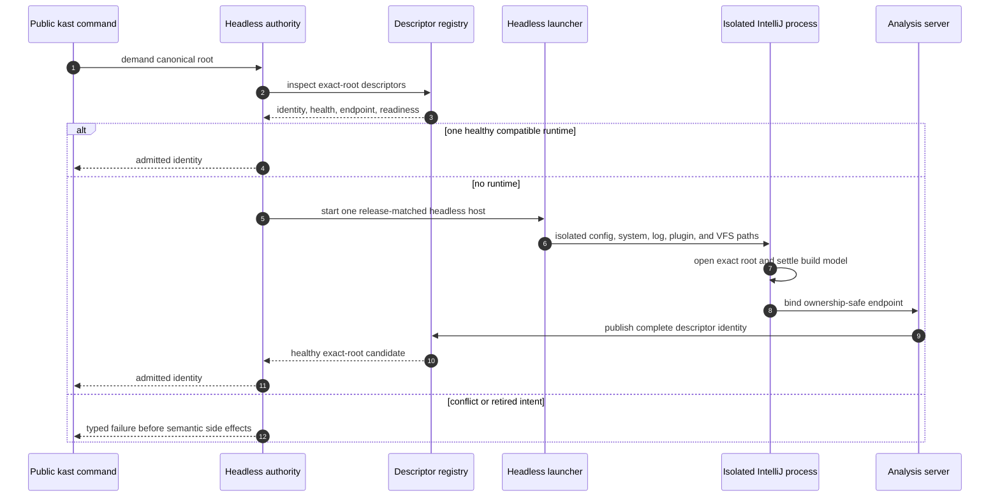

# Headless Load and Bootstrap

Public demand begins with `kast up` or a semantic command from the canonical
workspace root. The Rust runtime layer inspects only exact-root candidates and
passes them through the central headless admission boundary.

## Isolation boundary

The installed private payload is
`idea-home/plugins/kast-headless`. It runs only inside the release-owned
headless home. The foreground plugin descriptor has no startup activity,
project service, settings page, status widget, tool window, notification, or
semantic server extension.

On macOS, installed IntelliJ IDEA or Android Studio supplies a compatible JBR
and platform runtime. Kast does not ask that application to open a project and
does not attach to its VFS.

## Identity boundary

The descriptor binds canonical root, release version, headless backend kind,
runtime instance identifier, process start time, owner UID, socket path, and
socket file identity. Admission rechecks live status identity. A stale file,
PID reuse, alias path, or replacement socket fails closed.

Continue with [Gradle sync](gradle-sync.md).
