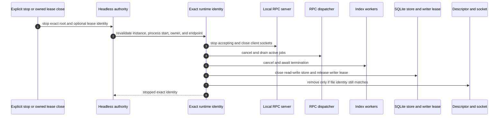

# Headless Runtime Shutdown

Only explicit Kast lifecycle demand stops a headless runtime. Foreground IDE
close, crash, project, VFS, and application events do not enter this flow.

## Ownership rules

- A lease can stop only the matching runtime instance it started.
- A borrowed runtime stays running when the borrower exits.
- PID equality alone is insufficient because a PID can be reused.
- Descriptor replacement does not authorize the old process to delete the new
  descriptor or socket.
- Concurrent close and start either reuse the valid identity or return a typed
  conflict; they do not create two writers.

The analysis server closes transport before dispatcher continuation state and
backend resources. Index workers terminate before the store and its writer
lease close. Endpoint cleanup compares the live file identity before unlinking.

After a crash, the next explicit demand quarantines stale evidence and admits
or starts one replacement. Kast does not add a foreground watcher or an
unattended supervisor.
